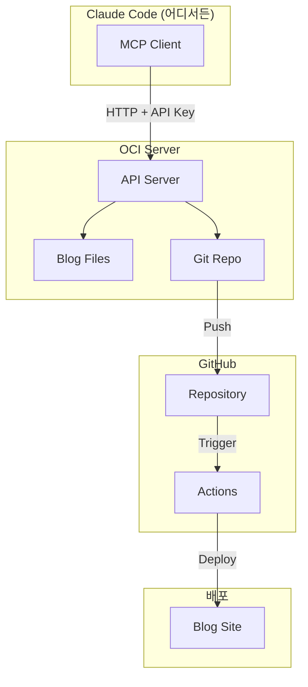
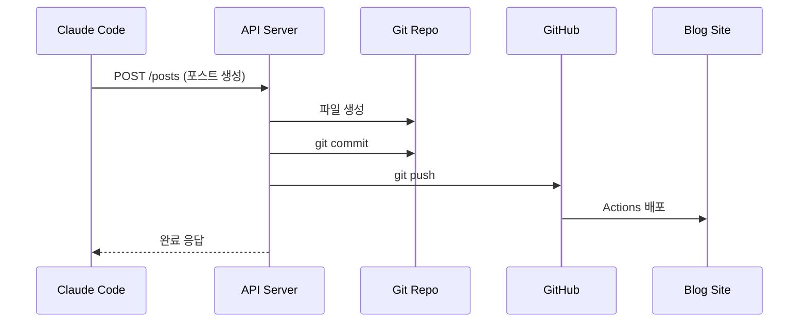

# Blog MCP Server - Claude Code용

Claude Code에서 블로그 포스트를 관리할 수 있는 MCP 서버입니다.

## 시스템 아키텍처



## 데이터 흐름



## 설치

### 1. 의존성 설치

```bash
cd /path/to/blogs/.claude
pip install -r requirements.txt
```

### 2. 환경 변수 설정

```bash
export BLOG_API_URL="https://api.blog.fcoinfup.com"
export BLOG_API_KEY="your_api_key_here"
```

### 3. Claude Desktop 설정

`~/Library/Application Support/Claude/claude_desktop_config.json`:

```json
{
  "mcpServers": {
    "blog-manager": {
      "command": "python3",
      "args": ["/path/to/blogs/.claude/mcp_server.py"],
      "env": {
        "BLOG_API_URL": "https://api.blog.fcoinfup.com",
        "BLOG_API_KEY": "your_api_key_here"
      }
    }
  }
}
```

## 사용법

### Claude Code에서 사용

```
"Python 리스트 컴프리헨션에 대한 블로그 포스트 작성해줘"
```

```
"이 회의 노트를 블로그 포스트로 정리해줘:
- 프로젝트 진행 상황
- 기술적 결정사항
- 다음 단계"
```

```
"Docker 관련 포스트 검색해줘"
```

### 제공 도구

| 도구 | 설명 |
|------|------|
| `blog_create_post` | 새 포스트 생성 + Git 커밋 |
| `blog_create_from_draft` | 초안을 포스트로 변환 가이드 |
| `blog_list_posts` | 포스트 목록 조회 |
| `blog_get_post` | 특정 포스트 조회 |
| `blog_update_post` | 포스트 수정 |
| `blog_delete_post` | 포스트 삭제 |
| `blog_search_posts` | 포스트 검색 |
| `blog_git_status` | Git 상태 확인 |
| `blog_sync` | 원격 동기화 |

## 워크플로우

### 1. 직접 작성
```
사용자: "Python 가상환경 설정법 블로그 포스트 작성해줘"
Claude: blog_create_post 도구 사용 → 포스트 생성 → Git 커밋 → 배포
```

### 2. 초안 정리
```
사용자: "이 노트를 블로그로 정리해줘: [노트 내용]"
Claude:
  1. blog_create_from_draft로 가이드 받기
  2. 내용을 Markdown으로 정리
  3. blog_create_post로 업로드
```

## API Key 관리

### 새 키 생성
```bash
python -c "import secrets; print(f'blog_{secrets.token_urlsafe(32)}')"
```

### 키 등록
API 서버의 `.env` 파일:
```
BLOG_API_KEYS=blog_key1,blog_key2
```
