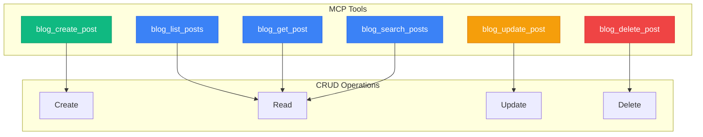
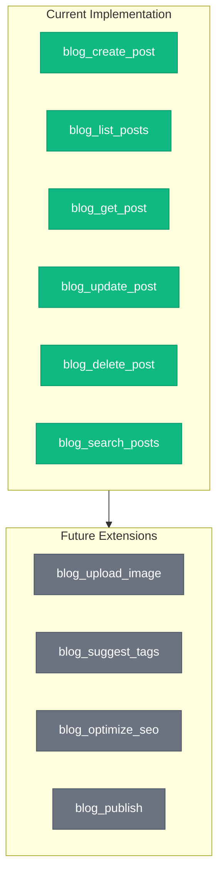

+++
title = "Building a Blog Automation System with MCP"
date = 2026-02-21T21:30:00+09:00
draft = false
tags = ["mcp", "automation", "claude", "blog"]
categories = ["Development"]
ShowToc = true
TocOpen = true
+++

## Introduction

We built a system where Claude can directly manage blog posts using the Model Context Protocol (MCP). This article explains the implementation and usage.

## What is MCP?

MCP (Model Context Protocol) is a protocol developed by Anthropic that enables standardized communication between Claude and external tools/data sources.


## Architecture

### System Structure

```
blogs/
├── .claude/
│   ├── mcp_server.py      # MCP Server Implementation
│   ├── requirements.txt   # Python Dependencies
│   ├── README.md          # Documentation
│   └── claude_desktop_config.json
├── content/
│   └── posts/             # Blog Posts
└── static/
    └── images/            # Image Files
```

### MCP Server Structure

```python
class BlogManager:
    """Blog Management Class"""

    def create_post(self, title, content, tags, categories):
        """Create new post"""

    def list_posts(self, limit, offset):
        """List posts"""

    def get_post(self, filename):
        """Get specific post"""

    def update_post(self, filename, **kwargs):
        """Update post"""

    def delete_post(self, filename):
        """Delete post"""

    def search_posts(self, query):
        """Search posts"""
```

## Available Tools



### 1. blog_create_post

Create a new blog post.

```json
{
  "title": "Post Title",
  "content": "Markdown content...",
  "tags": ["tag1", "tag2"],
  "categories": ["Development"],
  "draft": false
}
```

### 2. blog_list_posts

Retrieve post list.

```json
{
  "limit": 20,
  "offset": 0
}
```

### 3. blog_get_post

Get details of a specific post.

```json
{
  "filename": "2026-02-21-004-example.md"
}
```

### 4. blog_update_post

Update existing post.

```json
{
  "filename": "2026-02-21-004-example.md",
  "content": "Updated content...",
  "draft": false
}
```

### 5. blog_search_posts

Search posts by content.

```json
{
  "query": "Docker"
}
```

## Automated File Naming

Post filenames are automatically generated using the following rule:

```
YYYY-MM-DD-NNN-slug.md
```

- `YYYY-MM-DD`: Creation date
- `NNN`: Serial number (001, 002, ...)
- `slug`: URL-friendly string generated from title

Example: `2026-02-21-004-mcp-blog-automation.md`

## Usage Scenarios


### 1. Quick Post Writing

```
User: "Write a short tip post about Python list comprehensions"

Claude: Use blog_create_post tool to create post
→ File created: 2026-02-21-005-python-list-comprehension.md
```

### 2. Search and Update Existing Posts

```
User: "Find Docker-related posts and update with latest version info"

Claude: blog_search_posts("Docker") → Check results → blog_update_post
```

### 3. Manage Series Posts

```
User: "Show me all agent-related posts written so far"

Claude: blog_search_posts("agent") → List related posts
```

## Implementation Considerations

### Front Matter Parsing

Parses Hugo's TOML format front matter:

```python
def _parse_front_matter(self, content: str) -> Dict[str, Any]:
    """Parse TOML front matter"""
    if not content.startswith("+++"):
        return {}

    parts = content.split("+++", 2)
    # ... parsing logic
```

### Concurrency Handling

Prevents filename conflicts by checking existing file count:

```python
existing_count = len(list(self.content_dir.glob("*.md")))
filename = self._generate_filename(title, existing_count + 1)
```

## Extensibility



### 1. Image Processing

```
blog_upload_image: Image upload and optimization
```

### 2. Auto Tag Suggestion

```
blog_suggest_tags: Content analysis-based tag suggestions
```

### 3. SEO Optimization

```
blog_optimize_seo: Meta description, keyword optimization
```

### 4. Deployment Automation

```
blog_publish: git commit, push, deployment trigger
```

## Conclusion

With the MCP-based blog automation system:

1. **Improved Productivity**: Write posts in natural language
2. **Consistency**: Automatic file naming rules
3. **Better Accessibility**: Intuitive blog management via Claude

This system is continuously extensible, with potential additions like image processing, SEO optimization, and automated deployment.

## References

- [Model Context Protocol](https://modelcontextprotocol.io/)
- [MCP Python SDK](https://github.com/modelcontextprotocol/python-sdk)
- [Hugo Documentation](https://gohugo.io/documentation/)
