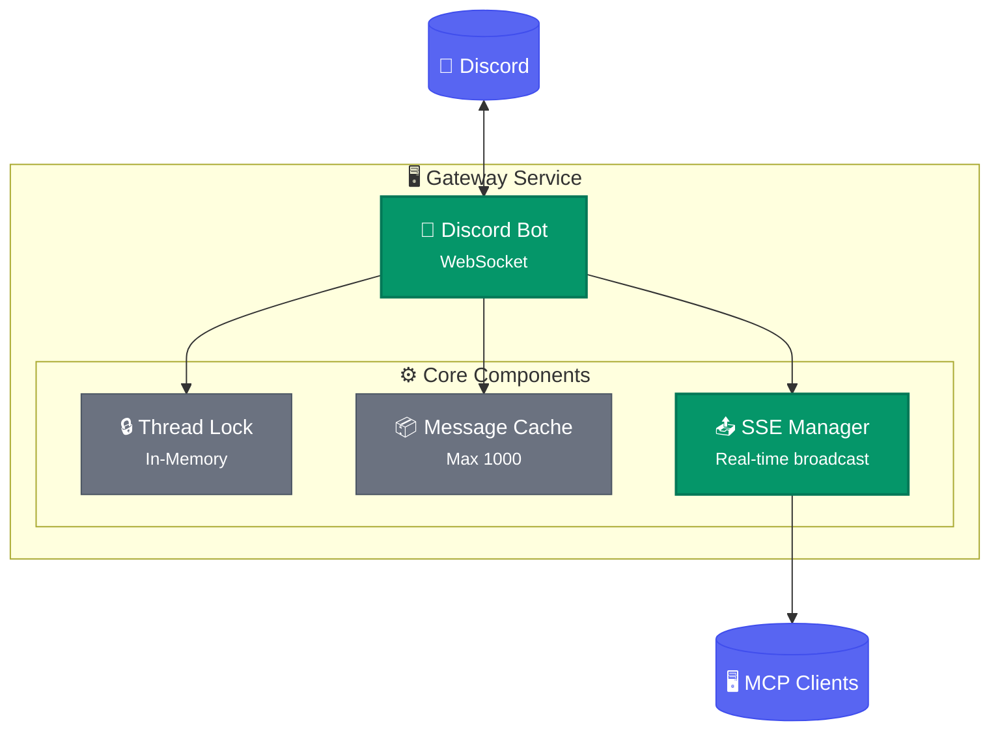
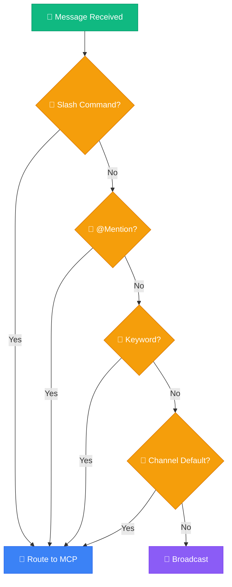
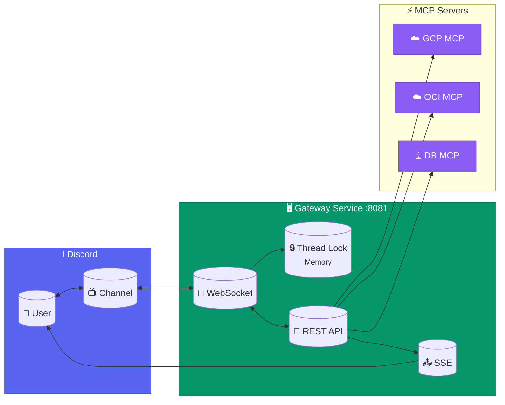

+++
title = "Discord Gateway MCP Architecture Design Decisions"
slug = "discord-gateway-mcp-architecture-decisions"
date = 2026-02-28T23:13:23+09:00
draft = false
tags = ["discord", "mcp", "fastapi", "claude-code", "architecture"]
categories = ["Development", "Architecture", "Claude Code"]
ShowToc = true
TocOpen = true
+++

# Discord Gateway MCP Architecture Design Decisions

## Overview

The Claude Code team designed a Discord Gateway Service for user communication via Discord. This article summarizes the key architecture decisions.

---

## 1. Lightweight Architecture Without Redis

### Decision

**Removed Redis and adopted in-memory approach**

### Rationale

- Redis is over-engineering for single-instance environments
- Thread Lock is sufficient with memory-based approach
- SSE handles streaming directly through FastAPI

### Structure



---

## 2. MCP Selection: Hybrid Approach

### Decision

**Adopted hybrid approach combining 4 methods**

### Selection Methods (Priority Order)

| Priority | Method | Example | Description |
|----------|--------|---------|-------------|
| 1 | Slash Command | `/gcp status` | Most explicit |
| 2 | @Mention | `@gcp-monitor status` | Natural conversation |
| 3 | Keyword Detection | `gcp server status` | Detects "gcp" keyword |
| 4 | Channel Assignment | #gcp-monitoring channel | Channel default MCP |

### Fallback Behavior



### Slash Command Examples

```
/gcp status [server]     → GCP server status
/oci list                → OCI instance list
/db query <sql>          → Execute DB query
/alert check [severity]  → Check alerts
```

---

## 3. Thread Lock: In-Memory Based

### Decision

**Use Python memory-based locks instead of Redis SET NX**

### Lock Rules

```
1. First MCP to respond to thread acquires lock
2. Default duration: 5 minutes (300 seconds)
3. Auto-extend on activity
4. Auto-release on timeout
```

### API

```bash
# Acquire lock
POST /api/threads/{thread_id}/acquire
{
  "agent_name": "gcp-mcp",
  "timeout": 300
}

# Check lock status
GET /api/threads/{thread_id}/lock

# Release lock
POST /api/threads/{thread_id}/release
```

---

## 4. MCP Tools (8)

### Provided Tools

| Tool | Description |
|------|-------------|
| `discord_send_message` | Send message |
| `discord_get_messages` | Get messages |
| `discord_wait_for_message` | Wait for message |
| `discord_create_thread` | Create thread |
| `discord_list_threads` | List threads |
| `discord_archive_thread` | Archive thread |
| `discord_acquire_thread` | Acquire thread lock |
| `discord_release_thread` | Release thread lock |

---

## 5. Overall Architecture



---

## 6. How to Run

### Local Execution

```bash
# Start Gateway Service
uvicorn gateway.main:app --host 0.0.0.0 --port 8081

# Health check
curl http://localhost:8081/health
```

### MCP Configuration

```json
// ~/.claude/settings.json
{
  "mcpServers": {
    "discord-gateway": {
      "command": "python3",
      "args": ["/path/to/discord_mcp/server.py"],
      "env": {
        "GATEWAY_URL": "http://localhost:8081"
      }
    }
  }
}
```

---

## 7. Future Plans

### Phase 1 (Complete)
- [x] Gateway Service
- [x] Discord WebSocket
- [x] MCP Server (8 tools)

### Phase 2 (In Progress)
- [ ] Slash commands
- [ ] Channel default MCP
- [ ] Routing configuration

### Phase 3 (Planned)
- [ ] API authentication
- [ ] Rate Limiting
- [ ] Message persistence

---

## Conclusion

We chose a strategy of starting with a lightweight architecture and expanding when needed. For single instances, it works sufficiently without Redis, and we plan to introduce Redis when multiple instances are needed in the future.
