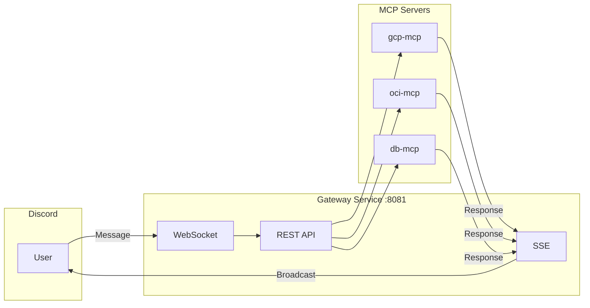
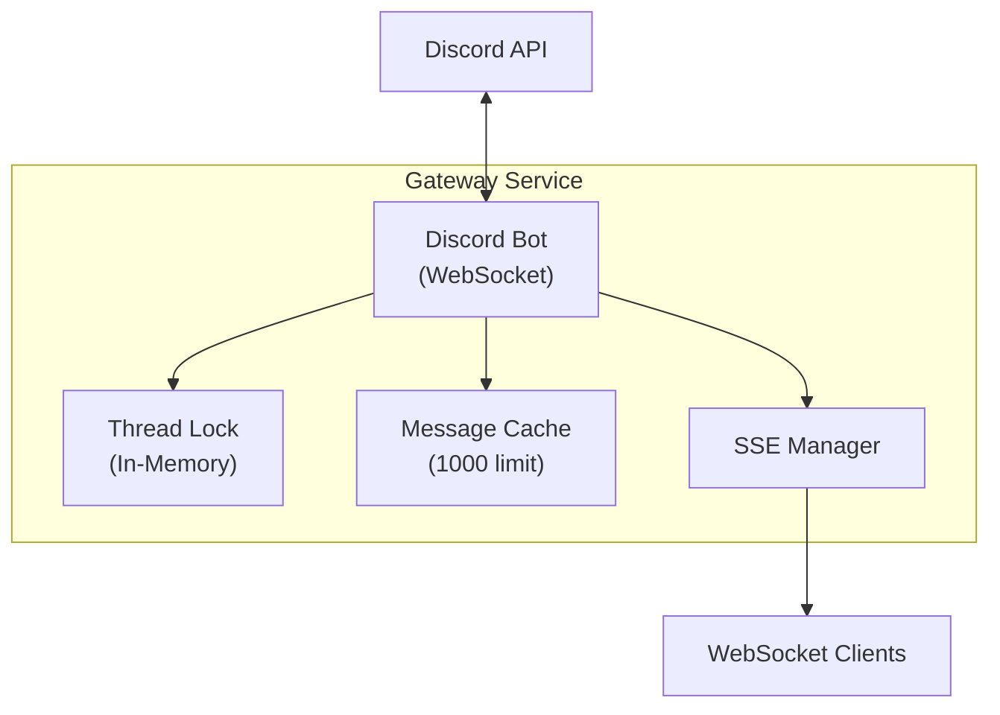
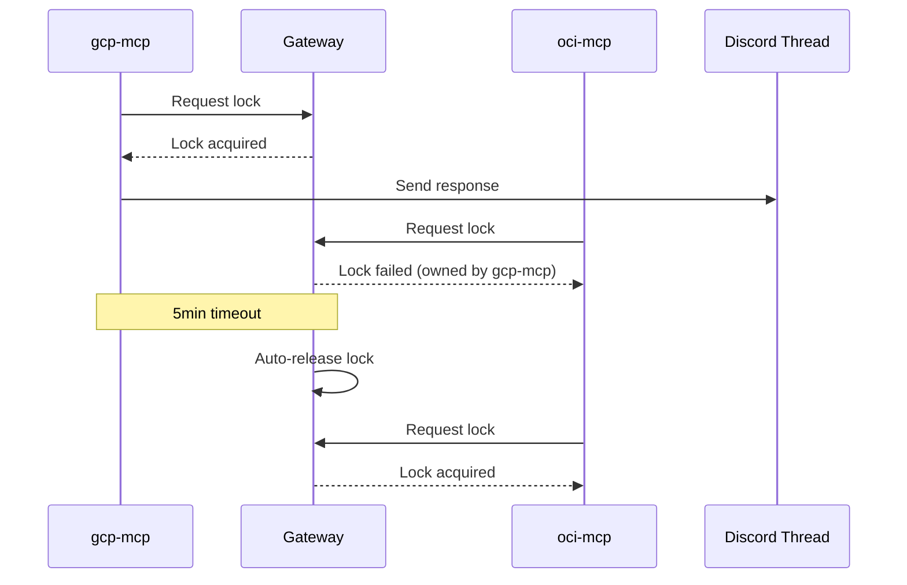
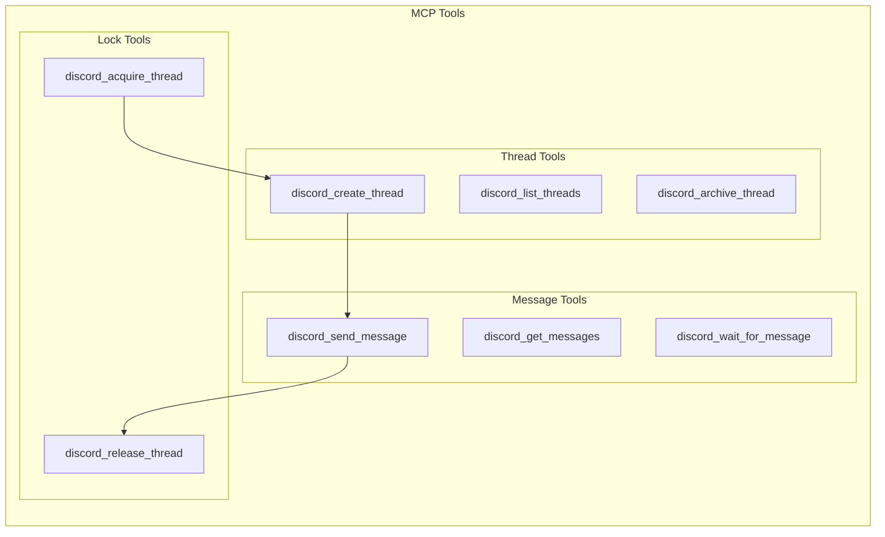
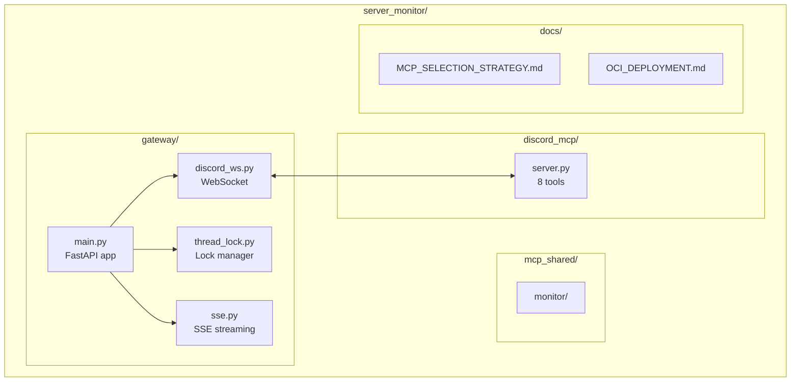
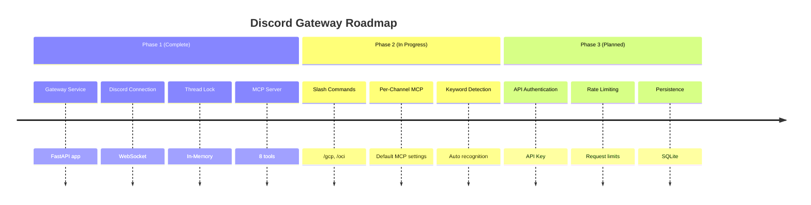

# Discord Gateway MCP Architecture Design

The Claude Code team designed the Discord Gateway Service for user communication through Discord. This article summarizes key architecture decisions.

---

## 1. Overall Architecture

### Components

| Layer | Components | Role |
|-------|-----------|------|
| **Discord** | Bot, Channel, Thread | User Interface |
| **Gateway** | WebSocket, REST API, SSE | Message Routing |
| **MCP** | gcp-mcp, oci-mcp, db-mcp | Tool Execution |

### Message Flow



---

## 2. Simple Architecture Without Redis

### Why Remove Redis?

| Item | Redis Usage | In-Memory Usage |
|------|-------------|-----------------|
| Thread Lock | Redis SET NX | Python dict |
| Event Distribution | Redis Streams | Direct SSE |
| State Storage | Redis Cache | Memory Cache |

**Conclusion**: In-Memory is sufficient for single-instance environment.

### Gateway Structure



### Component Details

| Module | Role | Features |
|--------|------|----------|
| Discord Bot | WebSocket connection | Auto-reconnect |
| Thread Lock | Concurrency control | 5min timeout |
| Message Cache | Message storage | Max 1000 messages |
| SSE Manager | Real-time streaming | Broadcast to all MCPs |

---

## 3. MCP Selection: 4-Stage Hybrid

### Selection Priority

| Priority | Method | Example | Description |
|:--------:|--------|--------|-------------|
| 1️⃣ | Slash Command | `/gcp status` | Most explicit |
| 2️⃣ | @Mention | `@gcp-monitor status` | Natural conversation |
| 3️⃣ | Keyword Detection | `gcp server status` | Auto keyword recognition |
| 4️⃣ | Per-Channel Default | #gcp-monitoring | Channel default MCP |

### Fallback Flow

```mermaid
flowchart TD
    A[Message Received] --> B{Slash Command?}
    B -->|Yes| C[Call MCP]
    B -->|No| D{@Mention?}
    D -->|Yes| C
    D -->|No| E{Keyword Detection?}
    E -->|Yes| C
    E -->|No| F{Channel Default MCP?}
    F -->|Yes| C
    F -->|No| G[Broadcast<br/>All MCPs]
```

### Slash Command List

| Command | MCP | Description |
|---------|-----|-------------|
| `/gcp status [server]` | gcp-mcp | GCP server status |
| `/gcp list` | gcp-mcp | GCP instance list |
| `/oci status [server]` | oci-mcp | OCI server status |
| `/oci list` | oci-mcp | OCI instance list |
| `/db query <sql>` | db-mcp | Execute DB query |
| `/db list` | db-mcp | Database list |
| `/alert check` | alert-mcp | Check alerts |

---

## 4. Thread Lock Rules

### Lock Behavior



### Lock API

| Method | Endpoint | Description |
|--------|----------|-------------|
| `POST` | `/api/threads/{id}/acquire` | Acquire lock |
| `POST` | `/api/threads/{id}/release` | Release lock |
| `GET` | `/api/threads/{id}/lock` | Check lock status |

---

## 5. MCP Tools (8 tools)

### Tool List

| Tool | Description | Key Parameters |
|------|-------------|-----------------|
| `discord_send_message` | Send message | channel_id, content |
| `discord_get_messages` | Get messages | channel_id, limit |
| `discord_wait_for_message` | Wait for message | channel_id, timeout |
| `discord_create_thread` | Create thread | channel_id, message_id |
| `discord_list_threads` | List threads | channel_id |
| `discord_archive_thread` | Archive thread | thread_id |
| `discord_acquire_thread` | Acquire lock | thread_id, agent_name |
| `discord_release_thread` | Release lock | thread_id, agent_name |

### Tool Relationship



---

## 6. File Structure



### Directory Description

| Path | Description |
|------|-------------|
| `gateway/` | Gateway Service (FastAPI) |
| `discord_mcp/` | MCP Server (8 tools) |
| `mcp_shared/` | Shared MCP tools |
| `docs/` | Documentation |

---

## 7. How to Run

### Local Execution

```bash
# Start Gateway Service
uvicorn gateway.main:app --host 0.0.0.0 --port 8081

# Health check
curl http://localhost:8081/health

# Response
{"status": "healthy", "discord_connected": true}
```

### Claude Code MCP Configuration

```json
// ~/.claude/settings.json
{
  "mcpServers": {
    "discord-gateway": {
      "command": "python3",
      "args": ["/path/to/discord_mcp/server.py"],
      "env": {
        "GATEWAY_URL": "http://localhost:8081"
      }
    }
  }
}
```

---

## 8. Roadmap



### Phase 1: Complete

- [x] FastAPI Gateway Service
- [x] Discord WebSocket connection
- [x] Thread Lock (In-Memory)
- [x] SSE broadcast
- [x] MCP Server (8 tools)

### Phase 2: In Progress

- [ ] Slash command implementation
- [ ] Per-channel default MCP settings
- [ ] Keyword auto-detection
- [ ] Routing configuration file

### Phase 3: Optional

- [ ] API authentication (API Key)
- [ ] Rate limiting
- [ ] Message persistence (SQLite)

---

## Conclusion

We chose a strategy of starting with simple architecture and extending as needed.

| Item | Current | Future |
|------|--------|--------|
| State Storage | In-Memory | SQLite (if needed) |
| Distributed Lock | Not used | Redis (multi-instance) |
| Authentication | None | API Key (if needed) |

The current structure is sufficient for a single instance, with plans for gradual expansion as traffic grows.

---

**Korean Version:** [한국어 버전](/ko/post/2026-03-01-005-discord-gateway-mcp-아키텍처-설계/)
