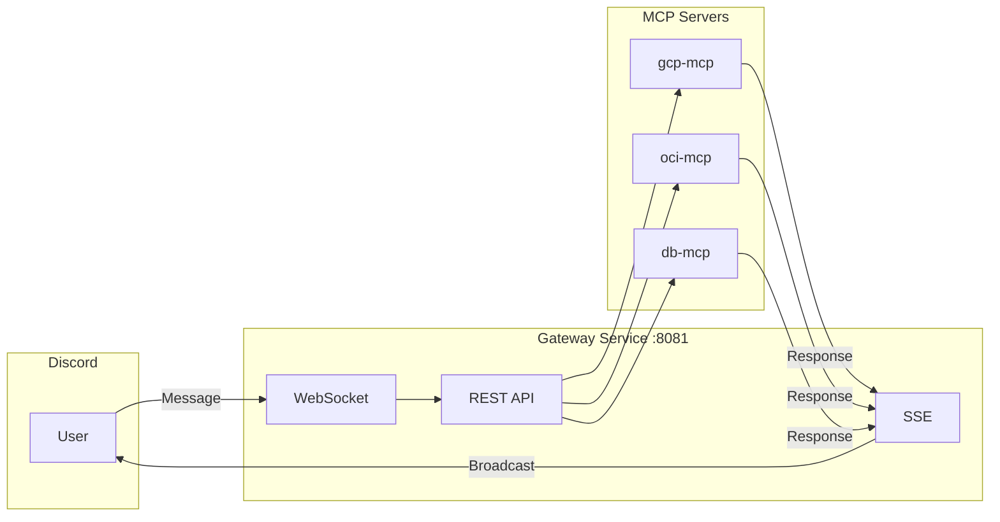
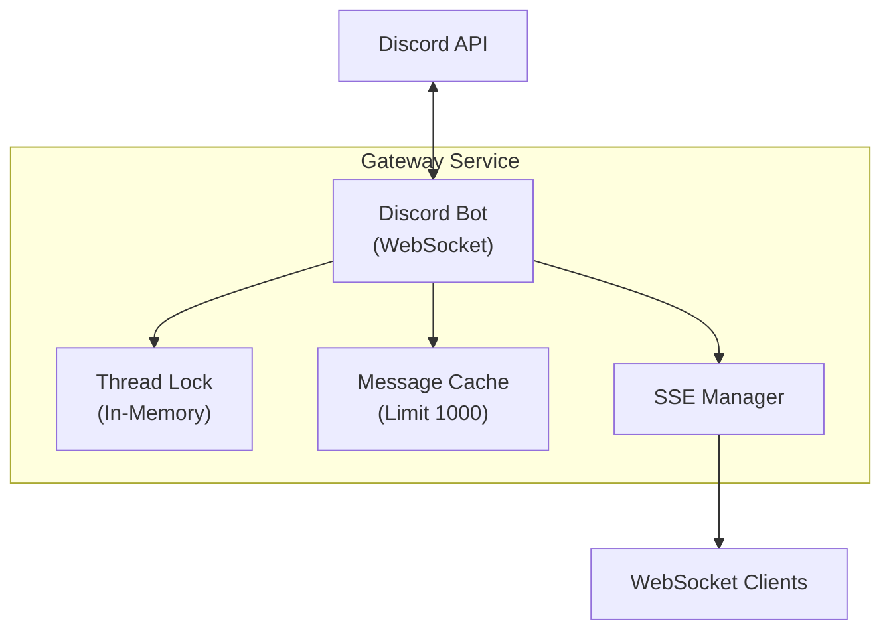
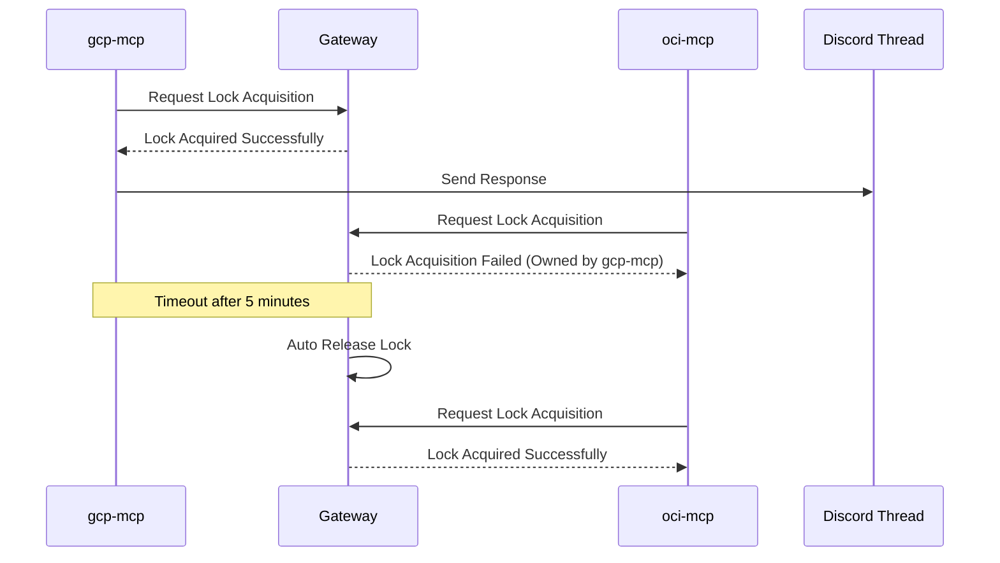
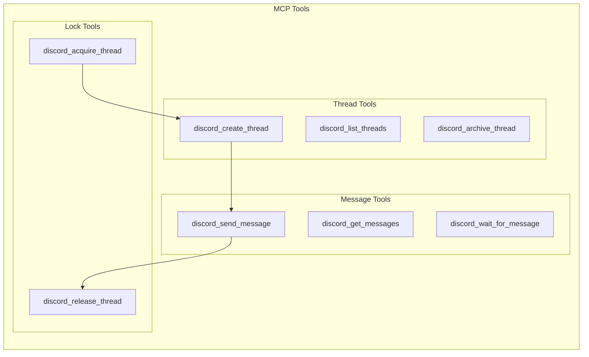
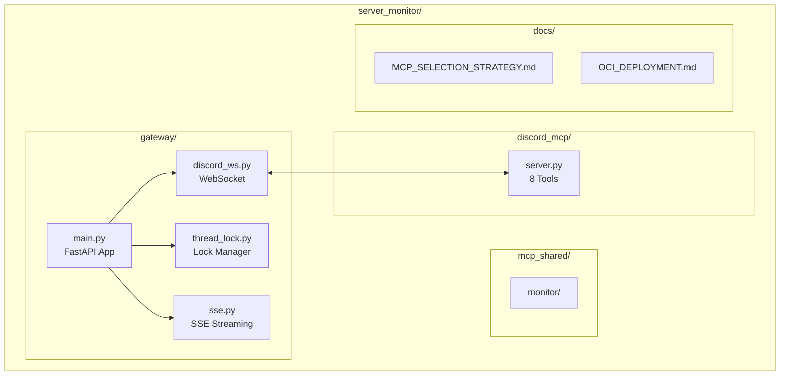
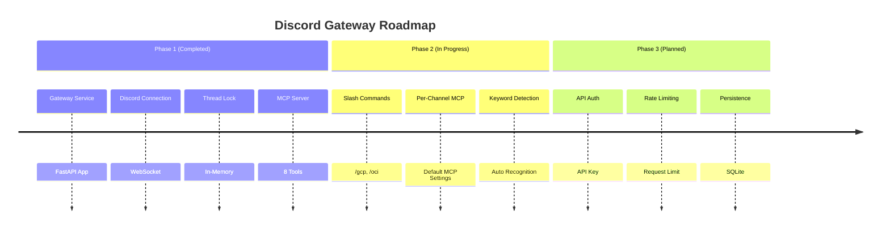

+++
title = ""
date = "2026-03-01T00:45:20+09:00"
draft = "false"
tags = ["discord", "mcp", "fastapi"]
categories = ["Development", "Architecture"]
ShowToc = "true"
TocOpen = "true"
+++

---
title: "Discord Gateway MCP Architecture Design"
date: 2026-03-01
categories: ["Development", "Architecture"]
tags: ["discord", "mcp", "fastapi", "claude-code"]
---

# Discord Gateway MCP Architecture Design

The Claude Code team designed a Discord Gateway Service for user communication via Discord. This article summarizes the key architectural decisions.

---

## 1. Overall Architecture

### Components

| Layer | Component | Role |
|------|-----------|------|
| **Discord** | Bot, Channel, Thread | User Interface |
| **Gateway** | WebSocket, REST API, SSE | Message Routing |
| **MCP** | gcp-mcp, oci-mcp, db-mcp | Tool Execution |

### Message Flow



---

## 2. Lightweight Architecture Operating Without Redis

### Why Remove Redis?

| Item | Using Redis | Using In-Memory |
|------|-------------|-----------------|
| Thread Lock | Redis SET NX | Python dict |
| Event Distribution | Redis Streams | Direct SSE |
| State Storage | Redis Cache | Memory Cache |

**Conclusion**: In-Memory is sufficient for a single-instance environment.

### Gateway Structure



### Component Details

| Module | Role | Features |
|------|------|----------|
| Discord Bot | WebSocket Connection | Auto Reconnect |
| Thread Lock | Concurrency Control | 5 min timeout |
| Message Cache | Message Retention | Max 1000 |
| SSE Manager | Real-time Transmission | Broadcast to all MCPs |

---

## 3. MCP Selection Method: 4-Step Hybrid

### Selection Priority

| Rank | Method | Example | Description |
|:----:|--------|---------|-------------|
| 1️⃣ | Slash Command | `/gcp status` | Most explicit |
| 2️⃣ | @Mention | `@gcp-monitor status` | Natural conversation |
| 3️⃣ | Keyword Detection | `gcp server status` | Automatic keyword recognition |
| 4️⃣ | Channel-specific | #gcp-monitoring | Channel default MCP |

### Fallback Behavior Sequence

```mermaid
flowchart TD
    A[Message Received] --> B{Slash Command?}
    B -->|Yes| C[Call Relevant MCP]
    B -->|No| D{@Mention?}
    D -->|Yes| C
    D -->|No| E{Keyword Detected?}
    E -->|Yes| C
    E -->|No| F{Channel Default MCP?}
    F -->|Yes| C
    F -->|No| G[Broadcast<br/>Send to all MCPs]
```

### Slash Command List

| Command | MCP | Description |
|--------|-----|-------------|
| `/gcp status [server]` | gcp-mcp | GCP Server Status |
| `/gcp list` | gcp-mcp | GCP Instance List |
| `/oci status [server]` | oci-mcp | OCI Server Status |
| `/oci list` | oci-mcp | OCI Instance List |
| `/db query <sql>` | db-mcp | Execute DB Query |
| `/db list` | db-mcp | DB List |
| `/alert check` | alert-mcp | Check Alerts |

---

## 4. Thread Lock Rules

### Lock Operation Method



### Lock API

| Method | Endpoint | Description |
|--------|----------|-------------|
| `POST` | `/api/threads/{id}/acquire` | Acquire Lock |
| `POST` | `/api/threads/{id}/release` | Release Lock |
| `GET` | `/api/threads/{id}/lock` | Check Lock Status |

---

## 5. MCP Tools (8)

### Tool List

| Tool | Description | Main Parameters |
|------|-------------|-----------------|
| `discord_send_message` | Send Message | channel_id, content |
| `discord_get_messages` | Get Messages | channel_id, limit |
| `discord_wait_for_message` | Wait for Message | channel_id, timeout |
| `discord_create_thread` | Create Thread | channel_id, message_id |
| `discord_list_threads` | List Threads | channel_id |
| `discord_archive_thread` | Archive Thread | thread_id |
| `discord_acquire_thread` | Acquire Lock | thread_id, agent_name |
| `discord_release_thread` | Release Lock | thread_id, agent_name |

### Tool Relationship Diagram



---

## 6. File Structure



### Directory Description

| Path | Description |
|------|-------------|
| `gateway/` | Gateway Service (FastAPI) |
| `discord_mcp/` | MCP Server (8 Tools) |
| `mcp_shared/` | Shared MCP Tools |
| `docs/` | Documentation |

---

## 7. How to Run

### Local Execution

```bash
# Start Gateway Service
uvicorn gateway.main:app --host 0.0.0.0 --port 8081

# Health Check
curl http://localhost:8081/health

# Response
{"status": "healthy", "discord_connected": true}
```

### Claude Code MCP Configuration

```json
// ~/.claude/settings.json
{
  "mcpServers": {
    "discord-gateway": {
      "command": "python3",
      "args": ["/path/to/discord_mcp/server.py"],
      "env": {
        "GATEWAY_URL": "http://localhost:8081"
      }
    }
  }
}
```

---

## 8. Roadmap



### Phase 1: Completed

- [x] FastAPI Gateway Service
- [x] Discord WebSocket Connection
- [x] Thread Lock (In-Memory)
- [x] SSE Broadcast
- [x] MCP Server (8 Tools)

### Phase 2: Planned

- [ ] Implement Slash Commands
- [ ] Set Default MCP per Channel
- [ ] Automatic Keyword Detection
- [ ] Routing Configuration File

### Phase 3: Optional

- [ ] API Authentication (API Key)
- [ ] Rate Limiting
- [ ] Message Persistence (SQLite)

---

## Conclusion

We chose a strategy of starting with a lightweight architecture and scaling when necessary.

| Item | Current | Future |
|------|---------|--------|
| State Storage | In-Memory | SQLite (if needed) |
| Distributed Lock | Not Used | Redis (for multi-instance) |
| Authentication | None | API Key (if needed) |

The current structure is sufficient for a single instance, and we plan to scale gradually as traffic increases.

---

**Korean Version:** [Korean Version](/post/2026-03-01-005-discord-gateway-mcp-architecture-design/)
```