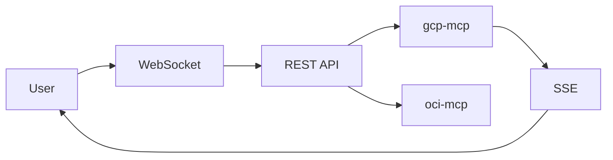

# Discord Gateway MCP Architecture

The Claude Code team designed the Discord Gateway Service for user communication through Discord.

## 1. Overall Structure

| Layer | Components | Role |
|-------|-----------|------|
| Discord | Bot, Channel, Thread | User Interface |
| Gateway | WebSocket, REST API, SSE | Message Routing |
| MCP | gcp-mcp, oci-mcp, db-mcp | Tool Execution |

## 2. Message Flow



## 3. Redis Removal: In-Memory Usage

| Item | Redis | In-Memory |
|------|-------|-----------|
| Thread Lock | SET NX | dict |
| Events | Streams | SSE |
| Cache | Cache | Memory |

**Single instance is sufficient with In-Memory**

## 4. MCP Selection: 4-Stage

| Priority | Method | Example |
|:--------:|--------|--------|
| 1 | /command | /gcp status |
| 2 | @mention | @gcp-monitor |
| 3 | Keyword | gcp server |
| 4 | Channel | #gcp-monitoring |

## 5. Thread Lock

- First responding MCP acquires lock
- Default 5-minute hold
- Auto-release on timeout

## 6. 8 MCP Tools

| Tool | Description |
|------|-------------|
| discord_send_message | Send message |
| discord_get_messages | Get messages |
| discord_wait_for_message | Wait for message |
| discord_create_thread | Create thread |
| discord_list_threads | List threads |
| discord_archive_thread | Archive thread |
| discord_acquire_thread | Acquire lock |
| discord_release_thread | Release lock |

## 7. Execution

```bash
uvicorn gateway.main:app --port 8081
curl http://localhost:8081/health
```

## 8. Roadmap

- Phase 1: Complete: Gateway, Lock, SSE, MCP
- Phase 2: In Progress: Slash commands, keywords
- Phase 3: Optional: Auth, Rate Limit

---

**Conclusion**: Start with simple architecture, extend as needed

---

**Korean Version:** [한국어 버전](/ko/post/2026-03-01-009-discord-gateway-mcp-아키텍처/)
