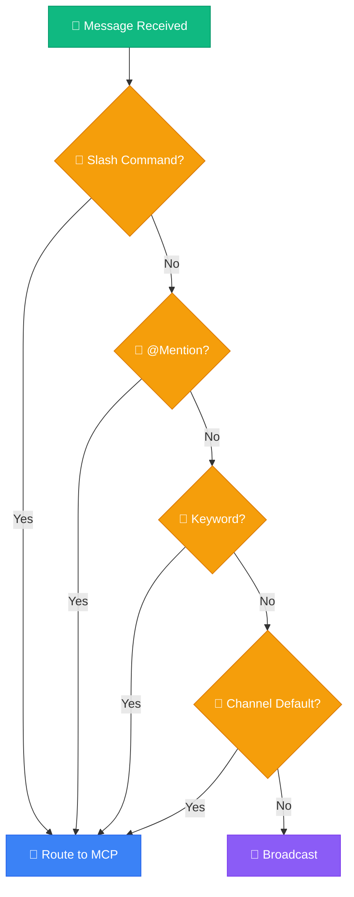

+++
title = "Discord MCP Selection Strategy"
slug = "discord-mcp-selection-strategy"
date = 2026-03-01T01:11:48+09:00
draft = false
tags = ["discord", "mcp"]
categories = ["Development"]
ShowToc = true
TocOpen = true
+++

# Discord MCP Selection Strategy Analysis

This analysis covers how Discord users can select a specific MCP in an environment with multiple MCP servers connected.

## Method Comparison

| Method | UX | Difficulty | Mobile | Recommended |
|--------|:--:|:----------:|:------:|:-----------:|
| Slash Commands | 5 | Medium | Good | **1st** |
| Channel Assignment | 4 | Low | Good | **2nd** |
| Emoji Reaction | 3 | Medium | Good | 3rd |
| Button Interaction | 4 | Medium | Good | 3rd |
| @Mention | 3 | Low | Fair | Current |
| Keyword Detection | 3 | Medium | Good | 5th |

## 1. Slash Commands

```
/gcp status    → GCP MCP
/oci list       → OCI MCP
/db query       → DB MCP
```

- Official Discord feature
- Autocomplete support
- Parameter validation

## 2. Channel Assignment

| Channel | Default MCP |
|---------|-------------|
| #gcp-monitoring | gcp-mcp |
| #oci-monitoring | oci-mcp |
| #general | broadcast |

- Just select the channel
- Natural conversation

## 3. Emoji Reaction

```
User: Check server status
Bot: 🔵 GCP  🟠 OCI  🟢 DB

User clicks 🔵 → GCP MCP responds
```

- Intuitive
- Mobile-friendly

## 4. Keyword Detection

| Keyword | MCP |
|---------|-----|
| gcp, google | gcp-mcp |
| oci, oracle | oci-mcp |
| db, database | db-mcp |

- Auto-detection
- No extra action needed

## Recommended: 4-Stage Hybrid

| Rank | Method | Example |
|:----:|--------|---------|
| 1 | /command | /gcp status |
| 2 | @mention | @gcp-monitor |
| 3 | keyword | gcp server |
| 4 | channel | #gcp-monitoring |

## Fallback Order


