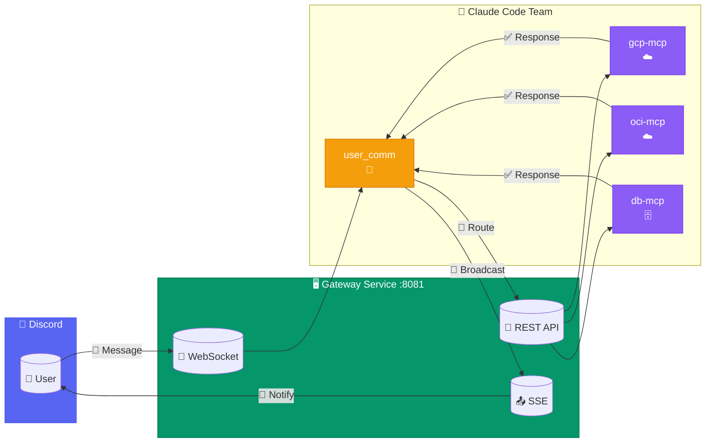
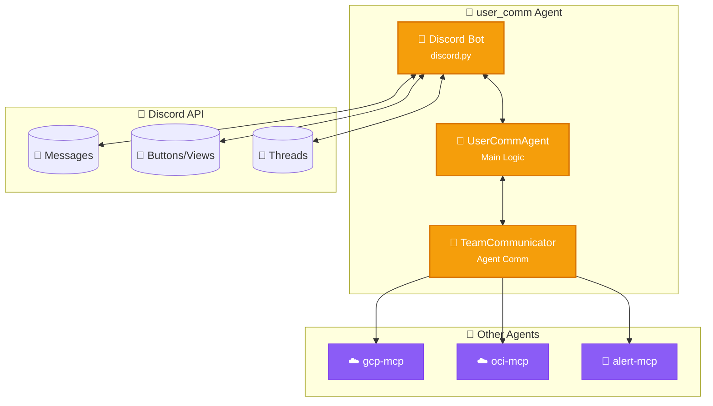
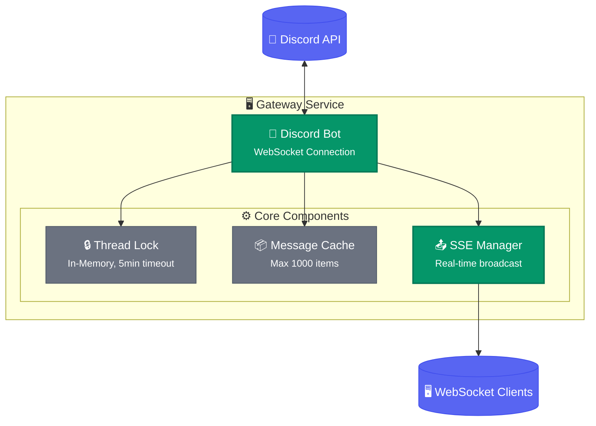
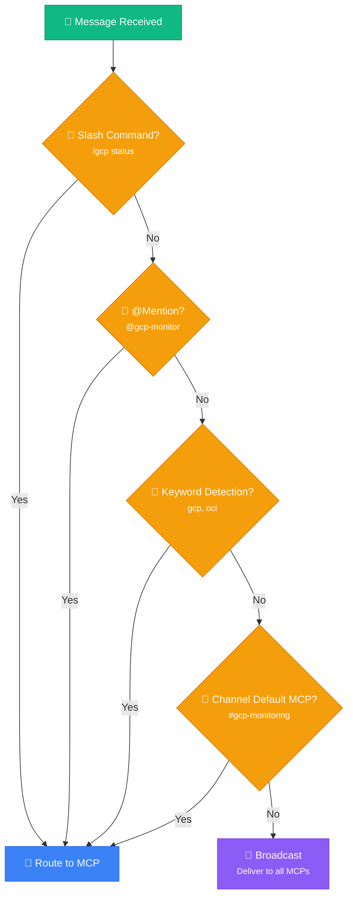
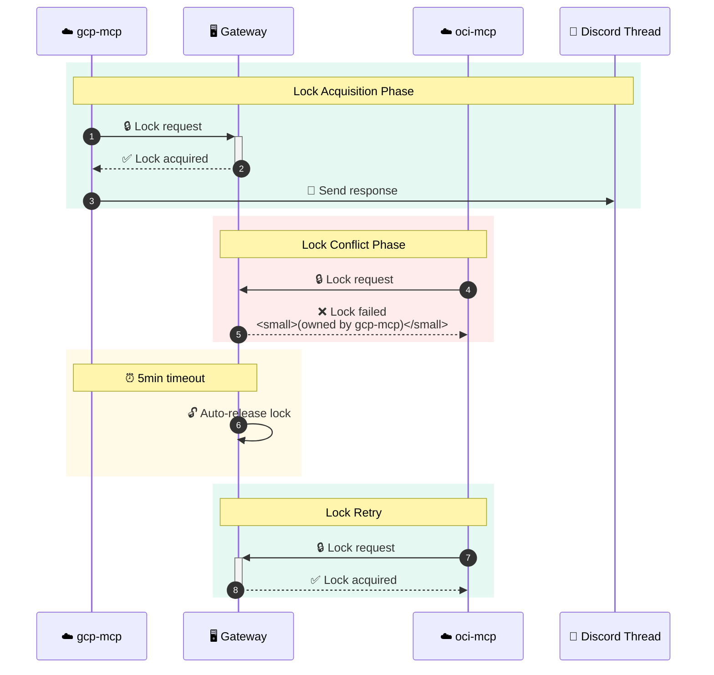
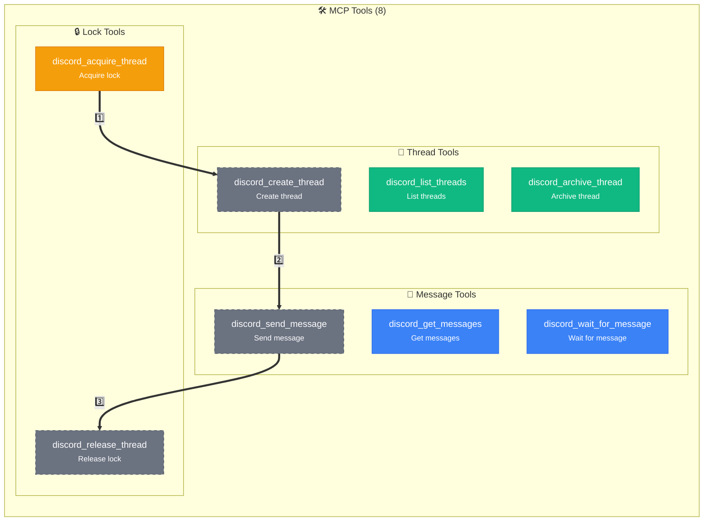
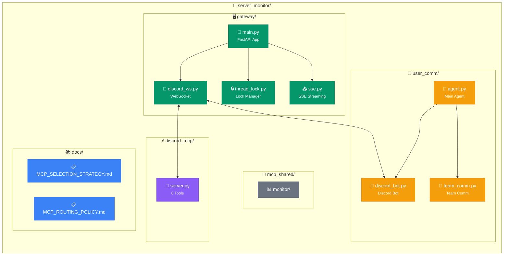
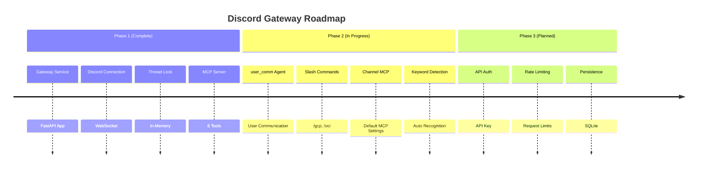

+++
title = "Discord Gateway MCP Architecture Design"
slug = "discord-gateway-mcp-architecture-design"
date = 2026-03-01T01:13:00+09:00
draft = false
categories = ["Development", "Architecture"]
tags = ["discord", "mcp", "fastapi", "claude-code", "user-comm"]
ShowToc = true
TocOpen = true
+++

# Discord Gateway MCP Architecture Design

The Claude Code team designed a Discord Gateway Service for user communication via Discord. This article summarizes the key architecture decisions and user_comm Agent design.

---

## 1. Overall Architecture

### Components

| Layer | Component | Role |
|-------|-----------|------|
| **Discord** | Bot, Channel, Thread | User interface |
| **Gateway** | WebSocket, REST API, SSE | Message routing |
| **MCP** | gcp-mcp, oci-mcp, db-mcp | Tool execution |
| **user_comm** | Discord Agent | User communication |

### Message Flow



---

## 2. user_comm Agent (User Communication Handler)

### Role and Responsibilities

The user_comm Agent is a member of the Claude Code team, communicating with users through Discord channels and collaborating with other agents.

| Function | Description |
|----------|-------------|
| **Input Reception** | Receive Discord messages and route to appropriate agent |
| **Opinion Request** | Query user opinions at other agents' requests |
| **Notification/Report** | Send system status, warnings, reports |
| **Team Communication** | Exchange messages with other agents |

### Internal Structure



### Message Types

```python
class MessageType(Enum):
    TASK_REQUEST = "task_request"       # Task request
    NOTIFICATION = "notification"        # Notification
    OPINION_REQUEST = "opinion_request"  # Opinion request
    OPINION_RESPONSE = "opinion_response" # Opinion response
    STATUS_REPORT = "status_report"      # Status report
    ERROR = "error"                      # Error
```

### Key Function Flows

#### Input Reception (Discord → Agent)
```
User: "@gcp-monitor check server status"
  → DiscordBot.on_message
  → UserCommAgent._parse_command (target: gcp-monitor)
  → TeamCommunicator.send_to_agent
  → Discord: "Request forwarded to gcp-monitor."
```

#### Opinion Request (Agent → Discord)
```
gcp-monitor: "Clean up disk?" → user_comm
  → DiscordBot.ask_opinion (wait for button or reply)
  → User response
  → TeamCommunicator.send_to_agent (forward response)
```

#### Notification/Report (Agent → Discord)
```
oci-monitor: "Disk 92% warning" → user_comm
  → DiscordBot.send_message (Embed format)
```

---

## 3. Lightweight Architecture Without Redis

### Why Remove Redis?

| Item | With Redis | With In-Memory |
|------|-----------|----------------|
| Thread Lock | Redis SET NX | Python dict |
| Event Distribution | Redis Streams | Direct SSE |
| State Storage | Redis Cache | Memory cache |

**Conclusion**: In-memory is sufficient for single-instance environments

### Gateway Structure



### Component Details

| Module | Role | Features |
|--------|------|----------|
| Discord Bot | WebSocket connection | Auto-reconnect |
| Thread Lock | Concurrency control | 5min timeout |
| Message Cache | Message storage | Max 1000 items |
| SSE Manager | Real-time delivery | Broadcast to all MCPs |

---

## 4. MCP Selection: 4-Stage Hybrid

### Selection Priority

| Rank | Method | Example | Description |
|:----:|--------|---------|-------------|
| 1️⃣ | Slash Command | `/gcp status` | Most explicit |
| 2️⃣ | @Mention | `@gcp-monitor status` | Natural conversation |
| 3️⃣ | Keyword Detection | `gcp server status` | Auto keyword recognition |
| 4️⃣ | Channel Assignment | #gcp-monitoring | Channel default MCP |

### Fallback Order



### Slash Command List

| Command | MCP | Description |
|---------|-----|-------------|
| `/gcp status [server]` | gcp-mcp | GCP server status |
| `/gcp list` | gcp-mcp | GCP instance list |
| `/oci status [server]` | oci-mcp | OCI server status |
| `/oci list` | oci-mcp | OCI instance list |
| `/db query <sql>` | db-mcp | Execute DB query |
| `/db list` | db-mcp | DB list |
| `/alert check` | alert-mcp | Check alerts |

---

## 5. Thread Lock Rules

### Lock Behavior



### Lock API

| Method | Endpoint | Description |
|--------|----------|-------------|
| `POST` | `/api/threads/{id}/acquire` | Acquire lock |
| `POST` | `/api/threads/{id}/release` | Release lock |
| `GET` | `/api/threads/{id}/lock` | Check lock status |

### Request/Response Example

**Lock Acquire Request**
```bash
POST /api/threads/123456/acquire
{
  "agent_name": "gcp-mcp",
  "timeout": 300
}
```

**Lock Acquire Response**
```json
{
  "acquired": true,
  "thread_id": "123456",
  "agent": "gcp-mcp"
}
```

---

## 6. MCP Tools (8)

### Tool List

| Tool | Description | Key Parameters |
|------|-------------|----------------|
| `discord_send_message` | Send message | channel_id, content |
| `discord_get_messages` | Get messages | channel_id, limit |
| `discord_wait_for_message` | Wait for message | channel_id, timeout |
| `discord_create_thread` | Create thread | channel_id, message_id |
| `discord_list_threads` | List threads | channel_id |
| `discord_archive_thread` | Archive thread | thread_id |
| `discord_acquire_thread` | Acquire lock | thread_id, agent_name |
| `discord_release_thread` | Release lock | thread_id, agent_name |

### Tool Relationships



### Usage Examples

```python
# Send message
discord_send_message(
    channel_id="123456789",
    content="Server status: OK"
)

# Create thread
discord_create_thread(
    channel_id="123456789",
    message_id="987654321",
    name="Status Check"
)

# Acquire lock
discord_acquire_thread(
    thread_id="111222333",
    agent_name="gcp-mcp",
    timeout=300
)
```

---

## 7. File Structure



### Directory Description

| Path | Description |
|------|-------------|
| `gateway/` | Gateway Service (FastAPI) |
| `user_comm/` | User Communication Agent |
| `discord_mcp/` | MCP Server (8 tools) |
| `mcp_shared/` | Shared MCP tools |
| `docs/` | Documentation |

---

### Directory Description

| Path | Description |
|------|-------------|
| `gateway/` | Gateway Service (FastAPI) |
| `user_comm/` | User Communication Agent |
| `discord_mcp/` | MCP Server (8 tools) |
| `mcp_shared/` | Shared MCP tools |
| `docs/` | Documentation |

---

## 8. How to Run

### Local Execution

```bash
# Start Gateway Service
uvicorn gateway.main:app --host 0.0.0.0 --port 8081

# Start user_comm Agent (standalone mode)
python main.py --standalone

# Start user_comm Agent (team mode)
python main.py --team server-monitor

# Health check
curl http://localhost:8081/health
# Response: {"status": "healthy", "discord_connected": true}
```

### Claude Code MCP Configuration

```json
// ~/.claude/settings.json
{
  "mcpServers": {
    "discord-gateway": {
      "command": "python3",
      "args": ["/path/to/discord_mcp/server.py"],
      "env": {
        "GATEWAY_URL": "http://localhost:8081"
      }
    }
  }
}
```

---

## 9. Roadmap



### Phase 1: Complete

- [x] FastAPI Gateway Service
- [x] Discord WebSocket connection
- [x] Thread Lock (In-Memory)
- [x] SSE broadcast
- [x] MCP Server (8 tools)

### Phase 2: In Progress

- [ ] user_comm Agent implementation
- [ ] Slash command implementation
- [ ] Channel default MCP settings
- [ ] Keyword auto-detection
- [ ] Routing configuration file

### Phase 3: Optional

- [ ] API authentication (API Key)
- [ ] Rate Limiting
- [ ] Message persistence (SQLite)

---

## Conclusion

We chose a strategy of starting with a lightweight architecture and expanding when needed.

| Item | Current | Future |
|------|---------|--------|
| State Storage | In-Memory | SQLite (if needed) |
| Distributed Lock | Not used | Redis (multi-instance) |
| Authentication | None | API Key (if needed) |
| User Communication | Gateway direct | user_comm Agent |

The current structure is sufficient for single instances, and we plan to expand incrementally as traffic grows. The user_comm Agent systematizes user communication and improves collaboration with other agents on the team.
