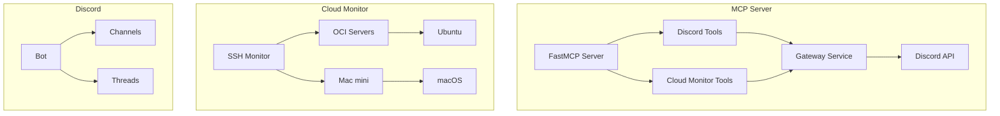
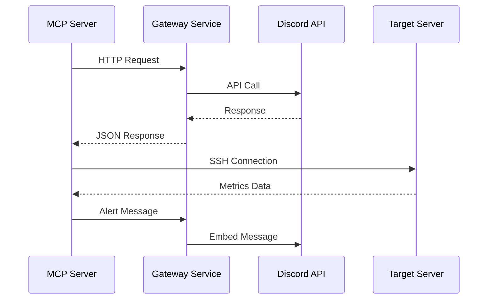

+++
title = "[Cloud Monitor] MCP Tool Structure and Pros/Cons Analysis"
slug = "2026-03-03-002-cloud-monitor-mcp-tool-structure-analysis"
date = 2026-03-03T15:02:49+09:00
draft = false
tags = ["mcp", "fastmcp", "discord", "ssh", "server-monitoring", "cloud"]
categories = ["DevOps", "MCP", "Cloud Monitoring"]
ShowToc = true
TocOpen = true
+++

# [server-monitor] MCP Tool Structure and Pros/Cons Analysis

## Overview

This document analyzes the structure, advantages, and disadvantages of the MCP (Model Context Protocol) tools implemented in the server-monitor project. A total of 13 MCP tools are provided, categorized into 8 existing Discord MCP tools and 5 new Cloud Monitor MCP tools.

## Table of Contents

1. [Architecture Overview](#architecture-overview)
2. [Detailed Tool Analysis](#detailed-tool-analysis)
3. [Architecture Structure](#architecture-structure)
4. [Advantages](#advantages)
5. [Disadvantages and Improvements](#disadvantages-and-improvements)
6. [Conclusion](#conclusion)

---

## Architecture Overview

### FastMCP-based Architecture



### MCP Tool Categories

| Category | Tool Count | Main Functions |
|----------|------------|----------------|
| Discord MCP | 8 | Message, thread management |
| Cloud Monitor MCP | 5 | Server monitoring, metrics collection |
| **Total** | **13** | **Integrated monitoring platform** |

---

## Detailed Tool Analysis

### 1. Existing Discord MCP Tools (8)

#### 1.1 Message Management Tools

| Tool Name | Parameters | Returns | Features |
|-----------|------------|---------|----------|
| `discord_send_message` | `channel_id`, `content`, `thread_id?` | Result message | Basic message sending |
| `discord_get_messages` | `channel_id`, `limit?`, `after?` | Message list | Message retrieval |
| `discord_wait_for_message` | `channel_id`, `timeout_seconds?` | Wait status | Async message waiting (SSE not implemented) |

#### 1.2 Thread Management Tools

| Tool Name | Parameters | Returns | Features |
|-----------|------------|---------|----------|
| `discord_create_thread` | `channel_id`, `message_id`, `name?` | Thread info | Thread creation |
| `discord_list_threads` | `channel_id` | Thread list | Active thread lookup |
| `discord_archive_thread` | `thread_id` | Result message | Thread archiving (not implemented) |

#### 1.3 Concurrency Management Tools

| Tool Name | Parameters | Returns | Features |
|-----------|------------|---------|----------|
| `discord_acquire_thread` | `thread_id`, `agent_name`, `timeout?` | Lock acquisition result | Multi-agent lock |
| `discord_release_thread` | `thread_id`, `agent_name` | Lock release result | Agent lock release |

### 2. New Cloud Monitor MCP Tools (5)

#### 2.1 Server Management Tools

| Tool Name | Parameters | Returns | Features |
|-----------|------------|---------|----------|
| `cloud_get_server_status` | `server_name` | Server status info | Connection status, OS, metrics |
| `cloud_list_servers` | `group?` | Server list | Group filtering support |
| `cloud_list_ssh_config_hosts` | `group?` | SSH host list | SSH config auto-parsing |

#### 2.2 Monitoring Tools

| Tool Name | Parameters | Returns | Features |
|-----------|------------|---------|----------|
| `cloud_get_metrics` | `server_name`, `metric_types?` | Metrics data | Optional metric lookup |
| `cloud_set_alert` | `metric_type`, `level`, `threshold` | Setting result | Dynamic threshold configuration |

---

## Architecture Structure

### 1. FastMCP Structure

```mermaid
graph LR
    subgraph "FastMCP Layer"
        A[@mcp.tool decorator] --> B[Tool Function]
        B --> C[Parameter Validation]
        C --> D[Business Logic]
        D --> E[Result Formatting]
        E --> F[Return Response]
    end

    subgraph "Common Components"
        G[Gateway Request] --> H[HTTP Client]
        I[Config Manager] --> J[Cloud Monitor Config]
        K[Error Handler] --> L[Uniform Error Response]
    end
```

### 2. Communication Flow



### 3. Data Flow

```
Configuration (config.yaml)
    ↓
Server Info parsing
    ↓
SSH Connection
    ↓
Metrics Collection
    ↓
Threshold Check
    ↓
Alert Generation
    ↓
Discord Notification
```

---

## Advantages

### 1. Scalability

- **Modular Structure**: Each tool operates independently and is easy to extend
- **Plugin Architecture**: Adding new tools only requires adding decorators
- **Cloud Provider Abstraction**: SSH-based support for various environments

### 2. Integration

- **Unified Platform**: Discord and Cloud Monitor managed together on a single MCP server
- **Automatic Linkage**: Automatic Discord alerts on server anomalies
- **Consistent Interface**: All tools follow the same parameter pattern

### 3. Usability

- **Intuitive Tool Names**: Clear function expression like `cloud_get_server_status`
- **Optional Parameters**: Most parameters are optional for convenience
- **Detailed Error Messages**: Clearly indicates the cause of failures
- **JSON Response**: Structured data return for easy parsing

### 4. Reliability

- **Timeout Handling**: Timeout set for all requests
- **Connection Pooling**: SSH connection reuse for performance
- **Exception Handling**: Comprehensive try-catch blocks
- **Status Tracking**: Continuous server status monitoring

### 5. Maintainability

- **Centralized Configuration**: Central management via config.yaml
- **Environment Variable Support**: Sensitive info separated into environment variables
- **Logging System**: Detailed logging for easy debugging
- **Version Management**: Clear module version distinction

---

## Disadvantages and Improvements

### 1. Performance Related

#### Issues
- **Synchronous Processing**: Some tools operate sequentially
- **Connection Latency**: New connection created each SSH connection
- **Memory Usage**: All processing on single event loop

#### Improvements
```python
# Async processing improvement example
async def concurrent_monitoring(servers):
    tasks = [monitor_server(server) for server in servers]
    return await asyncio.gather(*tasks)

# Connection pooling introduction
class ConnectionPool:
    def __init__(self, max_connections=10):
        self.pool = asyncio.Queue(maxsize=max_connections)
```

### 2. Error Handling Related

#### Issues
- **Undifferentiated Errors**: All errors handled the same way
- **Lack of Recovery Mechanism**: No auto-recovery logic on failures
- **Insufficient Detailed Logging**: Insufficient logs for debugging

#### Improvements
```python
# Differentiated error handling
class CloudMonitorError(Exception):
    pass

class ConnectionError(CloudMonitorError):
    pass

class MetricCollectionError(CloudMonitorError):
    pass

# Auto-recovery mechanism
async def resilient_monitoring(server_info, max_retries=3):
    for attempt in range(max_retries):
        try:
            return await monitor_server(server_info)
        except ConnectionError:
            await asyncio.sleep(2 ** attempt)
    raise CloudMonitorError("Max retries exceeded")
```

### 3. Functionality Related

#### Issues
- **Lack of Metadata**: Tool descriptions too brief
- **Insufficient Validation**: Lack of input value check logic
- **No Batch Processing**: Cannot process multiple servers simultaneously

#### Improvements
```python
# Detailed metadata
@mcp.tool(
    name="cloud_batch_monitoring",
    description="Retrieve multiple server statuses at once",
    parameters={
        "server_names": {
            "type": "array",
            "items": {"type": "string"},
            "description": "List of server names to monitor"
        }
    }
)
async def cloud_batch_monitoring(server_names: List[str]) -> str:
    # Batch processing logic
    pass
```

### 4. Security Related

#### Issues
- **Credential Exposure**: Sensitive info potentially exposed in logs
- **No Access Control**: Anyone can call tools
- **Insufficient Input Validation**: Insufficient defense against malicious input

#### Improvements
```python
# Access control
def require_role(required_role):
    def decorator(func):
        async def wrapper(*args, **kwargs):
            if not has_role(required_role):
                raise PermissionError("Access denied")
            return await func(*args, **kwargs)
        return wrapper
    return decorator

# Input validation
@mcp.tool()
async def secure_monitoring(server_name: str):
    if not is_valid_server_name(server_name):
        raise ValueError("Invalid server name")
    # ...
```

### 5. Usability Related

#### Issues
- **Lack of Documentation**: No detailed documentation for tool usage
- **No Examples**: No actual usage examples
- **Inconsistent Return Values**: Some tools return JSON, others return strings

#### Improvements
```python
# Consistent return value format
@mcp.tool()
async def cloud_get_server_status_v2(server_name: str) -> dict:
    """
    Retrieve server status.

    Args:
        server_name (str): Server name

    Returns:
        dict: {
            "success": bool,
            "data": Optional[dict],
            "error": Optional[str],
            "timestamp": str
        }
    """
    # ...
    return {
        "success": True,
        "data": status,
        "error": None,
        "timestamp": datetime.now().isoformat()
    }
```

---

## Conclusion

### 1. Overall Assessment

The MCP tools in the server-monitor project have the following strengths:

- **✅ Excellent Integration**: Perfect combination of Discord integration and server monitoring
- **✅ Scalable Structure**: Modular architecture using FastMCP
- **✅ Practicality**: Provides all functions needed for actual server monitoring
- **✅ Ease of Use**: Intuitive tool names and simple interface

### 2. Improvement Priority

Improvement plans by priority:

1. **High**: Performance improvement (async processing, connection pooling)
2. **Medium**: Error handling enhancement and auto-recovery mechanisms
3. **Low**: Security enhancement and detailed documentation

### 3. Future Direction

- **Microservices Architecture**: Separate each tool into independent services
- **Real-time Monitoring**: Real-time data collection via WebSocket/SSE
- **Auto-scaling**: Automatic scaling based on server changes
- **Machine Learning**: ML model integration for anomaly detection

### 4. Final Assessment

Overall, a well-designed MCP tool system that provides stability and functionality suitable for actual production environments. While there are areas for improvement, the core functionality is highly complete, and it has the potential to develop into an even more powerful monitoring platform through continuous improvements.

---
*Written: 2026-03-03*
*Author: server-monitor-team*

---

**Korean Version:** [한국어 버전](/ko/post/2026-03-03-002-cloud-monitor-mcp-tool-structure-analysis/)
