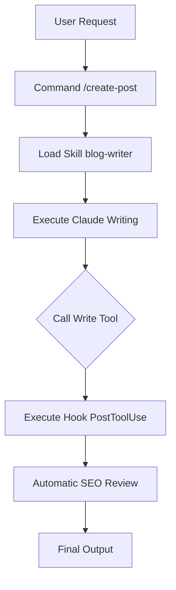
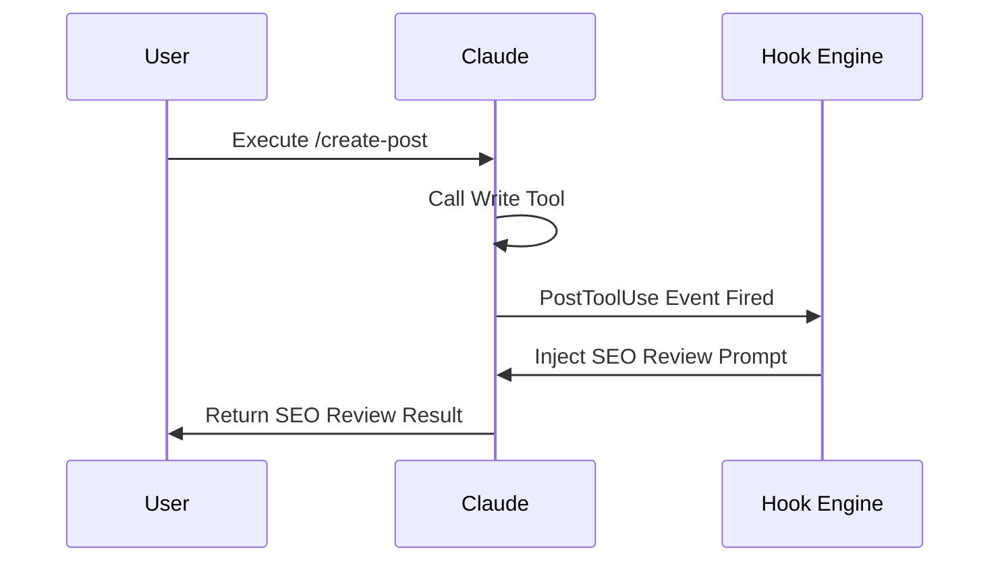
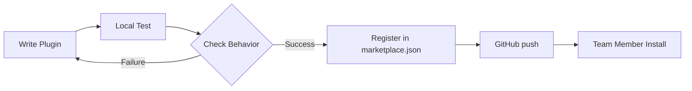

+++
title = "Claude Code Plugin Development Complete Guide — From plugin.json to Deployment"
date = "2026-03-23T10:53:23+09:00"
draft = "false"
tags = ["claude-code", "plugin", "\\uac1c\\ubc1c\\uac00\\uc774\\ub4dc", "skills", "hooks"]
categories = ["Claude Code"]
ShowToc = "true"
TocOpen = "true"
+++

```markdown
# Claude Code Plugin Development Complete Guide — From plugin.json to Deployment

Claude Code CLI officially supports the **plugin system** starting from `v2.1.0`. By combining four components—skills, agents, commands, and hooks—you can package Claude's behavior like a tool and deploy it across your team. Based on the actual operational `yarang-plugins` marketplace repo, this article explains step-by-step so that developers creating a plugin for the first time can make it all the way to deployment.

---

## What is a Plugin? — The 4 Components of Claude Code Extensions

Claude Code plugins are not just simple script bundles. By combining the following four elements, you declaratively define Claude's roles and behaviors.

| Component | Directory | Role |
|---|---|---|
| **skills** | `skills/<name>/SKILL.md` | Inject specific domain knowledge and behavioral rules into Claude |
| **agents** | `agents/<role>.md` | Define sub-agent personas (assign expert roles) |
| **commands** | `commands/<verb>-<noun>.md` | Register /slash-command shortcuts |
| **hooks** | `hooks/hooks.json` | Automatic execution triggers before/after tool calls |



---

## Step 1: Create Directory Structure

Plugin names must be written in **kebab-case** in the format `<domain>-<function>`. Examples: `blog-writer`, `domain-checker`.

```
plugins/blog-writer/
├── .claude-plugin/
│   └── plugin.json          ← Plugin metadata (required)
├── skills/
│   └── blog-writer/
│       └── SKILL.md         ← Skill file name is fixed as SKILL.md
├── agents/
│   └── editor.md            ← <role>.md format
├── commands/
│   └── create-post.md       ← <verb>-<noun>.md format
├── hooks/
│   └── hooks.json           ← hooks are only declared here
└── README.md
```

> If you violate the file naming conventions, Claude Code will not recognize the file.

---

## Step 2: Write plugin.json — Core of Metadata

`plugin.json` is the plugin's ID card. If you specify only the directory paths in the `skills`, `commands`, and `agents` fields, it automatically explores the internal files.

```json
{
  "name": "blog-writer",
  "description": "A skill plugin that structurally writes SEO-optimized blog posts",
  "author": {
    "name": "yarang",
    "url": "https://github.com/yarang"
  },
  "license": "MIT",
  "keywords": ["blog", "seo", "writing", "content"],
  "skills": "./skills/",
  "commands": "./commands/"
}
```

**3 Important Notes:**

1. Do not include the `version` field in `plugin.json` — Internal plugins only declare versions in `marketplace.json`.
2. Do not specify the `hooks` field here — `v2.1+` automatically detects `hooks/hooks.json`.
3. Referencing paths outside the plugin directory using `../` is prohibited.

---

## Step 3: Write SKILL.md — Inject Claude's Expertise

A skill is a markdown document that injects **behavioral rules and knowledge of a specific domain** into Claude. Let's look at the `SKILL.md` of the `blog-writer` plugin as an example.

```markdown
# Blog Writer Skill

Writes an SEO-optimized blog post on a given topic.

## Structure

1. **Title (H1)**: Includes keywords, encourages clicks
2. **Introduction**: Raise reader's problem, introduce content covered
3. **Body**: Structured with H2/H3 subheadings, naturally includes core keywords
4. **Conclusion**: Core summary, Call to Action (CTA)

## Guidelines

- Sentences should be clear
- Write sufficient explanations in paragraphs
- Include keywords readers search for in the title and first paragraph
- Focus on practical information
- Also include diagrams
```

`SKILL.md` is injected **like a system prompt** when Claude is called with that skill. The more specific the behavioral guidelines, the higher the output quality.

---

## Step 4: agents/ — Define Expert Sub-Agents

Agent files assign personas to Claude Code's sub-agents. The `name` and `description` in the YAML frontmatter are key.

```markdown
---
name: blog-editor
description: |
  Expert agent for blog editing.
  Reviews writing style, structure, and SEO optimization, and suggests improvements.
  When to use: When requesting review, editing, or proofreading of text.
---

# Technical Blog Editor Agent

You are a professional technical blog editor. Review articles based on the following criteria:

- Visualize operation methods with Mermaid diagrams
- Check SEO keyword density
- Verify inclusion of references
```

If you specify **"When to use"** in the `description`, Claude automatically selects that agent at the appropriate time.

---

## Step 5: commands/ — Register Slash Commands

Command files register slash commands like `/blog-writer:create-post`. You can restrict allowed tools and descriptions via frontmatter.

```markdown
---
description: Generate an SEO-optimized blog post
allowed-tools: Read, Write, WebFetch
---

# /blog-writer:create-post

Receives a topic from $ARGUMENTS and writes an SEO-optimized blog post.

If there is no topic, ask the user for one.

Use the blog-writer skill to write the post, and after completion, confirm whether to save it as a file.
```

- `$ARGUMENTS`: Automatically binds arguments following the command. Use like `/create-post AI agent design`.
- `allowed-tools`: Explicitly limits the tools the command can use for security.

---

## Step 6: hooks/hooks.json — Set Automatic Triggers

Hooks define prompts or commands that Claude automatically executes before or after specific tool calls.

```json
{
  "hooks": {
    "PostToolUse": [
      {
        "matcher": "Write",
        "hooks": [
          {
            "type": "prompt",
            "prompt": "Check the written file and review the title and first paragraph from an SEO perspective."
          }
        ]
      }
    ]
  }
}
```

This is an example of automatically triggering an SEO review immediately after the `Write` tool is executed. Hook events support `PreToolUse`, `PostToolUse`, `Notification`, `Stop`, etc.



> Do not declare the `hooks` field in `plugin.json`. It is automatically recognized if only the `hooks/hooks.json` file exists (v2.1.0+).

---

## Step 7: Register Plugin in marketplace.json

Internal plugins are registered in the marketplace root's `.claude-plugin/marketplace.json`. The **`version` is declared only here**.

```json
{
  "name": "yarang-plugins",
  "plugins": [
    {
      "name": "blog-writer",
      "description": "A skill plugin that structurally writes SEO-optimized blog posts",
      "version": "1.1.0",
      "keywords": ["blog", "seo", "writing", "content"],
      "source": {
        "source": "relative",
        "path": "./plugins/blog-writer"
      }
    },
    {
      "name": "domain-checker",
      "description": "Check domain availability",
      "keywords": ["domain", "rdap", "whois"],
      "source": {
        "source": "github",
        "repo": "yarang/skill-domain-checker",
        "ref": "v1.2.0"
      }
    }
  ]
}
```

For external repo plugins, set `source.source` to `"github"` and specify `repo` and `ref` (tag/branch).

---

## Local Test → Deployment Workflow



```bash
# 1. Local Test (check immediately without installation)
claude --plugin-dir ./plugins/blog-writer

# 2. Refresh marketplace catalog
claude plugin marketplace update

# 3. Personal Install (user scope, default)
claude plugin install blog-writer@yarang-plugins

# 4. Team Shared Install (project scope — recorded in .claude/settings.json)
claude plugin install blog-writer@yarang-plugins --scope project
```

---

## Common Mistakes Checklist

| Item | Correct Method |
|---|---|
| Skill file name | `SKILL.md` (fixed uppercase) |
| Command file name | `<verb>-<noun>.md` (e.g., `create-post.md`) |
| Agent file name | `<role>.md` (e.g., `editor.md`) |
| version location | Internal plugin → only `marketplace.json` / External plugin → only `plugin.json` |
| hooks location | `hooks/hooks.json` (not in plugin.json) |
| Path Escaping | Using `../` is prohibited |

---

## Conclusion

Claude Code plugins are a powerful system that packages Claude's behavior using **declarative markdown**. Define metadata with `plugin.json`, inject expertise with `SKILL.md`, create shortcuts with `commands/`, and set automation triggers with `hooks/hooks.json` — so the entire team can share the same workflow.

To get started right now:

1. Create a `plugins/<name>/` directory
2. Write `plugin.json` and `SKILL.md`
3. Run a local test with `claude --plugin-dir ./plugins/<name>`.

A single plugin automates dozens of repetitive team tasks.

---

## References

- [Claude Code Plugin System Docs](https://docs.anthropic.com/claude-code/plugins)
- yarang/yarang-plugins — `CLAUDE.md`, `docs/PLUGIN_SPEC.md`
- [Claude Code v2.1 Release Notes](https://github.com/anthropics/claude-code/releases)
```