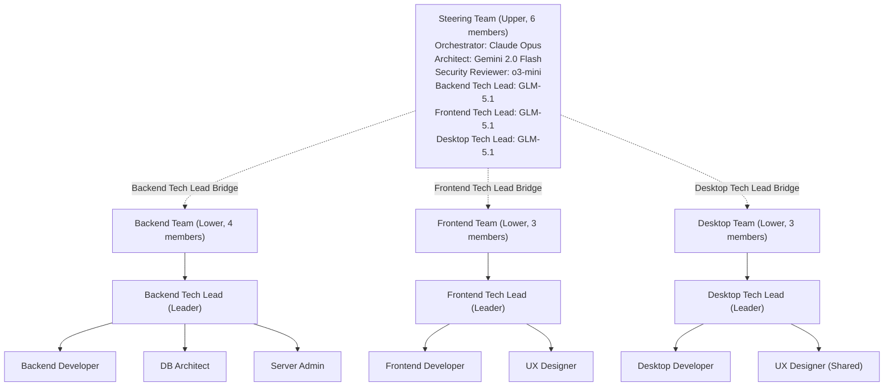
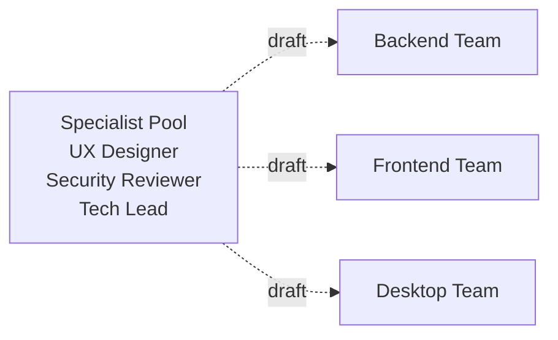

+++
title = "AI Agent Team Structure: Hierarchical Architecture and Bridge Leadership Design"
date = 2026-03-30T00:32:25+09:00
draft = false
tags = ["ai", "agent", "team", "structure", "llm", "multimodel"]
categories = ["Development", "AI"]
ShowToc = true
TocOpen = true
+++

## Overview

Sharing my experience building an AI agent team for a blog system development project, using hierarchical structure and bridge leadership. I'll walk through how we achieved both cost optimization and maximum performance with a team of **14 specialists across 4 teams**.

## Background

The blog system is developed across three domains: **Backend (FastAPI)**, **Frontend (Next.js)**, and **Desktop (Tauri)**. Each domain requires a specialized skill set, along with unified architecture design and security review.

## Team Structure Design Principles

### 1. Cost Optimization

High-performance models like Claude Opus are expensive. Running the entire team on such models leads to exponential costs. To address this:

- **Leader/Design**: High-performance model (Claude Opus)
- **Team members**: Cost-effective model (GLM-5.1, 60-70% cost reduction)
- **Special purpose**: Dedicated models (Gemini for design, o3-mini for security)

### 2. Expert Separation

It's more efficient to have specialists responsible for their domains:

- **Architect**: System architecture, API design
- **Security Reviewer**: OWASP, vulnerability analysis
- **Tech Lead**: Team management + code review
- **Developer**: Implementation work

### 3. Bridge Leadership

To resolve communication bottlenecks between upper and lower teams, tech leads have **dual membership** in both tiers.

## Final Team Structure



## Steering Team (Upper, 6 members)

| Role | Model | Responsibility |
|------|-------|----------------|
| Orchestrator | Claude Opus | Overall coordination, final decisions |
| Architect | Gemini 2.0 Flash | Rapid design, prototyping |
| Security Reviewer | o3-mini | Security review, vulnerability analysis |
| Backend Tech Lead | GLM-5.1 | Backend team bridge |
| Frontend Tech Lead | GLM-5.1 | Frontend team bridge |
| Desktop Tech Lead | GLM-5.1 | Desktop team bridge |

We adopted **Consensus**. All decisions in the steering team are made through consensus, with each expert having a voice in their domain.

## Sub-Teams (3 teams)

### Backend Team (4 members)

- **Backend Tech Lead** (Leader, Bridge): FastAPI, SQLAlchemy, PostgreSQL
- **Backend Developer**: API endpoint implementation
- **Database Architect**: Schema design, query optimization
- **Server Admin**: Docker, Ubuntu, monitoring

### Frontend Team (3 members)

- **Frontend Tech Lead** (Leader, Bridge): Next.js 15, React Server Components
- **Frontend Developer**: UI components, ISR
- **UX Designer**: Wireframes, component design

### Desktop Team (3 members)

- **Desktop Tech Lead** (Leader, Bridge): Tauri, Rust
- **Desktop Developer**: Local application implementation
- **UX Designer**: Shared expert (shared with frontend team)

## Bridge Leadership: The Core Design

The key is tech leads having **dual membership** in both upper and lower teams.

**In the Steering Team:**
- Participate in architecture design
- Decision-making for backend/frontend/desktop concerns
- Technical coordination with other teams

**In the Sub-Team:**
- Task assignment to team members
- Code review
- Technical coaching
- Schedule management

Bridge effect:
- **Upward**: Escalate technical issues from team members to steering team
- **Downward**: Interpret and communicate steering team design decisions to team members

## Model Distribution Strategy

| Model | Count | Purpose | Cost |
|-------|-------|---------|------|
| Claude Opus | 1 | Orchestrator | Very high |
| Gemini 2.0 Flash | 1 | Design | Free/low |
| o3-mini | 1 | Security review | High |
| **GLM-5.1** | **11** | **Tech leads + members** | **Low** |

By assigning 11 team members to GLM-5.1, we achieved **60-70% cost reduction**.

## Shared Expert Structure

UX Designer has **simultaneous membership** in both frontend and desktop teams.

**Advantages:** Design consistency, resource efficiency, centralized communication

**Disadvantages:** Bottleneck when overloaded, wait time when both teams need design simultaneously

**Solutions:** Priority-based task assignment, add external designer agent when needed

## Alternative Structures Considered

### Alternative 1: Pool Structure

Manage specialists as a **Pool** rather than assigning them to specific teams.



**Pros:** Flexibility, resource efficiency / **Cons:** Requires Pool structure support in Relay plugin

### Alternative 2: Lean Steering Team

Reduce steering team to 3 members, with tech leads joining only when needed.

**Pros:** Faster decision-making / **Cons:** Tech leads excluded from key decisions

### Adopted: Current Structure

The reason is **"execution first"**. Rather than finding the perfect structure, we chose to start with an executable structure and improve as we go.

## How to Run

### Zai Mode (Default)

```bash
env CLAUDE_CODE_EXPERIMENTAL_AGENT_TEAMS=1 \
  /Users/yarang/.local/bin/claude \
  --settings .agent_forge_for_zai.json \
  --teammate-mode tmux \
  --plugin-dir /Users/yarang/working/agent_teams/relay-plugin
```

## Wrapper Design

Gemini and OpenAI are not compatible with the Anthropic API. We wrote a **Python HTTP Wrapper** to convert:

```
Claude Code → Anthropic API format request
                ↓
          Wrapper Server
                ↓
    (Anthropic → Gemini/OpenAI conversion)
                ↓
          Gemini/OpenAI API
                ↓
    (Gemini/OpenAI → Anthropic conversion)
                ↓
           Claude Code
```

## Conclusion

1. **Cost optimization**: Focus high-performance models on leadership/design only
2. **Expert separation**: Assign specialized models to design, security, etc.
3. **Bridge leadership**: Resolve communication bottlenecks between upper and lower teams
4. **Execution first**: Start with an executable structure rather than a perfect one

The next post will share our actual team operation experience, the issues we encountered, and how we resolved them.
