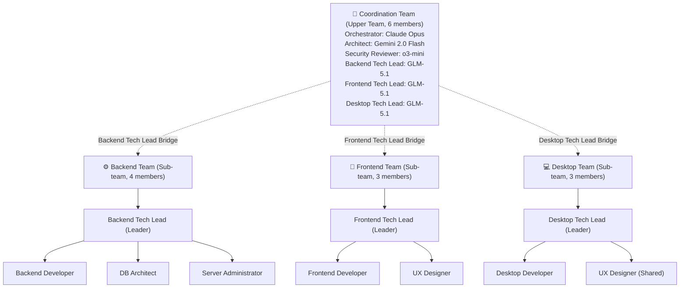
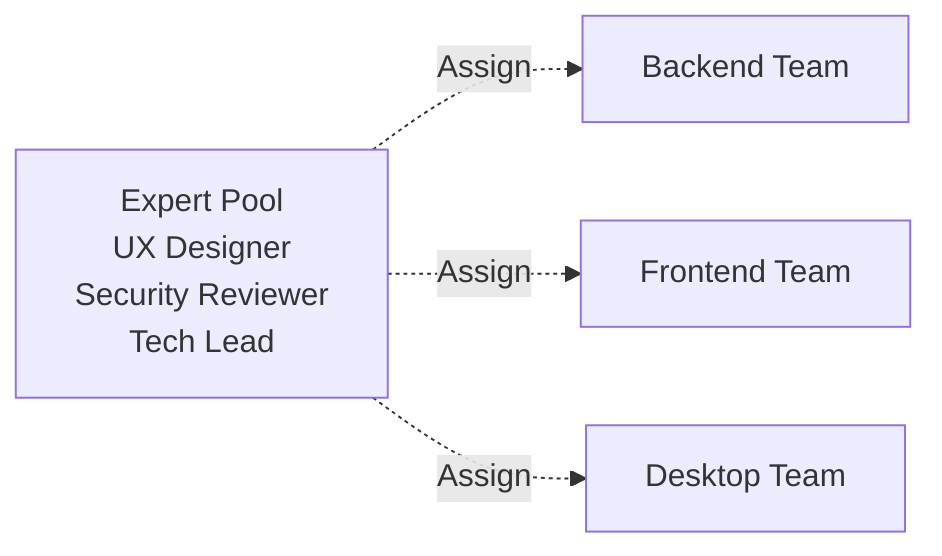

## Overview

Sharing the experience of introducing a hierarchical structure and bridge leadership while organizing an AI agent team for blog system development. We have summarized the process of achieving both cost optimization and performance maximization through a team structure composed of **14 experts and 4 teams**.

## Background

The blog system is developed across three areas: **Backend (FastAPI)**, **Frontend (Next.js)**, and **Desktop (Tauri)**. Each area requires a specialized technical set, as well as integrated architecture design and security reviews.

## Team Structure Design Principles

### 1. Cost Optimization

High-performance models like Claude Opus are expensive. If the entire team uses high-performance models, costs increase exponentially. To solve this:

- **Leader/Design**: High-performance model (Claude Opus)
- **Team Members**: Cheaper models (GLM-5.1, 60-70% cost savings)
- **Special Purpose**: Dedicated models (Gemini for design, o3-mini for security)

### 2. Separation of Experts

It is more efficient for experts to take responsibility for their respective fields rather than having one person do everything:

- **Architect**: System architecture, API design
- **Security Reviewer**: OWASP, vulnerability analysis
- **Tech Lead**: Team management + code review
- **Developer**: Implementation tasks

### 3. Bridge Leadership

To resolve communication bottlenecks between the upper team and sub-teams, we introduced a structure where tech leads have **dual affiliation**.

## Final Team Structure



## Coordination Team (Upper Team, 6 members)

| Role | Model | Responsibility |
|------|------|------|
| Orchestrator | Claude Opus | Overall coordination, final decisions |
| Architect | Gemini 2.0 Flash | Rapid design, prototyping |
| Security Reviewer | o3-mini | Security review, vulnerability analysis |
| Backend Tech Lead | GLM-5.1 | Backend team bridge |
| Frontend Tech Lead | GLM-5.1 | Frontend team bridge |
| Desktop Tech Lead | GLM-5.1 | Desktop team bridge |

We adopted a **Consensus** system. All decisions in the Coordination Team are made through consensus, and each expert has a say in their area of expertise.

## Sub-teams (3 Teams)

### Backend Team (4 members)

- **Backend Tech Lead** (Leader, Bridge): FastAPI, SQLAlchemy, PostgreSQL
- **Backend Developer**: API endpoint implementation
- **Database Architect**: Schema design, query optimization
- **Server Administrator**: Docker, Ubuntu, monitoring

### Frontend Team (3 members)

- **Frontend Tech Lead** (Leader, Bridge): Next.js 15, React Server Components
- **Frontend Developer**: UI components, ISR
- **UX Designer**: Wireframes, component design

### Desktop Team (3 members)

- **Desktop Tech Lead** (Leader, Bridge): Tauri, Rust
- **Desktop Developer**: Local application implementation
- **UX Designer**: Shared expert (shared with Frontend team)

## Bridge Leadership: Key Design

The core structure is that tech leads have **dual affiliation** with the upper team and sub-teams.

**In the Coordination Team:**
- Participate in architecture design
- Decisions regarding Backend/Frontend/Desktop
- Technical coordination with other teams

**In the Sub-teams:**
- Assign tasks to team members
- Code reviews
- Technical coaching
- Schedule management

Bridge Effects:
- **Upward**: Escalate technical issues from team members to the Coordination Team
- **Downward**: Convey and interpret design decisions from the Coordination Team to team members

## Model Allocation Strategy

| Model | Count | Purpose | Cost |
|------|------|------|------|
| Claude Opus | 1 | Orchestrator | Very High |
| Gemini 2.0 Flash | 1 | Design | Free/Cheap |
| o3-mini | 1 | Security Review | High |
| **GLM-5.1** | **11** | **Tech Lead + Team Members** | **Low** |

By composing the 11 team members with GLM-5.1, we achieved **60-70% cost savings**.

## Shared Expert Structure

A structure where the UX Designer belongs to both the Frontend Team and the Desktop Team **simultaneously**.

**Pros:** Design consistency, resource efficiency, focused communication

**Cons:** Bottleneck when workload is high, waiting time when both teams request simultaneously

**Solution:** Priority-based task allocation, adding external designer agents when necessary

## Team Structure Discussion: Various Alternatives

### Alternative 1: Pool Structure

A method of managing experts in a **Pool** rather than assigning them to a specific team.



**Pros:** Flexibility, resource efficiency / **Cons:** Need for Relay plugin Pool structure support, increased complexity

### Alternative 2: Lightweight Coordination Team

Reduce the Coordination Team to 3 members, with tech leads participating only when necessary.

**Pros:** Faster decision-making / **Cons:** Tech leaders are excluded from key decisions

### Adopted Option: Maintain Current Structure

The reason is **"Prioritizing Practical Execution"**. Instead of seeking a perfect structure, we chose to start quickly with a feasible structure and improve it through operation.

## Execution Method

### Zai Mode (Default)

```bash
env CLAUDE_CODE_EXPERIMENTAL_AGENT_TEAMS=1 \
  /Users/yarang/.local/bin/claude \
  --settings .agent_forge_for_zai.json \
  --teammate-mode tmux \
  --plugin-dir /Users/yarang/working/agent_teams/relay-plugin
```

### Gemini Mode (Design Rapid Prototyping)

```bash
export GEMINI_API_KEY="your_key"
python3 claude-gemini-wrapper.py
```

### OpenAI Mode (Security Review)

```bash
export OPENAI_API_KEY="your_key"
python3 claude-codex-wrapper.py
```

## Wrapper Design

Gemini and OpenAI are not compatible with the Anthropic API. Convert via **Python HTTP Wrapper**:

```
Claude Code → Request in Anthropic API format
                ↓
          Wrapper Server
                ↓
    (Anthropic → Gemini/OpenAI conversion)
                ↓
          Gemini/OpenAI API
                ↓
    (Gemini/OpenAI → Anthropic conversion)
                ↓
           Claude Code
```

## Conclusion

1. **Cost Optimization**: Concentrated use of high-performance models only for leadership/design
2. **Separation of Experts**: Assignment of models specialized in expert fields such as design and security
3. **Bridge Leadership**: Resolution of communication bottlenecks between upper team and sub-teams
4. **Practicality First**: Quick start with a feasible structure over a perfect one

In the next post, I will share the actual team operation experience, problems encountered, and the resolution process.