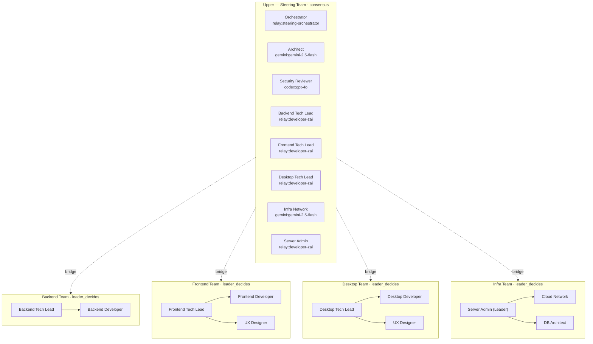
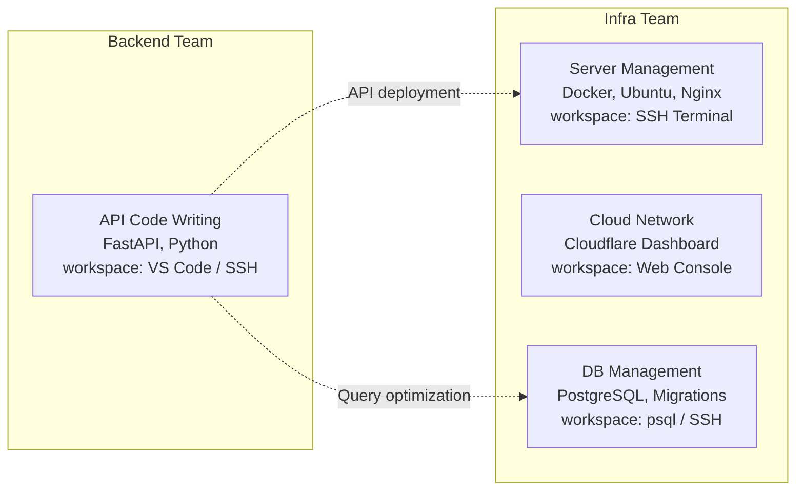
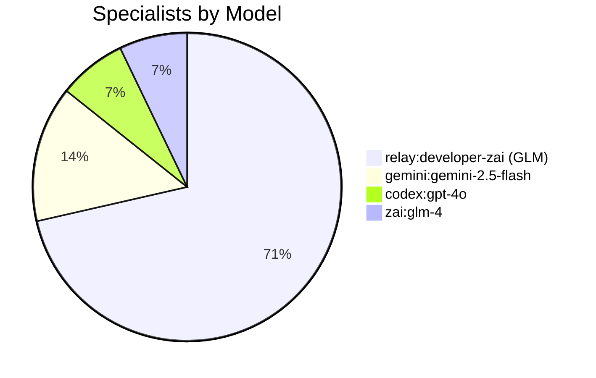
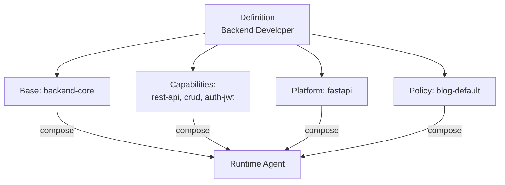
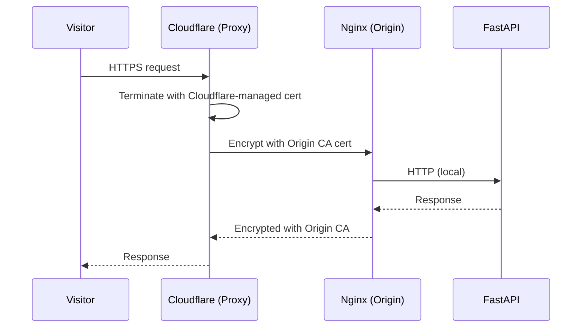
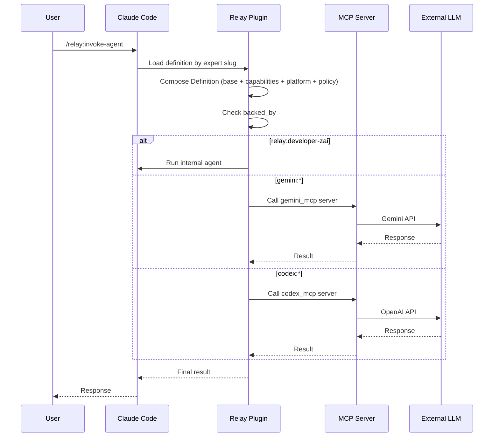

+++
title = "Multi-Model AI Agent Team Design: Composed Architecture and 5-Team Hierarchy"
date = 2026-03-30T00:33:34+09:00
draft = false
tags = ["ai", "agent", "multi-model", "claude", "gemini", "gpt", "llm", "team-architecture", "composed-agent"]
categories = ["Development", "AI", "Architecture"]
ShowToc = true
TocOpen = true
+++

## Overview

For building a blog system, I designed a multi-model agent team consisting of **14 AI specialists, 5 teams, and 4 LLM models**. The core innovations are two:

1. **Composed Agent**: Separating role definitions from execution profiles for maximum reusability
2. **Hierarchical Bridge Leadership**: Dual membership of tech leads between upper and lower teams to resolve communication bottlenecks

This post covers the final structure, model distribution strategy, and the composed architecture design process.

---

## Background: Why Multi-Model?

Using a single LLM for all tasks creates two problems:

- **Cost**: Running 14 specialists on a Claude Opus-level model makes costs uncontrollable
- **Fit**: Design needs fast reasoning, security analysis needs deep logic, implementation needs stable coding

So we distributed models based on task characteristics.

---

## Final Team Structure

5 teams, 14 specialists, 4 models.



### Team Details

| Team | Type | Decision-Making | Leader | Members |
|------|------|----------------|--------|---------|
| Steering Team | upper | consensus | Orchestrator | 8 (including bridges) |
| Backend Team | lower | leader_decides | Backend Tech Lead | 2 |
| Frontend Team | lower | leader_decides | Frontend Tech Lead | 3 |
| Desktop Team | lower | leader_decides | Desktop Tech Lead | 3 |
| Infra Team | lower | leader_decides | Server Admin | 3 |

---

## The Infra Team Separation Decision

In the initial design, DB Architect and Server Admin were part of the backend team. But we separated them based on **workspace**.



When workspaces differ, separation is more natural than keeping them together.

---

## Model Distribution Strategy



| Model | Specialists | Purpose | Why Chosen |
|-------|-------------|---------|------------|
| relay:developer-zai | 10 | Implementation, ops, leads | Cost-effective, stable coding |
| gemini:gemini-2.5-flash | 2 | Design, infra network | Fast response, easy external API calls |
| codex:gpt-4o | 1 | Security review | High reasoning, OWASP knowledge |
| zai:glm-4 | 1 | Context compression | Free tier, text summarization specialized |

By assigning 10 implementation specialists to GLM, we achieved **60-70% total cost reduction**.

---

## Composed Agent Architecture

The core innovation is **separating role definitions (Expert) from execution profiles (Definition)**.

With the traditional approach, role and execution logic are coupled — any change requires a full rewrite, and reuse is impossible.

### Composed Approach



### Module Structure

```
agent-library/
├── definitions/        ← 14 agent definitions
├── modules/
│   ├── base/           ← 6 base modules
│   ├── capabilities/   ← 15 capability modules
│   ├── platforms/      ← 5 platform modules
│   └── policies/       ← 1 policy
└── runs/               ← execution history
```

### Advantages

1. **Reusability**: `rest-api` capability module shared by backend developer and backend tech lead
2. **Platform swap**: Change `platform: fastapi` to `platform: django` for instant switching
3. **Capability extension**: Add a new capability module and connect it to the Definition
4. **Policy unification**: All agents follow the same `blog-default` policy

### Expert-Definition Mapping

| Expert | Definition | Base | Capabilities | Platform |
|--------|-----------|------|-------------|---------|
| Backend Developer | backend-developer | backend-core | rest-api, crud, auth-jwt | fastapi |
| Backend Tech Lead | backend-tech-lead | backend-core | rest-api, crud, code-review | fastapi |
| Frontend Developer | frontend-developer | frontend-core | markdown-renderer, list-filter-sort | nextjs |
| Server Admin | server-administrator | server-core | docker-management, nginx-config, postgres-admin | ubuntu |
| Infra Network | infra-network-admin | infra-core | dns-management, ssl-certificates, rate-limiting | cloudflare |
| Security Reviewer | security-auditor | specialist-core | security-audit | fastapi |
| Context Compressor | context-compressor | specialist-core | context-compression | markdown |

---

## TLS Certificate Strategy: Cloudflare Origin CA

For production TLS certificates, we chose **Cloudflare Origin CA** over Let's Encrypt.



| Item | Let's Encrypt | Cloudflare Origin CA |
|------|---------------|---------------------|
| Validity | 90 days (renewal required) | 15 years (no renewal) |
| Issuance | ACME automation required | Manual from Dashboard |
| Complexity | certbot setup | Copy cert files only |

Production architecture:

```
Oracle Cloud ARM (4 OCPU, 24GB)
├── PostgreSQL (installed directly on host)
├── Docker Compose
│   ├── blog-api (FastAPI)
│   ├── blog-frontend (Next.js standalone)
│   ├── MinIO (S3-compatible storage)
│   └── Nginx (Cloudflare Origin CA)
└── Cloudflare Proxy (Full Strict SSL)
```

---

## Relay Plugin: Agent Invocation Mechanism

The team structure runs in Claude Code through the **Relay plugin**.



### backed_by Namespaces

| Namespace | MCP Server | Purpose |
|-----------|-----------|---------|
| `relay:developer-zai` | internal agent | Implementation, ops (low cost) |
| `relay:steering-orchestrator` | internal agent | Coordination, final decisions |
| `gemini:gemini-2.5-flash` | gemini_mcp | Design, external APIs |
| `codex:gpt-4o` | codex_mcp | Security analysis |
| `zai:glm-4` | zai_mcp | Context compression |

---

## Design Decision Log

| Decision | Alternative | Rationale |
|----------|------------|-----------|
| Separate infra team | Include in backend | Different workspaces (SSH vs IDE) |
| Cloudflare Origin CA | Let's Encrypt | 15-year validity, no renewal |
| PostgreSQL on host | Docker container | Memory efficiency on single server |
| Composed agent | Single-definition agent | Module reusability, easy platform swap |
| Assign many GLM | Assign many Claude | 60-70% cost reduction |

---

## Retrospective: What I Learned

### 1. "Executable Structure" over "Perfect Structure"

Trying to design everything perfectly can prevent you from ever starting. It's better to compromise and improve as you execute.

### 2. Workspace Defines Team Boundaries

People who write code and people who manage servers have different physical work environments — that's a natural team boundary.

### 3. The Value of Composed Architecture

In an environment with 14 specialists, 5 teams, and 4 models interacting, module separation is essential. It minimizes the scope of changes and maximizes reusability.

### 4. Cost is Determined at Design Time

Asking "does this task really need a high-cost model?" every time naturally optimizes costs.

---

## Next Steps

- Start Phase 1 implementation: DB, Auth, Post/Category CRUD, Docker
- Share team operation experience: Problems encountered during actual execution
- Performance monitoring: Response time per model, cost vs quality analysis

---

> This post summarizes my experience building an AI agent team using Claude Code + Relay plugin.
> It reflects learnings from applying this to a real project — different approaches may be more suitable depending on your situation.
