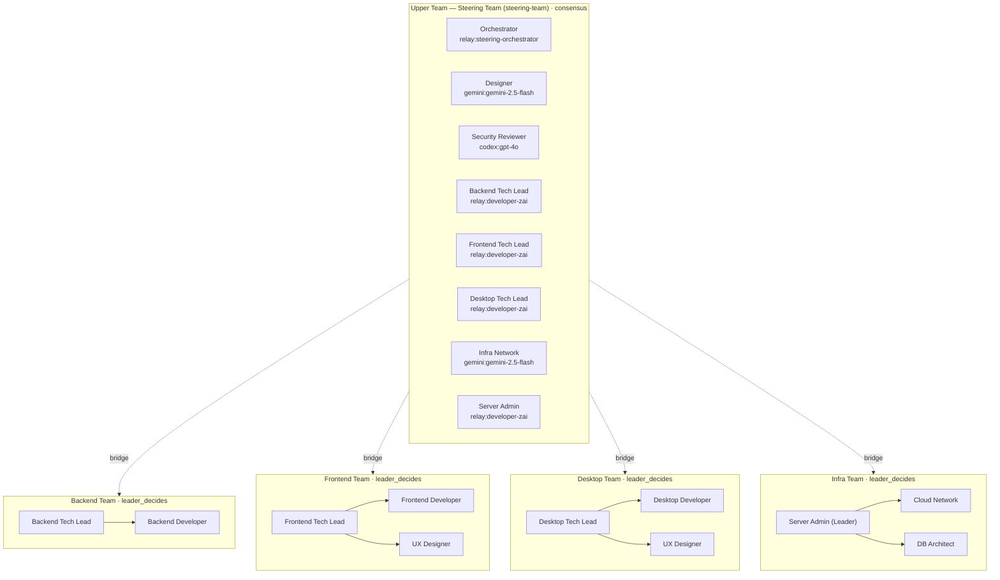
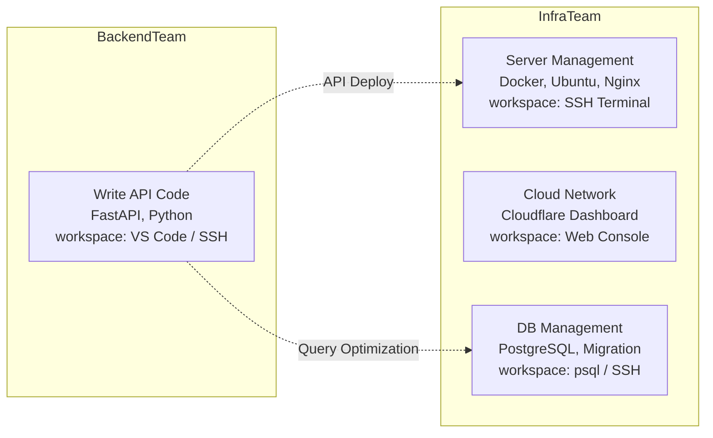
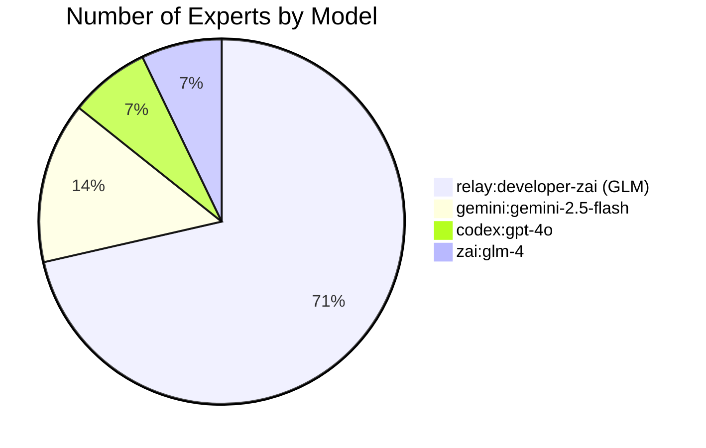
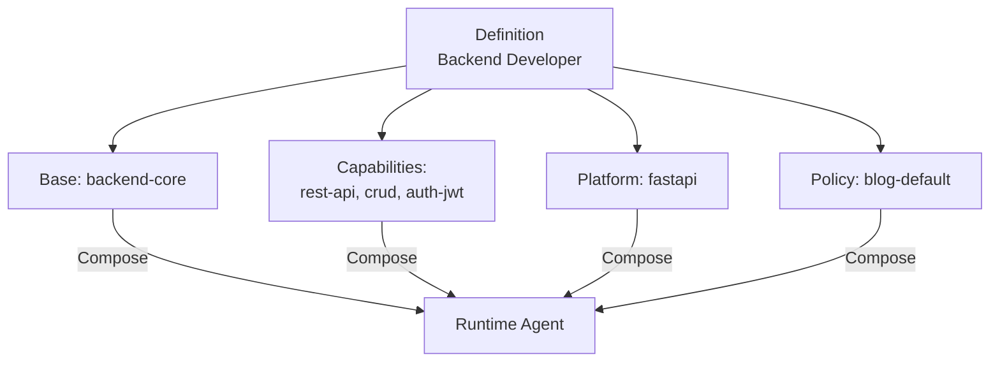
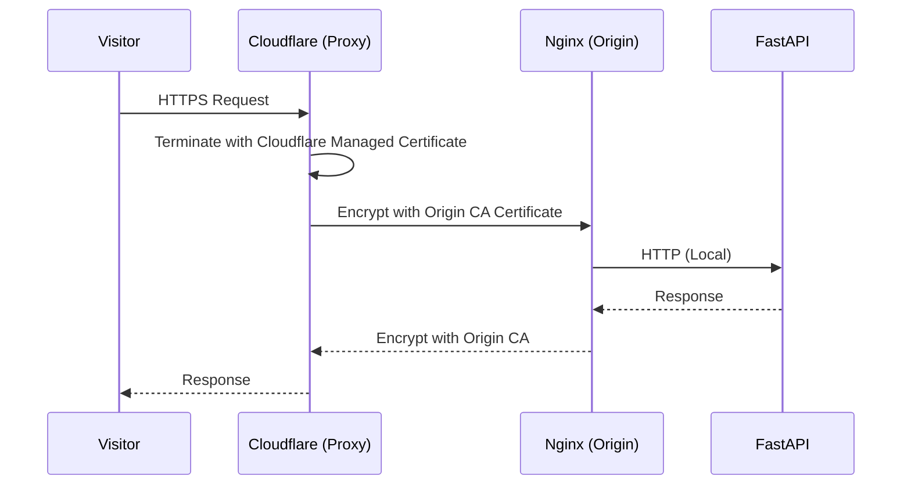
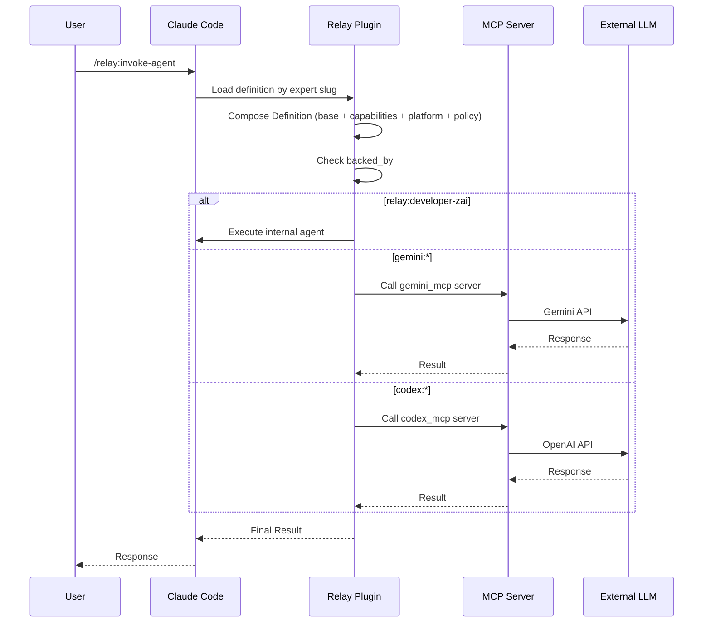

+++
title = ""
date = "2026-03-30T00:31:36+09:00"
draft = "false"
tags = ["ai", "agent", "multi-model", "claude", "gemini", "gpt", "llm", "team-architecture", "composed-agent"]
categories = ["Development", "AI", "Architecture"]
ShowToc = "true"
TocOpen = "true"
+++

## Overview

To build a blog system, I designed a multi-model agent team consisting of **14 AI experts, 5 teams, and 4 LLM models**. The core consists of two points.

1. **Composed Agent**: Maximizing reusability by separating role definitions from execution profiles
2. **Hierarchical Bridge Leadership**: Resolving communication bottlenecks through the dual affiliation of technical leads between upper and lower teams

In this post, I share the final structure, model allocation strategy, and the design process for the composed architecture.

---

## Background: Why Multi-model?

Handling all tasks with a single LLM leads to two problems.

- **Cost**: Running 14 experts with a model at the level of Claude Opus makes costs uncontrollable
- **Suitability**: Design requires fast inference, security analysis requires deep logic, and implementation requires stable coding

Therefore, we distributed models according to the nature of the tasks.

---

## Final Team Structure

Composed of 5 teams, 14 experts, and 4 models.



### Details by Team

| Team | Type | Decision Making | Leader | Team Size |
|---|---|---|---|---|
| Steering Team | upper | consensus | Orchestrator | 8 (including bridges) |
| Backend Team | lower | leader_decides | Backend Tech Lead | 2 |
| Frontend Team | lower | leader_decides | Frontend Tech Lead | 3 |
| Desktop Team | lower | leader_decides | Desktop Tech Lead | 3 |
| Infra Team | lower | leader_decides | Server Admin | 3 |

---

## Decision to Separate Infra Team

In the initial design, the DB Architect and Server Admin were part of the Backend Team. However, we separated them based on the **Workspace** standard.



**Reason for Separation:** If workspaces differ, it is more natural to separate them than to keep them in the same team.

---

## Model Allocation Strategy



| Model | Number of Experts | Purpose | Reason for Selection |
|---|---|---|---|
| relay:developer-zai | 10 | Implementation, Operations, Lead | Cost-effective, stable coding |
| gemini:gemini-2.5-flash | 2 | Design, Infra Network | Fast response, easy external API calls |
| codex:gpt-4o | 1 | Security Review | High reasoning ability, OWASP knowledge |
| zai:glm-4 | 1 | Context Compression | Free tier, specialized in text summarization |

By assigning 10 implementation experts to GLM (a low-cost model), we reduced the total cost by **60-70%**.

---

## Composed Agent Architecture (Composed Agent Pattern)

The core innovation of this design is the **separation of Role Definition (Expert) and Execution Profile (Definition)**.

### Problems with the Existing Approach

Previously, roles and execution logic were coupled, requiring complete rewriting when changes were needed and making reuse impossible.

### Composed Approach



### Module Structure

```
agent-library/
├── definitions/        ← 14 agent definitions
├── modules/
│   ├── base/           ← 6 base modules
│   ├── capabilities/   ← 15 capability modules
│   ├── platforms/      ← 5 platform modules
│   └── policies/       ← 1 policy
└── runs/               ← Execution history
```

### Benefits

1. **Reusability**: The `rest-api` capability module is shared by backend developers and tech leads
2. **Platform Replacement**: Changing `platform: fastapi` to `platform: django` switches immediately
3. **Capability Expansion**: Simply add a new capability module and link it to the Definition
4. **Policy Unification**: All agents follow the same `blog-default` policy

### Expert-Definition Mapping

| Expert | Definition | Base | Capabilities | Platform |
|---|---|---|---|---|
| Backend Developer | backend-developer | backend-core | rest-api, crud, auth-jwt | fastapi |
| Backend Tech Lead | backend-tech-lead | backend-core | rest-api, crud, code-review | fastapi |
| Frontend Developer | frontend-developer | frontend-core | markdown-renderer, list-filter-sort | nextjs |
| Server Admin | server-administrator | server-core | docker-management, nginx-config, postgres-admin | ubuntu |
| Infra Network | infra-network-admin | infra-core | dns-management, ssl-certificates, rate-limiting | cloudflare |
| Security Reviewer | security-auditor | specialist-core | security-audit | fastapi |
| Context Compression | context-compressor | specialist-core | context-compression | markdown |

---

## TLS Certificate Strategy: Cloudflare Origin CA

For the production environment's TLS certificate, I chose **Cloudflare Origin CA** instead of Let's Encrypt.



| Item | Let's Encrypt | Cloudflare Origin CA |
|---|---|---|
| Validity Period | 90 days (renewal required) | 15 years (no renewal needed) |
| Issuance Method | ACME automation required | Manual issuance via Dashboard |
| Complexity | certbot setup | Just copy certificate files |

Production Architecture:

```
Oracle Cloud ARM (4 OCPU, 24GB)
├── PostgreSQL (Installed directly on host)
├── Docker Compose
│   ├── blog-api (FastAPI)
│   ├── blog-frontend (Next.js standalone)
│   ├── MinIO (S3 compatible storage)
│   └── Nginx (Cloudflare Origin CA)
└── Cloudflare Proxy (Full Strict SSL)
```

---

## Relay Plugin: Agent Invocation Mechanism

The team structure is executed within Claude Code via the **Relay Plugin**.



### backed_by Namespace

| Namespace | MCP Server | Purpose |
|---|---|---|
| `relay:developer-zai` | Internal Agent | Implementation, Operations (Low cost) |
| `relay:steering-orchestrator` | Internal Agent | Coordination, Final Decision |
| `gemini:gemini-2.5-flash` | gemini_mcp | Design, External API |
| `codex:gpt-4o` | codex_mcp | Security Analysis |
| `zai:glm-4` | zai_mcp | Context Compression |

---

## Design Decision History

| Decision | Alternative | Reason for Selection |
|---|---|---|
| Separate Infra Team | Include in Backend Team | Different workspaces (SSH vs IDE) |
| Cloudflare Origin CA | Let's Encrypt | 15-year validity, no renewal needed |
| PostgreSQL Host Install | Docker Container | Prioritize memory efficiency on single server |
| Composed Agent | Single Definition Agent | Module reusability, easy platform replacement |
| Assign mostly GLM | Assign mostly Claude | 60-70% cost reduction |

---

## Retrospective: What I Learned While Designing

### 1. "Feasible Structure" over "Perfect Structure"

If you try to perfectly design the team structure, model assignment, and infrastructure settings, you won't even be able to start.

### 2. Workspace is the Team Boundary

Those who write code and those who manage servers have different physical working environments, and that becomes a natural team boundary.

### 3. Value of Composed Architecture

In an environment where 14 experts, 5 teams, and 4 models are intertwined, module separation is essential.

### 4. Cost is Determined at the Design Stage

If you keep asking, "Is a high-cost model absolutely necessary for this task?", costs will naturally be optimized.

---

## Next Steps

- Start Phase 1 Implementation: DB, Auth, Post/Category CRUD, Docker
- Share Team Operation Experience: Problems encountered during actual execution and the resolution process
- Performance Monitoring: Analysis of response time by model and quality relative to cost

---

> This post summarizes the experience of configuring an AI agent team using Claude Code + Relay Plugin.

```