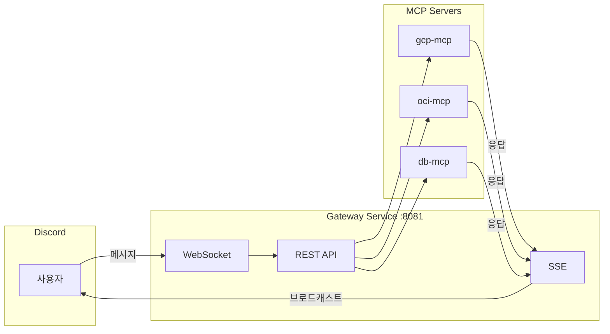
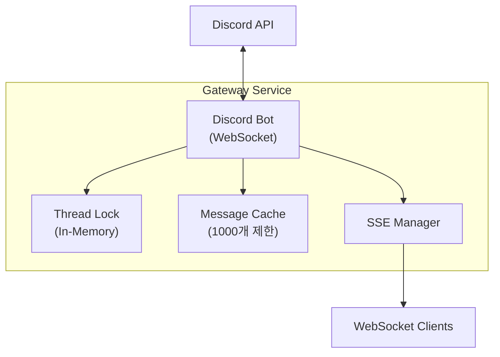
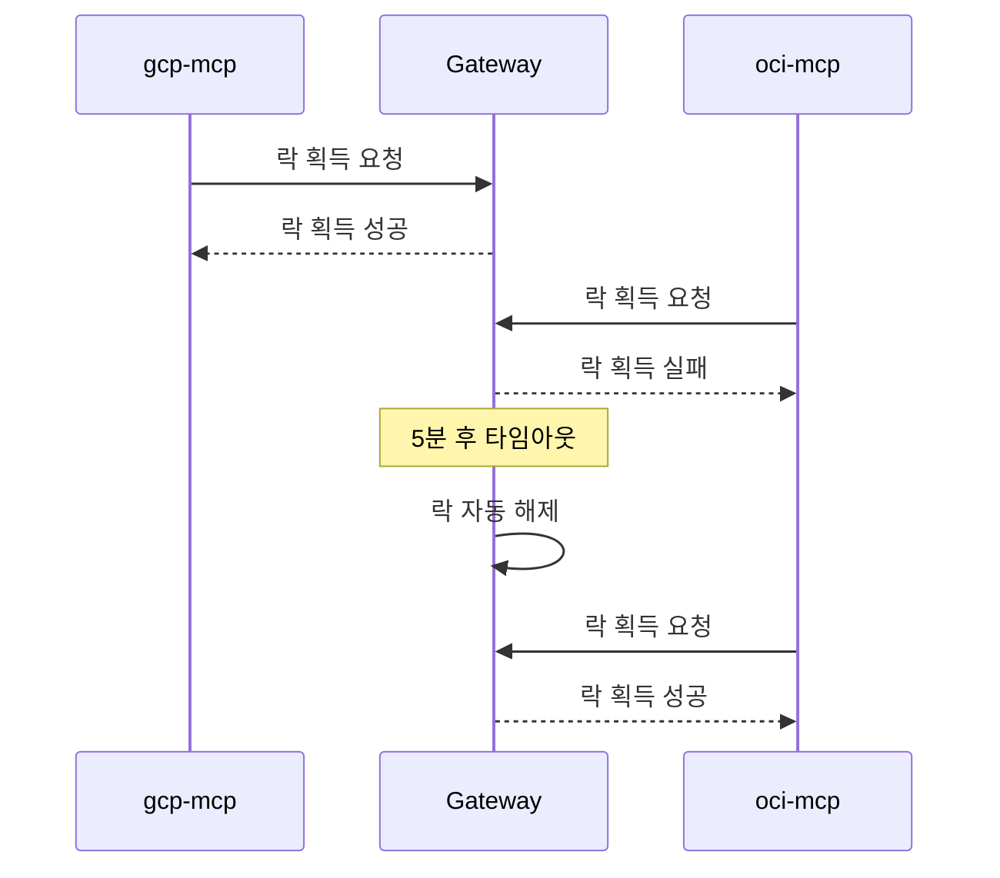
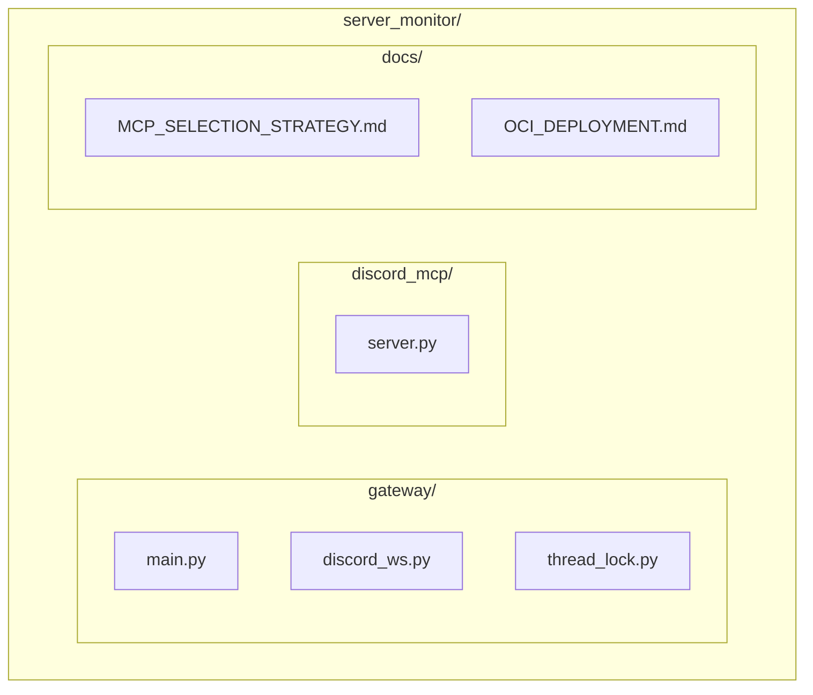
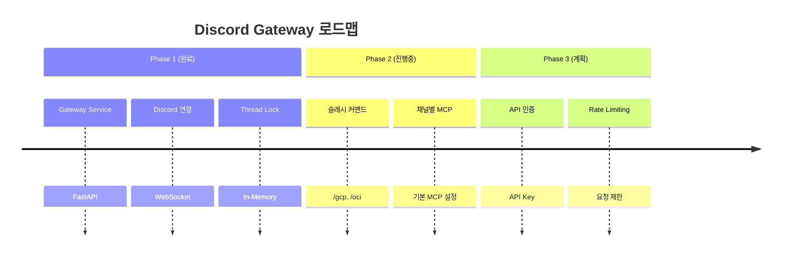

+++
title = "Discord Gateway MCP 아키텍처 설계"
date = 2026-03-01T00:24:52+09:00
draft = false
tags = ["discord", "mcp", "fastapi"]
categories = ["Development", "Architecture"]
ShowToc = true
TocOpen = true
+++

---
title: "Discord Gateway MCP 아키텍처 설계"
date: 2026-03-01
categories: ["Development", "Architecture"]
tags: ["discord", "mcp", "fastapi", "claude-code"]
---

# Discord Gateway MCP 아키텍처 설계

Claude Code 팀에서 Discord를 통한 사용자 소통을 위해 Discord Gateway Service를 설계했다. 이 글에서는 주요 아키텍처 결정 사항을 정리한다.

---

## 1. 전체 아키텍처

### 구성 요소

| 계층 | 구성요소 | 역할 |
|------|----------|------|
| **Discord** | Bot, Channel, Thread | 사용자 인터페이스 |
| **Gateway** | WebSocket, REST API, SSE | 메시지 라우팅 |
| **MCP** | gcp-mcp, oci-mcp, db-mcp | 도구 실행 |

### 메시지 흐름



---

## 2. Redis 없이 동작하는 가벼운 아키텍처

### 왜 Redis를 제거했나?

| 항목 | Redis 사용 | In-Memory 사용 |
|------|-----------|----------------|
| Thread Lock | Redis SET NX | Python dict |
| 이벤트 분배 | Redis Streams | SSE 직접 |
| 상태 저장 | Redis Cache | 메모리 캐시 |

**결론**: 단일 인스턴스 환경에서는 In-Memory로 충분

### Gateway 구조



---

## 3. MCP 선택 방식: 4단계 하이브리드

### 선택 우선순위

| 순위 | 방식 | 예시 | 설명 |
|:----:|------|------|------|
| 1️⃣ | 슬래시 커맨드 | `/gcp status` | 가장 명시적 |
| 2️⃣ | @멘션 | `@gcp-monitor status` | 자연스러운 대화 |
| 3️⃣ | 키워드 감지 | `gcp 서버 상태` | 키워드 자동 인식 |
| 4️⃣ | 채널별 지정 | #gcp-모니터링 | 채널 기본 MCP |

### Fallback 동작 순서

```mermaid
flowchart TD
    A[메시지 수신] --> B{슬래시 커맨드?}
    B -->|Yes| C[해당 MCP 호출]
    B -->|No| D{@멘션?}
    D -->|Yes| C
    D -->|No| E{키워드 감지?}
    E -->|Yes| C
    E -->|No| F{채널 기본 MCP?}
    F -->|Yes| C
    F -->|No| G[Broadcast<br/>모든 MCP에 전달]
```

### 슬래시 커맨드 목록

| 커맨드 | MCP | 설명 |
|--------|-----|------|
| `/gcp status [server]` | gcp-mcp | GCP 서버 상태 |
| `/gcp list` | gcp-mcp | GCP 인스턴스 목록 |
| `/oci status [server]` | oci-mcp | OCI 서버 상태 |
| `/oci list` | oci-mcp | OCI 인스턴스 목록 |
| `/db query <sql>` | db-mcp | DB 쿼리 실행 |

---

## 4. Thread Lock 규칙

### 락 동작 방식



### Lock API

| Method | Endpoint | 설명 |
|--------|----------|------|
| `POST` | `/api/threads/{id}/acquire` | 락 획득 |
| `POST` | `/api/threads/{id}/release` | 락 해제 |
| `GET` | `/api/threads/{id}/lock` | 락 상태 확인 |

---

## 5. MCP 도구 (8개)

### 도구 목록

| 도구 | 설명 | 주요 파라미터 |
|------|------|--------------|
| `discord_send_message` | 메시지 전송 | channel_id, content |
| `discord_get_messages` | 메시지 조회 | channel_id, limit |
| `discord_wait_for_message` | 메시지 대기 | channel_id, timeout |
| `discord_create_thread` | 스레드 생성 | channel_id, message_id |
| `discord_list_threads` | 스레드 목록 | channel_id |
| `discord_archive_thread` | 스레드 아카이브 | thread_id |
| `discord_acquire_thread` | 락 획득 | thread_id, agent_name |
| `discord_release_thread` | 락 해제 | thread_id, agent_name |

---

## 6. 파일 구조



---

## 7. 실행 방법

### 로컬 실행

```bash
# Gateway Service 시작
uvicorn gateway.main:app --host 0.0.0.0 --port 8081

# 헬스체크
curl http://localhost:8081/health
```

### Claude Code MCP 설정

```json
{
  "mcpServers": {
    "discord-gateway": {
      "command": "python3",
      "args": ["/path/to/discord_mcp/server.py"],
      "env": {
        "GATEWAY_URL": "http://localhost:8081"
      }
    }
  }
}
```

---

## 8. 로드맵



---

## 결론

가벼운 아키텍처로 시작해서 필요시 확장하는 전략을 선택했다.

| 항목 | 현재 | 향후 |
|------|------|------|
| 상태 저장 | In-Memory | SQLite (필요시) |
| 분산 락 | 미사용 | Redis (다중 인스턴스 시) |
| 인증 | 없음 | API Key (필요시) |
