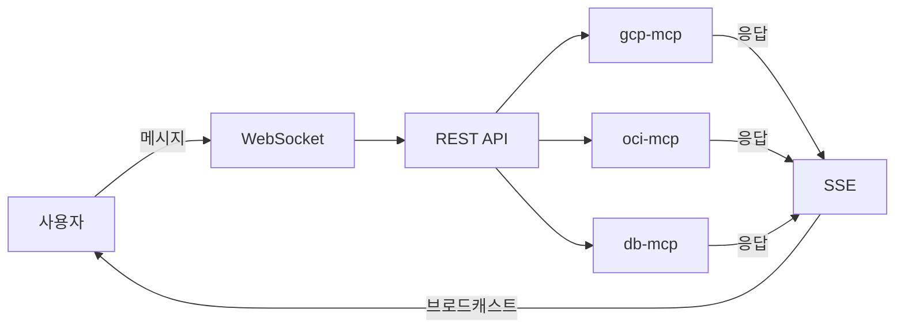
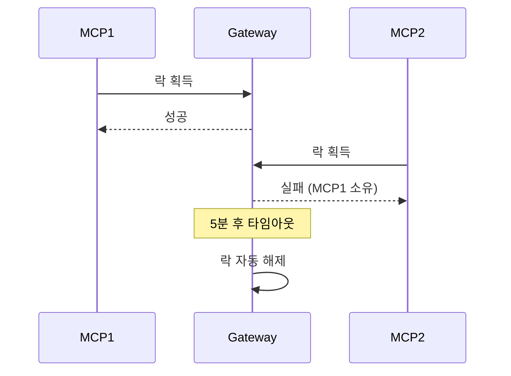
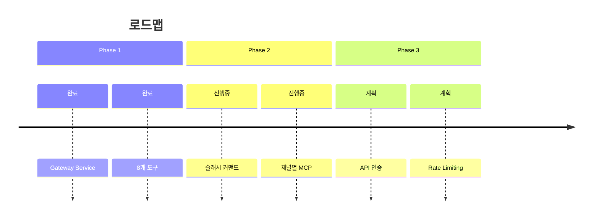

+++
title = "Discord Gateway MCP 아키텍처"
date = 2026-03-01T00:46:28+09:00
draft = false
tags = ["discord", "mcp"]
categories = ["Development"]
ShowToc = true
TocOpen = true
+++

---
title: "Discord Gateway MCP 아키텍처"
date: 2026-03-01
---

# Discord Gateway MCP 아키텍처

Claude Code 팀을 위한 Discord 통합 아키텍처 설계.

## 1. 구성 요소

| 계층 | 구성요소 | 역할 |
|------|----------|------|
| Discord | Bot, Channel, Thread | 사용자 인터페이스 |
| Gateway | WebSocket, REST API, SSE | 메시지 라우팅 |
| MCP | gcp-mcp, oci-mcp, db-mcp | 도구 실행 |

## 2. 메시지 흐름



## 3. Redis 제거 이유

| 항목 | Redis | In-Memory |
|------|-------|-----------|
| Thread Lock | SET NX | Python dict |
| 이벤트 분배 | Streams | SSE 직접 |
| 상태 저장 | Cache | 메모리 |

**결론**: 단일 인스턴스에서는 In-Memory로 충분

## 4. MCP 선택 우선순위

| 순위 | 방식 | 예시 |
|:----:|------|------|
| 1 | 슬래시 커맨드 | `/gcp status` |
| 2 | @멘션 | `@gcp-monitor` |
| 3 | 키워드 | `gcp 서버` |
| 4 | 채널 지정 | #gcp-모니터링 |

## 5. Thread Lock 규칙



## 6. MCP 도구 (8개)

| 도구 | 설명 |
|------|------|
| discord_send_message | 메시지 전송 |
| discord_get_messages | 메시지 조회 |
| discord_wait_for_message | 메시지 대기 |
| discord_create_thread | 스레드 생성 |
| discord_list_threads | 스레드 목록 |
| discord_archive_thread | 아카이브 |
| discord_acquire_thread | 락 획득 |
| discord_release_thread | 락 해제 |

## 7. 실행

```bash
# Gateway 시작
uvicorn gateway.main:app --port 8081

# 헬스체크
curl http://localhost:8081/health
```

## 8. 로드맵



## 결론

In-Memory로 시작, 필요시 SQLite/Redis 확장.
