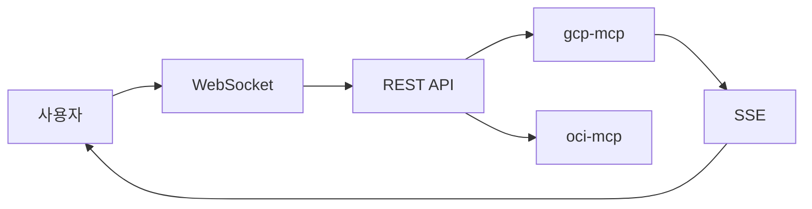

+++
title = "Discord Gateway MCP 아키텍처"
date = 2026-03-01T00:56:27+09:00
draft = false
tags = ["discord", "mcp", "fastapi"]
categories = ["Development", "Architecture"]
ShowToc = true
TocOpen = true
+++

---
title: Discord Gateway MCP 아키텍처
date: 2026-03-01
categories: ["Development", "Architecture"]
---

# Discord Gateway MCP 아키텍처

Claude Code 팀에서 Discord를 통한 사용자 소통을 위해 Discord Gateway Service를 설계했다.

## 1. 전체 구조

| 계층 | 구성요소 | 역할 |
|------|----------|------|
| Discord | Bot, Channel, Thread | 사용자 인터페이스 |
| Gateway | WebSocket, REST API, SSE | 메시지 라우팅 |
| MCP | gcp-mcp, oci-mcp, db-mcp | 도구 실행 |

## 2. 메시지 흐름



## 3. Redis 제거: In-Memory 사용

| 항목 | Redis | In-Memory |
|------|-------|-----------|
| Thread Lock | SET NX | dict |
| 이벤트 | Streams | SSE |
| 캐시 | Cache | 메모리 |

**단일 인스턴스에서는 In-Memory로 충분**

## 4. MCP 선택: 4단계

| 순위 | 방식 | 예시 |
|:----:|------|------|
| 1 | /커맨드 | /gcp status |
| 2 | @멘션 | @gcp-monitor |
| 3 | 키워드 | gcp 서버 |
| 4 | 채널 | #gcp-모니터링 |

## 5. Thread Lock

- 첫 응답 MCP가 락 획득
- 기본 5분 유지
- 타임아웃 시 자동 해제

## 6. MCP 도구 8개

| 도구 | 설명 |
|------|------|
| discord_send_message | 메시지 전송 |
| discord_get_messages | 메시지 조회 |
| discord_wait_for_message | 대기 |
| discord_create_thread | 스레드 생성 |
| discord_list_threads | 목록 |
| discord_archive_thread | 아카이브 |
| discord_acquire_thread | 락 획득 |
| discord_release_thread | 락 해제 |

## 7. 실행

```bash
uvicorn gateway.main:app --port 8081
curl http://localhost:8081/health
```

## 8. 로드맵

- Phase 1: 완료: Gateway, Lock, SSE, MCP
- Phase 2: 진행: 슬래시 커맨드, 키워드
- Phase 3: 선택: 인증, Rate Limit

---

**결론**: 가벼운 아키텍처로 시작, 필요시 확장 전략

---

**영어 버전:** [English Version](/en/post/2026-03-01-009-discord-gateway-mcp-architecture/)
