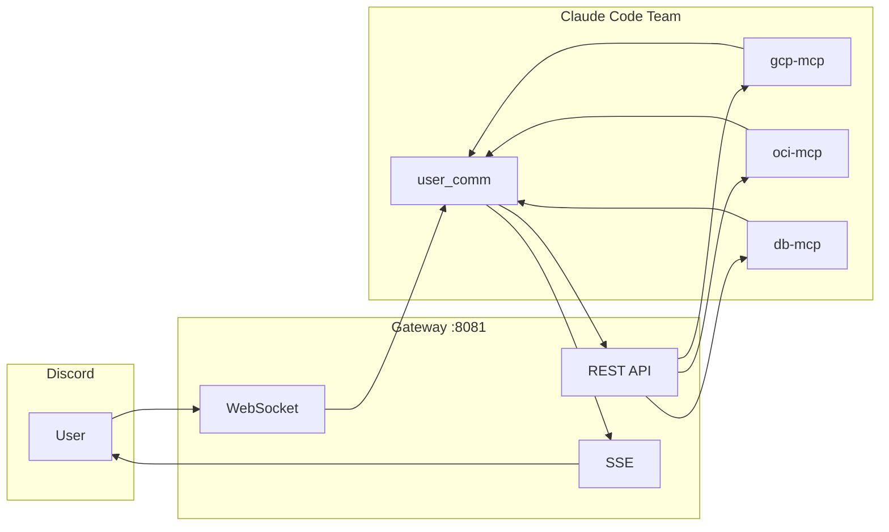
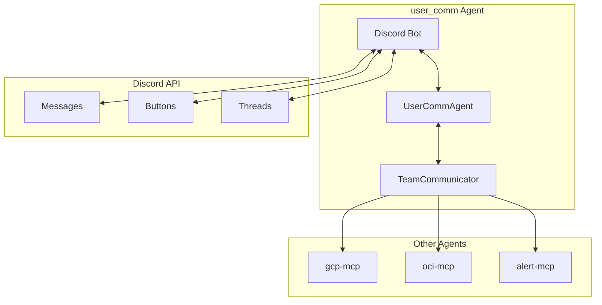
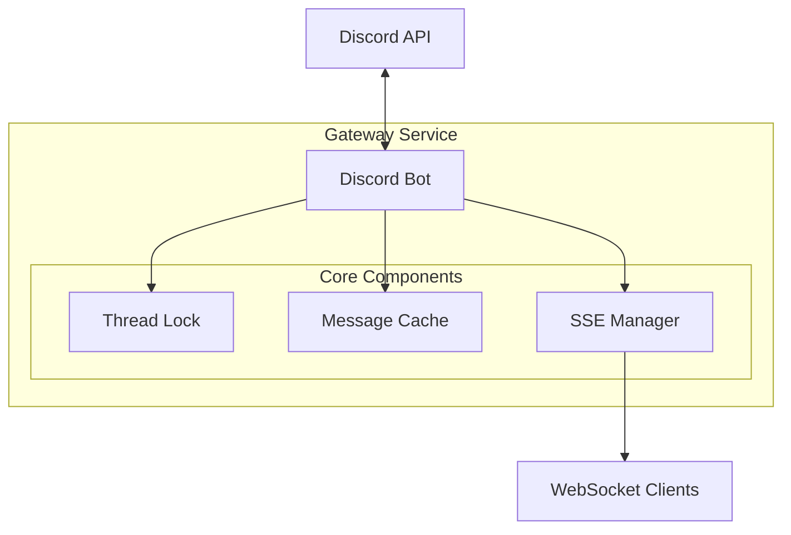
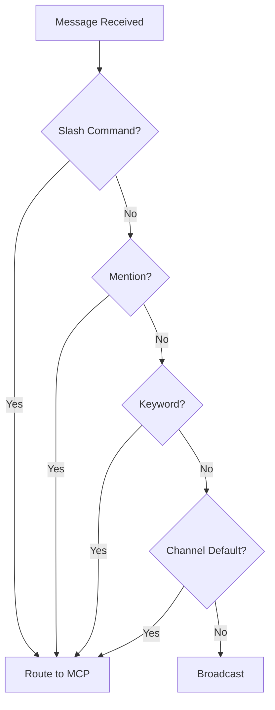
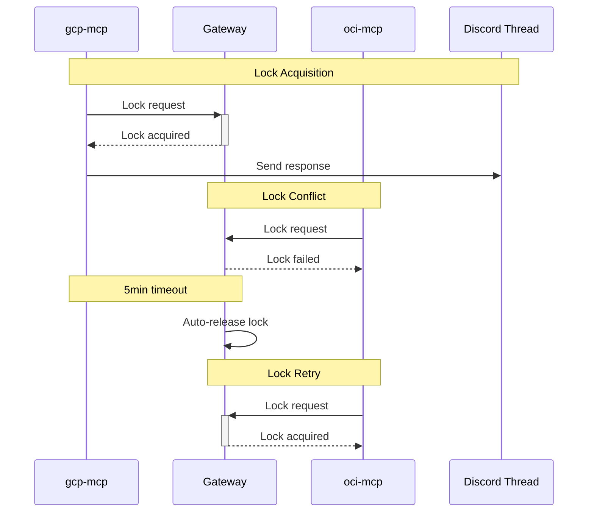
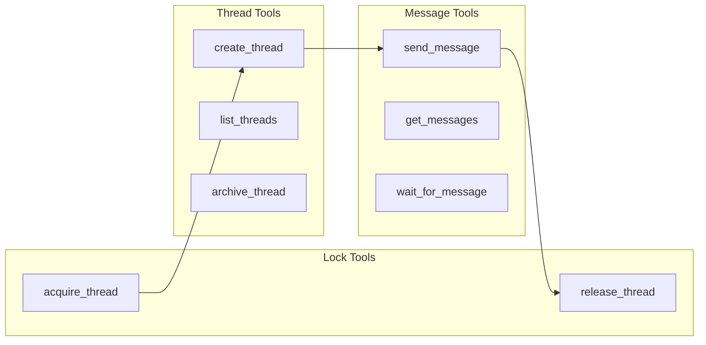
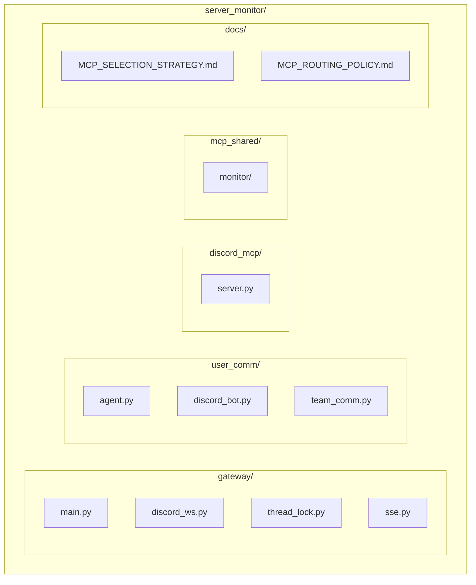

+++
title = "[Discord MCP] Gateway 아키텍처 설계"
slug = "discord-gateway-mcp-architecture-design"
date = 2026-03-01T01:13:00+09:00
draft = false
categories = ["Development", "Architecture"]
tags = ["discord", "mcp", "fastapi", "claude-code", "user-comm"]
ShowToc = true
TocOpen = true
+++

Claude Code 팀에서 Discord를 통한 사용자 소통을 위해 Discord Gateway Service를 설계했다. 이 글에서는 주요 아키텍처 결정 사항과 user_comm Agent 설계를 정리한다.

---

## 1. 전체 아키텍처

### 구성 요소

| 계층 | 구성요소 | 역할 |
|------|----------|------|
| **Discord** | Bot, Channel, Thread | 사용자 인터페이스 |
| **Gateway** | WebSocket, REST API, SSE | 메시지 라우팅 |
| **MCP** | gcp-mcp, oci-mcp, db-mcp | 도구 실행 |
| **user_comm** | Discord Agent | 사용자 소통 담당 |

### 메시지 흐름



---

## 2. user_comm Agent (사용자 소통 담당)

### 역할 및 책임

user_comm Agent는 Claude Code 팀의 멤버로서 Discord 채널을 통해 사용자와 소통하고 다른 agent들과 협업합니다.

| 기능 | 설명 |
|------|------|
| **입력 수신** | Discord 메시지를 받아 적절한 agent에게 전달 |
| **의견 요청** | 다른 agent의 요청으로 사용자 의견 질의 |
| **알림/보고** | 시스템 상태, 경고, 리포트 전송 |
| **팀 통신** | 다른 agent와 메시지 송수신 |

### 내부 구조



### 메시지 타입

```python
class MessageType(Enum):
    TASK_REQUEST = "task_request"      # 작업 요청
    NOTIFICATION = "notification"       # 알림
    OPINION_REQUEST = "opinion_request" # 의견 요청
    OPINION_RESPONSE = "opinion_response" # 의견 응답
    STATUS_REPORT = "status_report"     # 상태 보고
    ERROR = "error"                     # 에러
```

### 주요 기능 동작

#### 입력 수신 (Discord → Agent)
```
사용자: "@gcp-monitor 서버 상태 확인"
  → DiscordBot.on_message
  → UserCommAgent._parse_command (target: gcp-monitor)
  → TeamCommunicator.send_to_agent
  → Discord: "gcp-monitor에게 요청을 전달했습니다."
```

#### 의견 요청 (Agent → Discord)
```
gcp-monitor: "디스크 정리할까요?" → user_comm
  → DiscordBot.ask_opinion (버튼 또는 답장 대기)
  → 사용자 응답
  → TeamCommunicator.send_to_agent (응답 전달)
```

#### 알림/보고 (Agent → Discord)
```
oci-monitor: "디스크 92% 경고" → user_comm
  → DiscordBot.send_message (Embed 형식)
```

---

## 3. Redis 없이 동작하는 가벼운 아키텍처

### 왜 Redis를 제거했나?

| 항목 | Redis 사용 | In-Memory 사용 |
|------|-----------|----------------|
| Thread Lock | Redis SET NX | Python dict |
| 이벤트 분배 | Redis Streams | SSE 직접 |
| 상태 저장 | Redis Cache | 메모리 캐시 |

**결론**: 단일 인스턴스 환경에서는 In-Memory로 충분

### Gateway 구조



### 구성요소 상세

| 모듈 | 역할 | 특징 |
|------|------|------|
| Discord Bot | WebSocket 연결 | 자동 재연결 |
| Thread Lock | 동시성 제어 | 5분 타임아웃 |
| Message Cache | 메시지 보관 | 최대 1000개 |
| SSE Manager | 실시간 전송 | 모든 MCP에 브로드캐스트 |

---

## 4. MCP 선택 방식: 4단계 하이브리드

### 선택 우선순위

| 순위 | 방식 | 예시 | 설명 |
|:----:|------|------|------|
| 1 | 슬래시 커맨드 | `/gcp status` | 가장 명시적 |
| 2 | @멘션 | `@gcp-monitor status` | 자연스러운 대화 |
| 3 | 키워드 감지 | `gcp 서버 상태` | 키워드 자동 인식 |
| 4 | 채널별 지정 | #gcp-모니터링 | 채널 기본 MCP |

### Fallback 동작 순서



### 슬래시 커맨드 목록

| 커맨드 | MCP | 설명 |
|--------|-----|------|
| `/gcp status [server]` | gcp-mcp | GCP 서버 상태 |
| `/gcp list` | gcp-mcp | GCP 인스턴스 목록 |
| `/oci status [server]` | oci-mcp | OCI 서버 상태 |
| `/oci list` | oci-mcp | OCI 인스턴스 목록 |
| `/db query <sql>` | db-mcp | DB 쿼리 실행 |
| `/db list` | db-mcp | DB 목록 |
| `/alert check` | alert-mcp | 알림 확인 |

---

## 5. Thread Lock 규칙

### 락 동작 방식



### Lock API

| Method | Endpoint | 설명 |
|--------|----------|------|
| `POST` | `/api/threads/{id}/acquire` | 락 획득 |
| `POST` | `/api/threads/{id}/release` | 락 해제 |
| `GET` | `/api/threads/{id}/lock` | 락 상태 확인 |

### 요청/응답 예시

**락 획득 요청**
```bash
POST /api/threads/123456/acquire
{
  "agent_name": "gcp-mcp",
  "timeout": 300
}
```

**락 획득 응답**
```json
{
  "acquired": true,
  "thread_id": "123456",
  "agent": "gcp-mcp"
}
```

---

## 6. MCP 도구 (8개)

### 도구 목록

| 도구 | 설명 | 주요 파라미터 |
|------|------|--------------|
| `discord_send_message` | 메시지 전송 | channel_id, content |
| `discord_get_messages` | 메시지 조회 | channel_id, limit |
| `discord_wait_for_message` | 메시지 대기 | channel_id, timeout |
| `discord_create_thread` | 스레드 생성 | channel_id, message_id |
| `discord_list_threads` | 스레드 목록 | channel_id |
| `discord_archive_thread` | 스레드 아카이브 | thread_id |
| `discord_acquire_thread` | 락 획득 | thread_id, agent_name |
| `discord_release_thread` | 락 해제 | thread_id, agent_name |

### 도구 관계도



### 사용 예시

```python
# 메시지 전송
discord_send_message(
    channel_id="123456789",
    content="서버 상태: 정상"
)

# 스레드 생성
discord_create_thread(
    channel_id="123456789",
    message_id="987654321",
    name="상태 확인"
)

# 락 획득
discord_acquire_thread(
    thread_id="111222333",
    agent_name="gcp-mcp",
    timeout=300
)
```

---

## 7. 파일 구조



### 디렉토리 설명

| 경로 | 설명 |
|------|------|
| `gateway/` | Gateway Service (FastAPI) |
| `user_comm/` | 사용자 소통 Agent |
| `discord_mcp/` | MCP Server (8개 도구) |
| `mcp_shared/` | 공유 MCP 도구 |
| `docs/` | 문서 |

---

## 8. 실행 방법

### 로컬 실행

```bash
# Gateway Service 시작
uvicorn gateway.main:app --host 0.0.0.0 --port 8081

# user_comm Agent 시작 (독립 모드)
python main.py --standalone

# user_comm Agent 시작 (팀 모드)
python main.py --team server-monitor

# 헬스체크
curl http://localhost:8081/health

# 응답
{"status": "healthy", "discord_connected": true}
```

### Claude Code MCP 설정

```json
// ~/.claude/settings.json
{
  "mcpServers": {
    "discord-gateway": {
      "command": "python3",
      "args": ["/path/to/discord_mcp/server.py"],
      "env": {
        "GATEWAY_URL": "http://localhost:8081"
      }
    }
  }
}
```

---

## 9. 로드맵

### Phase 1: 완료

- [x] FastAPI Gateway Service
- [x] Discord WebSocket 연결
- [x] Thread Lock (In-Memory)
- [x] SSE 브로드캐스트
- [x] MCP Server (8개 도구)

### Phase 2: 진행 예정

- [ ] user_comm Agent 구현
- [ ] 슬래시 커맨드 구현
- [ ] 채널별 기본 MCP 설정
- [ ] 키워드 자동 감지
- [ ] 라우팅 설정 파일

### Phase 3: 선택 사항

- [ ] API 인증 (API Key)
- [ ] Rate Limiting
- [ ] 메시지 영속성 (SQLite)

---

## 결론

가벼운 아키텍처로 시작해서 필요시 확장하는 전략을 선택했다.

| 항목 | 현재 | 향후 |
|------|------|------|
| 상태 저장 | In-Memory | SQLite (필요시) |
| 분산 락 | 미사용 | Redis (다중 인스턴스 시) |
| 인증 | 없음 | API Key (필요시) |
| 사용자 소통 | Gateway 직접 | user_comm Agent |

단일 인스턴스에서는 현재 구조로 충분하며, 트래픽이 늘어나면 점진적으로 확장할 계획이다. user_comm Agent를 통해 사용자와의 소통을 체계화하고, 팀 내 다른 agent들과의 협업을 효율화한다.


---

**영어 버전:** [English Version](/en/post/2026-03-01-013-discord-gateway-mcp-architecture-design/)