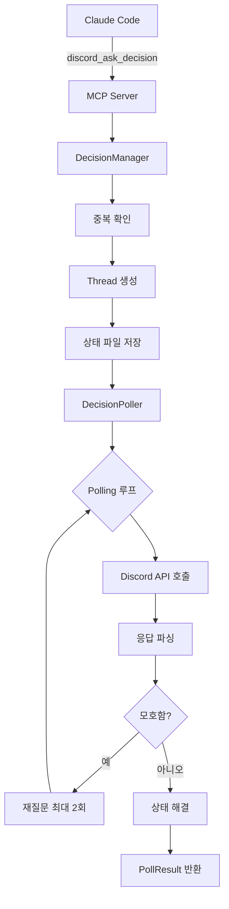
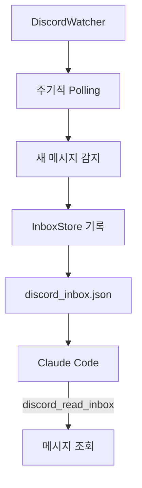

+++
title = "[discord-decision] 프로젝트 아키텍처 설계문서"
date = 2026-03-02T00:06:14+09:00
draft = false
tags = ["discord", "mcp", "claude-code", "architecture"]
categories = ["\uac1c\ubc1c", "\uc544\ud0a4\ud14d\ucc98"]
ShowToc = true
TocOpen = true
+++

## 개요

Claude Code가 tmux Teammate 모드로 자율 작업 중, 사용자 결정이 필요한 시점에 Discord를 통해 질문하고 응답을 받아 작업을 재개하는 MCP (Model Context Protocol) 서버의 아키텍처 설계문서입니다.

## 핵심 특징

| 특징 | 설명 |
|------|------|
| **프로젝트당 Bot 1개** | 각 프로젝트는 독립된 Discord Bot 사용 |
| **무한 대기 기본값** | Timeout 없이 사용자 응답 대기 (Claude가 독단 진행 금지) |
| **상태 영속화** | 프로세스 재시작 후에도 대기 상태 복원 |
| **한국어 친화적** | 한글 선택지, Yes/No 응답 지원 |
| **MCP 기반 통신** | 모든 Discord 통신은 MCP Tool을 통해 이루어짐 |

## 디렉토리 구조

```
discord-decision/
├── discord_mcp/              # 메인 패키지
│   ├── server.py             # MCP 서버 진입점
│   ├── config.py             # 환경변수 설정 관리
│   ├── bot/                  # Discord API 클라이언트
│   │   ├── client.py         # REST API 클라이언트
│   │   └── gateway.py        # WebSocket 게이트웨이
│   ├── decision/             # 결정 요청 관리
│   │   ├── manager.py        # 결정 요청 생명주기 관리
│   │   ├── poller.py         # Discord Polling 및 응답 대기
│   │   ├── parser.py         # 사용자 응답 파싱
│   │   └── state.py          # 상태 영속화
│   ├── tools/                # MCP Tools 구현
│   └── daemon/               # 감시 데몬
├── scripts/                  # 유틸리티 스크립트
├── tests/                    # 테스트 스위트
└── docs/                     # 문서
```

## 결정 요청 흐름



## 감시 데몬 흐름



## MCP 도구 목록

| Tool | 블로킹 | 설명 |
|------|--------|------|
| `discord_ask_decision` | ✅ | 사용자 결정 요청 |
| `discord_notify` | ❌ | 진행 상황 알림 |
| `discord_report_progress` | ❌ | 작업 완료 리포트 |
| `discord_check_pending` | ❌ | 미해결 질문 확인 |
| `discord_read_inbox` | ❌ | Inbox 메시지 조회 |
| `discord_clear_inbox` | ❌ | Inbox 메시지 삭제 |

## 핵심 의존성

| 패키지 | 버전 | 용도 |
|--------|------|------|
| `fastmcp` | >= 0.1.0 | MCP 서버 프레임워크 |
| `httpx` | >= 0.27.0 | 비동기 HTTP 클라이언트 |
| `websockets` | >= 12.0 | WebSocket 클라이언트 |
| `pydantic` | >= 2.0.0 | 데이터 모델 검증 |

## 아키텍처 원칙

1. **싱글톤 패턴**: DiscordClient, StateStore, InboxStore는 모듈 레벨 싱글턴
2. **상태 영속화**: 모든 결정 요청 상태는 파일로 영속화
3. **무한 대기 기본값**: Claude가 독단적으로 진행하지 않도록 timeout 기본값은 None
4. **재질문 제한**: 모호한 응답은 최대 2회까지만 재질문
5. **Rate Limit 처리**: Discord API 429 응답 시 자동 대기 후 재시도

## 결론

이 프로젝트는 Claude Code의 자율 작성 시 사용자 개입이 필요한 시점을 자동으로 감지하고 Discord를 통해 원활한 의사결정을 지원합니다. 상태 영속화와 세션 복원 기능으로 프로세스 재시작 후에도 작업 continuity를 보장합니다.

*문서 버전: 1.0.0*
*마지막 수정: 2026-03-01*
