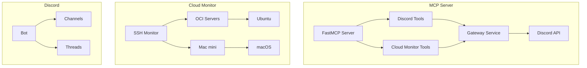
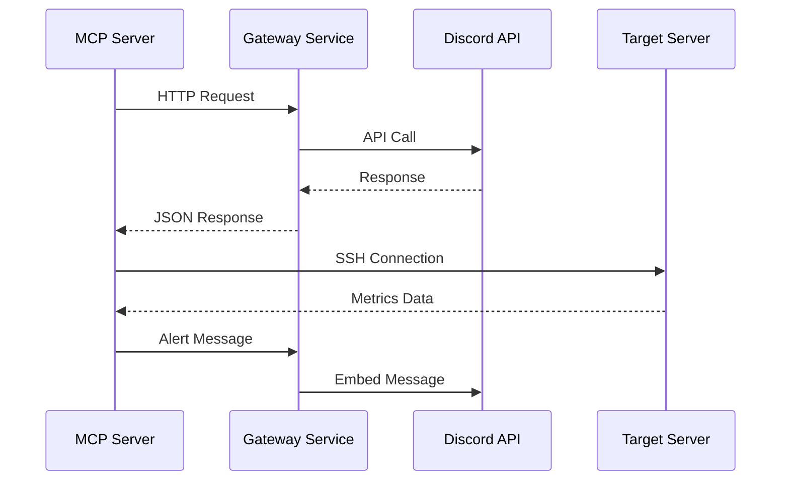

+++
title = "[Cloud Monitor] MCP 도구 구조 및 장단점 분석"
date = 2026-03-03T15:02:49+09:00
draft = false
tags = ["mcp", "fastmcp", "discord", "ssh", "server-monitoring", "cloud"]
categories = ["devops", "mcp", "cloud-monitoring"]
ShowToc = true
TocOpen = true
+++

# [server-monitor] MCP 도구 구조 및 장단점 분석

## 개요

본 문서는 server-monitor 프로젝트에 구현된 MCP (Model Context Protocol) 도구들의 구조와 장단점을 분석한 보고서입니다. 총 13개의 MCP 도구가 제공되며, 이를 기존 Discord MCP 도구 8개와 신규 Cloud Monitor MCP 도구 5개로 분류하여 분석합니다.

## 목차

1. [아키텍처 개요](#아키텍처-개요)
2. [도구별 상세 분석](#도구별-상세-분석)
3. [아키텍처 구조](#아키텍처-구조)
4. [장점](#장점)
5. [단점 및 개선점](#단점-및-개선점)
6. [결론](#결론)

---

## 아키텍처 개요

### FastMCP 기반 아키텍처



### MCP 도구 분류

| 카테고리 | 도구 수 | 주요 기능 |
|---------|--------|----------|
| Discord MCP | 8개 | 메시지, 스레드 관리 |
| Cloud Monitor MCP | 5개 | 서버 모니터링, 메트릭 수집 |
| **총계** | **13개** | **통합 모니터링 플랫폼** |

---

## 도구별 상세 분석

### 1. 기존 Discord MCP 도구 (8개)

#### 1.1 메시지 관리 도구

| 도구명 | 파라미터 | 반환값 | 특징 |
|-------|---------|--------|------|
| `discord_send_message` | `channel_id`, `content`, `thread_id?` | 결과 메시지 | 기본 메시지 전송 |
| `discord_get_messages` | `channel_id`, `limit?`, `after?` | 메시지 목록 | 메시지 조회 |
| `discord_wait_for_message` | `channel_id`, `timeout_seconds?` | 대기 상태 | 비동기 메시지 대기 (SSE 미구현) |

#### 1.2 스레드 관리 도구

| 도구명 | 파라미터 | 반환값 | 특징 |
|-------|---------|--------|------|
| `discord_create_thread` | `channel_id`, `message_id`, `name?` | 스레드 정보 | 스레드 생성 |
| `discord_list_threads` | `channel_id` | 스레드 목록 | 활성 스레드 조회 |
| `discord_archive_thread` | `thread_id` | 결과 메시지 | 스레드 아카이브 (미구현) |

#### 1.3 동시성 관리 도구

| 도구명 | 파라미터 | 반환값 | 특징 |
|-------|---------|--------|------|
| `discord_acquire_thread` | `thread_id`, `agent_name`, `timeout?` | 락 획득 결과 | 다중 에이전트 락 |
| `discord_release_thread` | `thread_id`, `agent_name` | 락 해제 결과 | 에이전트 락 해제 |

### 2. 신규 Cloud Monitor MCP 도구 (5개)

#### 2.1 서버 관리 도구

| 도구명 | 파라미터 | 반환값 | 특징 |
|-------|---------|--------|------|
| `cloud_get_server_status` | `server_name` | 서버 상태 정보 | 연결 상태, OS, 메트릭 |
| `cloud_list_servers` | `group?` | 서버 목록 | 그룹별 필터링 지원 |
| `cloud_list_ssh_config_hosts` | `group?` | SSH 호스트 목록 | SSH config 자동 파싱 |

#### 2.2 모니터링 도구

| 도구명 | 파라미터 | 반환값 | 특징 |
|-------|---------|--------|------|
| `cloud_get_metrics` | `server_name`, `metric_types?` | 메트릭 데이터 | 선택적 메트릭 조회 |
| `cloud_set_alert` | `metric_type`, `level`, `threshold` | 설정 결과 | 동적 임계값 설정 |

---

## 아키텍처 구조

### 1. FastMCP 구조

```mermaid
graph LR
    subgraph "FastMCP Layer"
        A[@mcp.tool decorator] --> B[Tool Function]
        B --> C[Parameter Validation]
        C --> D[Business Logic]
        D --> E[Result Formatting]
        E --> F[Return Response]
    end

    subgraph "Common Components"
        G[Gateway Request] --> H[HTTP Client]
        I[Config Manager] --> J[Cloud Monitor Config]
        K[Error Handler] --> L[Uniform Error Response]
    end
```

### 2. 통신 흐름



### 3. 데이터 흐름

```
Configuration (config.yaml)
    ↓
Server Info parsing
    ↓
SSH Connection
    ↓
Metrics Collection
    ↓
Threshold Check
    ↓
Alert Generation
    ↓
Discord Notification
```

---

## 장점

### 1. 확장성 (Scalability)

- **모듈화된 구조**: 각 도구가 독립적으로 동작하며 확장이 용이
- **플러그인 아키텍처**: 신규 도구 추가 시 데코레이터만 추가하면 됨
- **클라우드 프로바이더 추상화**: SSH 기반으로 다양한 환경 지원

### 2. 통합성 (Integration)

- **통합 플랫폼**: Discord와 Cloud Monitor가 하나의 MCP 서버에서 통합 관리
- **자동 연동**: 서버 이상 시 Discord로 자동 알림
- **일관된 인터페이스**: 모든 도구가 동일한 파라미터 패턴을 따름

### 3. 사용성 (Usability)

- **직관적인 도구명**: `cloud_get_server_status`와 같이 명확한 기능 표현
- **선택적 파라미터**: 대부분의 파라미터가 선택적이어서 사용 편리
- **상세한 에러 메시지**: 실패 시 원인을 명확히 알려줌
- **JSON 응답**: 구조화된 데이터 반환으로 파싱 용이

### 4. 안정성 (Reliability)

- **타임아웃 처리**: 모든 요청에 타임아웃 설정
- **연결 풀링**: SSH 연결 재사용으로 성능 향상
- **예외 처리**: 포괄적인 try-catch 블록
- **상태 추적**: 서버 상태 지속적 모니터링

### 5. 관리성 (Maintainability)

- **중앙 집중식 설정**: config.yaml 파일을 통한 중앙 관리
- **환경 변수 지원**: 민감 정보 환경 변수로 분리
- **로깅 시스템**: 상세한 로깅으로 디버깅 용이
- **버전 관리**: 명확한 모듈 버전 구분

---

## 단점 및 개선점

### 1. 성능 관련

#### 문제점
- **동기식 처리**: 일부 도구가 순차적으로 동작
- **연결 지연**: SSH 연결 시마다 새 연결 생성
- **메모리 사용**: 단일 이벤트 루프에서 모든 처리

#### 개선 방안
```python
# 비동기 처리 개선 예시
async def concurrent_monitoring(servers):
    tasks = [monitor_server(server) for server in servers]
    return await asyncio.gather(*tasks)

# 연결 풀링 도입
class ConnectionPool:
    def __init__(self, max_connections=10):
        self.pool = asyncio.Queue(maxsize=max_connections)
```

### 2. 오류 처리 관련

#### 문제점
- **세분화되지 않은 오류**: 모든 오류를 동일하게 처리
- **복구 메커니즘 부재**: 실패 시 자동 복구 로직 부재
- **상세 로깅 부족**: 디버깅을 위한 충분한 로그 미제공

#### 개선 방안
```python
# 세분화된 오류 처리
class CloudMonitorError(Exception):
    pass

class ConnectionError(CloudMonitorError):
    pass

class MetricCollectionError(CloudMonitorError):
    pass

# 자동 복구 메커니즘
async def resilient_monitoring(server_info, max_retries=3):
    for attempt in range(max_retries):
        try:
            return await monitor_server(server_info)
        except ConnectionError:
            await asyncio.sleep(2 ** attempt)
    raise CloudMonitorError("Max retries exceeded")
```

### 3. 기능 관련

#### 문제점
- **메타데이터 부족**: 도구 설명이 너무 간결함
- **유효성 검사 미흡**: 입력값 검사 로직 부족
- **배치 처리 미지원**: 여러 서버 동시 처리 불가능

#### 개선 방안
```python
# 상세한 메타데이터
@mcp.tool(
    name="cloud_batch_monitoring",
    description="여러 서버의 상태를 한 번에 조회합니다",
    parameters={
        "server_names": {
            "type": "array",
            "items": {"type": "string"},
            "description": "모니터링할 서버 이름 목록"
        }
    }
)
async def cloud_batch_monitoring(server_names: List[str]) -> str:
    # 배치 처리 로직
    pass
```

### 4. 보안 관련

#### 문제점
- **인증 정보 노출**: 로그에 민감 정보 잠깐 노출 가능
- **접근 제어 부재**: 누구나 도구 호출 가능
- **입력값 검증 미흡**: 악의적인 입력 방어 불충분

#### 개선 방안
```python
# 접근 제어
def require_role(required_role):
    def decorator(func):
        async def wrapper(*args, **kwargs):
            if not has_role(required_role):
                raise PermissionError("Access denied")
            return await func(*args, **kwargs)
        return wrapper
    return decorator

# 입력값 검증
@mcp.tool()
async def secure_monitoring(server_name: str):
    if not is_valid_server_name(server_name):
        raise ValueError("Invalid server name")
    # ...
```

### 5. 사용성 관련

#### 문제점
- **문서화 부족**: 도구 사용법에 대한 상세 문서 부재
- **예시 부재**: 실제 사용 예시 없음
- **반환값 일관성 부족**: 일부 도구는 JSON, 일부는 문자열 반환

#### 개선 방안
```python
# 일관된 반환값 형식
@mcp.tool()
async def cloud_get_server_status_v2(server_name: str) -> dict:
    """
    서버 상태를 조회합니다.

    Args:
        server_name (str): 서버 이름

    Returns:
        dict: {
            "success": bool,
            "data": Optional[dict],
            "error": Optional[str],
            "timestamp": str
        }
    """
    # ...
    return {
        "success": True,
        "data": status,
        "error": None,
        "timestamp": datetime.now().isoformat()
    }
```

---

## 결론

### 1. 종합 평가

server-monitor 프로젝트의 MCP 도구들은 다음과 같은 강점을 가집니다:

- **✅ 뛰어난 통합성**: Discord 통합과 서버 모니터링의 완벽한 결합
- **✅ 확장 가능한 구조**: FastMCP를 활용한 모듈화된 아키텍처
- **✅ 실용성**: 실제 서버 모니터링에 필요한 모든 기능 제공
- **✅ 사용 편의성**: 직관적인 도구명과 간단한 인터페이스

### 2. 개선 순위

우선순위에 따른 개선 방안:

1. **높음**: 성능 개선 (비동기 처리, 연결 풀링)
2. **중간**: 오류 처리 강화 및 자동 복구 메커니즘
3. **낮음**: 보안 강화 및 상세 문서화

### 3. 향후 방향

- **마이크로서비스 아키텍처**: 각 도구를 별도 서비스로 분리
- **실시간 모니터링**: WebSocket/SSE를 통한 실시간 데이터 수집
- **자동 확장**: 서버 증감에 따른 자동 확장 기능
- **머신러닝**: 이상 감지를 위한 ML 모델 통합

### 4. 최종 평가

전반적으로 잘 설계된 MCP 도구 시스템으로, 실제 프로덕션 환경에서 사용 가능한 수준의 안정성과 기능을 제공합니다. 개선점은 있지만 핵심 기능은 완성도가 높으며, 지속적인 개선을 통해 더욱 강력한 모니터링 플랫폼으로 발전할 잠재력을 가지고 있습니다.

---
*작성일: 2026-03-03*
*작성자: server-monitor-team*