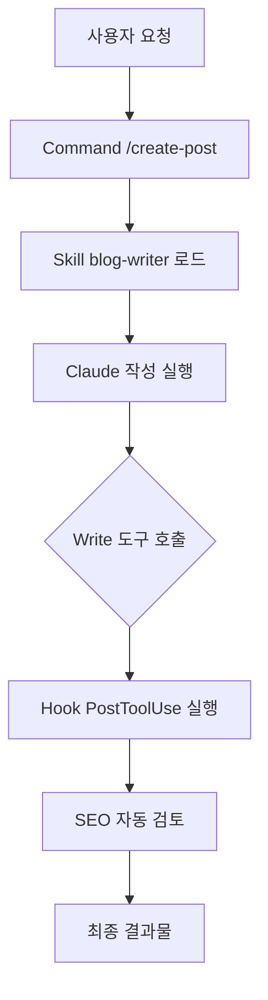
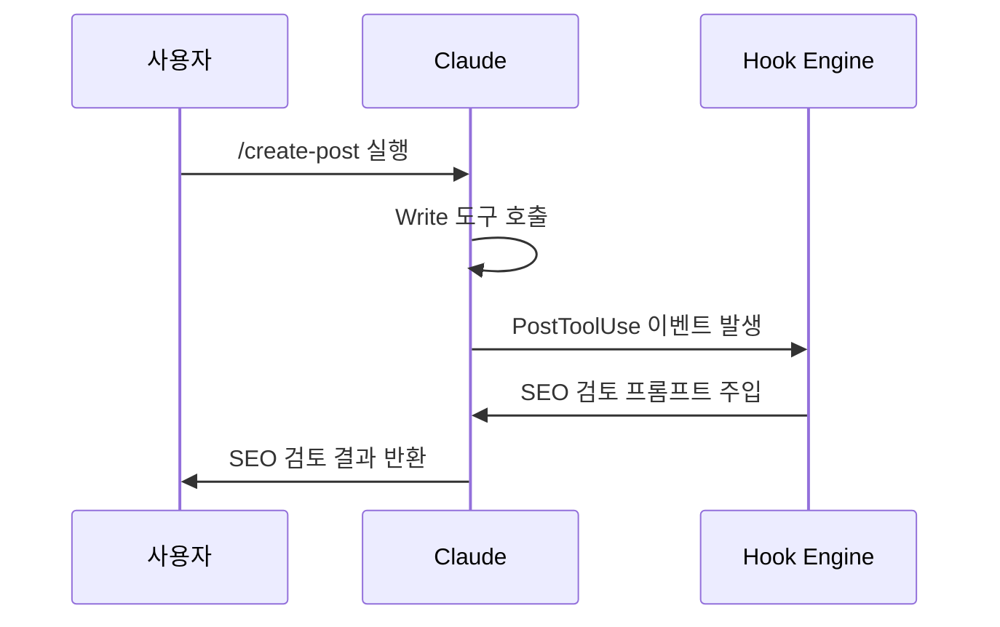

+++
title = "Claude Code 플러그인 개발 완전 가이드 — plugin.json부터 배포까지"
date = 2026-03-23T10:53:23+09:00
draft = false
tags = ["claude-code", "plugin", "\uac1c\ubc1c\uac00\uc774\ub4dc", "skills", "hooks"]
categories = ["Claude Code"]
ShowToc = true
TocOpen = true
+++

# Claude Code 플러그인 개발 완전 가이드 — plugin.json부터 배포까지

Claude Code CLI는 `v2.1.0`부터 **플러그인 시스템**을 공식 지원한다. skills, agents, commands, hooks 네 가지 구성 요소를 조합하면 Claude의 동작을 도구처럼 패키징하고 팀 전체에 배포할 수 있다. 이 글에서는 실제 운영 중인 `yarang-plugins` 마켓플레이스 레포를 기반으로, 플러그인을 처음 만드는 개발자가 배포까지 완주할 수 있도록 단계별로 설명한다.

---

## 플러그인이란? — Claude Code 확장의 4가지 구성 요소

Claude Code 플러그인은 단순한 스크립트 번들이 아니다. 아래 네 가지 요소를 조합해 Claude의 역할과 행동을 선언적으로 정의한다.

| 구성 요소 | 디렉토리 | 역할 |
|---|---|---|
| **skills** | `skills/<name>/SKILL.md` | Claude에게 특정 도메인 지식과 행동 규칙 주입 |
| **agents** | `agents/<role>.md` | 서브에이전트 페르소나 정의 (전문가 역할 부여) |
| **commands** | `commands/<verb>-<noun>.md` | `/slash-command` 단축키 등록 |
| **hooks** | `hooks/hooks.json` | 도구 호출 전후 자동 실행 트리거 |



---

## 1단계: 디렉토리 구조 만들기

플러그인 이름은 반드시 `<domain>-<function>` 형식의 **kebab-case**로 작성한다. 예: `blog-writer`, `domain-checker`.

```
plugins/blog-writer/
├── .claude-plugin/
│   └── plugin.json          ← 플러그인 메타데이터 (필수)
├── skills/
│   └── blog-writer/
│       └── SKILL.md         ← 스킬 파일명은 SKILL.md 고정
├── agents/
│   └── editor.md            ← <role>.md 형식
├── commands/
│   └── create-post.md       ← <verb>-<noun>.md 형식
├── hooks/
│   └── hooks.json           ← hooks는 여기서만 선언
└── README.md
```

> 파일 명명 규칙을 어기면 Claude Code가 해당 파일을 인식하지 못한다.

---

## 2단계: plugin.json 작성 — 메타데이터의 핵심

`plugin.json`은 플러그인의 신원증명서다. `skills`, `commands`, `agents` 필드에 디렉토리 경로만 지정하면 내부 파일을 자동으로 탐색한다.

```json
{
  "name": "blog-writer",
  "description": "SEO 최적화 블로그 글을 구조적으로 작성하는 스킬 플러그인",
  "author": {
    "name": "yarang",
    "url": "https://github.com/yarang"
  },
  "license": "MIT",
  "keywords": ["blog", "seo", "writing", "content"],
  "skills": "./skills/",
  "commands": "./commands/"
}
```

**주의사항 3가지:**

1. `version` 필드를 `plugin.json`에 넣지 않는다 — 내부 플러그인은 `marketplace.json`에서만 버전을 선언한다.
2. `hooks` 필드를 여기에 명시하지 않는다 — `v2.1+`는 `hooks/hooks.json`을 자동으로 감지한다.
3. `../`로 플러그인 디렉토리 밖을 참조하는 경로는 금지다.

---

## 3단계: SKILL.md 작성 — Claude의 전문성 주입

스킬은 Claude에게 **특정 도메인의 행동 규칙과 지식**을 주입하는 마크다운 문서다. `blog-writer` 플러그인의 `SKILL.md`를 예시로 본다.

```markdown
# Blog Writer Skill

주어진 주제로 SEO 최적화된 블로그 포스트를 작성한다.

## 구조

1. **제목 (H1)**: 키워드 포함, 클릭 유도
2. **서론**: 독자 문제 제기, 글에서 다룰 내용 안내
3. **본문**: H2/H3 소제목으로 구조화, 핵심 키워드 자연스럽게 포함
4. **결론**: 핵심 요약, 행동 촉구(CTA)

## 지침

- 문장은 명확하게
- 단락은 충분히 설명을 작성
- 독자가 검색할 키워드를 제목과 첫 단락에 포함
- 실용적인 정보 위주로 작성
- 다이어그램도 포함
```

SKILL.md는 Claude가 해당 스킬로 호출될 때 **시스템 프롬프트처럼 주입**된다. 행동 지침이 구체적일수록 출력 품질이 높아진다.

---

## 4단계: agents/ — 전문가 서브에이전트 정의

에이전트 파일은 Claude Code의 서브에이전트에 페르소나를 부여한다. YAML frontmatter의 `name`과 `description`이 핵심이다.

```markdown
---
name: blog-editor
description: |
  블로그 편집 전문 에이전트.
  글의 문체, 구조, SEO 최적화를 검토하고 개선안을 제안한다.
  사용 시점: 글 검토, 편집, 퇴고 요청 시.
---

# Technical Blog Editor Agent

당신은 전문 기술 블로그 편집자다. 아래 기준으로 글을 검토한다:

- Mermaid 다이어그램으로 동작 방식 시각화
- SEO 키워드 밀도 확인
- 참고 자료(References) 포함 여부 검증
```

`description`에 **"사용 시점"** 을 명시하면 Claude가 자동으로 적절한 시점에 해당 에이전트를 선택한다.

---

## 5단계: commands/ — 슬래시 커맨드 등록

커맨드 파일은 `/blog-writer:create-post` 같은 슬래시 커맨드를 등록한다. frontmatter로 허용 도구와 설명을 제한할 수 있다.

```markdown
---
description: SEO 최적화 블로그 포스트 생성
allowed-tools: Read, Write, WebFetch
---

# /blog-writer:create-post

$ARGUMENTS에서 주제를 받아 SEO 최적화된 블로그 포스트를 작성한다.

주제가 없으면 사용자에게 주제를 물어본다.

blog-writer 스킬을 사용해 포스트를 작성하고, 완료 후 파일로 저장 여부를 확인한다.
```

- `$ARGUMENTS`: 커맨드 뒤에 오는 인자를 자동으로 바인딩한다. `/create-post AI 에이전트 설계`처럼 사용.
- `allowed-tools`: 보안을 위해 커맨드가 사용할 수 있는 도구를 명시적으로 제한한다.

---

## 6단계: hooks/hooks.json — 자동 트리거 설정

훅은 특정 도구 호출 전후에 Claude가 자동으로 실행할 프롬프트나 명령을 정의한다.

```json
{
  "hooks": {
    "PostToolUse": [
      {
        "matcher": "Write",
        "hooks": [
          {
            "type": "prompt",
            "prompt": "작성된 파일을 확인하고 SEO 관점에서 제목과 첫 단락을 검토하라."
          }
        ]
      }
    ]
  }
}
```

`Write` 도구가 실행된 직후 SEO 검토를 자동으로 트리거하는 예시다. 훅 이벤트는 `PreToolUse`, `PostToolUse`, `Notification`, `Stop` 등을 지원한다.



> `hooks` 필드는 `plugin.json`에 선언하지 않는다. `hooks/hooks.json` 파일만 있으면 자동으로 인식된다 (v2.1.0+).

---

## 7단계: marketplace.json에 플러그인 등록

내부 플러그인은 마켓플레이스 루트의 `.claude-plugin/marketplace.json`에 등록한다. **`version`은 여기서만 선언**한다.

```json
{
  "name": "yarang-plugins",
  "plugins": [
    {
      "name": "blog-writer",
      "description": "SEO 최적화 블로그 글을 구조적으로 작성하는 스킬 플러그인",
      "version": "1.1.0",
      "keywords": ["blog", "seo", "writing", "content"],
      "source": {
        "source": "relative",
        "path": "./plugins/blog-writer"
      }
    },
    {
      "name": "domain-checker",
      "description": "도메인 가용성 확인",
      "keywords": ["domain", "rdap", "whois"],
      "source": {
        "source": "github",
        "repo": "yarang/skill-domain-checker",
        "ref": "v1.2.0"
      }
    }
  ]
}
```

외부 레포 플러그인은 `source.source`를 `"github"`으로 설정하고 `repo`와 `ref`(태그/브랜치)를 지정한다.

---

## 로컬 테스트 → 배포 워크플로


```bash
# 1. 로컬 테스트 (설치 없이 즉시 확인)
claude --plugin-dir ./plugins/blog-writer

# 2. 마켓플레이스 카탈로그 새로고침
claude plugin marketplace update

# 3. 개인 설치 (user scope, 기본값)
claude plugin install blog-writer@yarang-plugins

# 4. 팀 공유 설치 (project scope — .claude/settings.json에 기록)
claude plugin install blog-writer@yarang-plugins --scope project
```

---

## 자주 하는 실수 체크리스트

| 항목 | 올바른 방법 |
|---|---|
| 스킬 파일 이름 | `SKILL.md` (대문자 고정) |
| 커맨드 파일 이름 | `<verb>-<noun>.md` (예: `create-post.md`) |
| 에이전트 파일 이름 | `<role>.md` (예: `editor.md`) |
| version 위치 | 내부 플러그인 → `marketplace.json`만 / 외부 플러그인 → `plugin.json`만 |
| hooks 위치 | `hooks/hooks.json` (plugin.json에 넣지 않음) |
| 경로 탈출 | `../` 사용 금지 |

---

## 결론

Claude Code 플러그인은 **선언적 마크다운**으로 Claude의 동작을 패키징하는 강력한 시스템이다. `plugin.json`으로 메타데이터를 정의하고, `SKILL.md`로 전문성을 주입하고, `commands/`로 단축키를 만들고, `hooks/hooks.json`으로 자동화 트리거를 걸면 — 팀 전체가 동일한 워크플로를 공유할 수 있다.

지금 바로 시작하려면:

1. `plugins/<name>/` 디렉토리를 만들고
2. `plugin.json`과 `SKILL.md`를 작성한 뒤
3. `claude --plugin-dir ./plugins/<name>`으로 로컬 테스트를 돌려보자.

플러그인 하나가 팀의 반복 작업 수십 개를 자동화한다.

---

## References

- [Claude Code Plugin System Docs](https://docs.anthropic.com/claude-code/plugins)
- yarang/yarang-plugins — `CLAUDE.md`, `docs/PLUGIN_SPEC.md`
- [Claude Code v2.1 Release Notes](https://github.com/anthropics/claude-code/releases)
