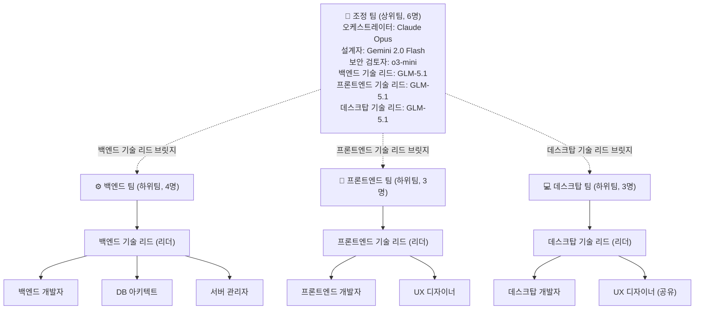
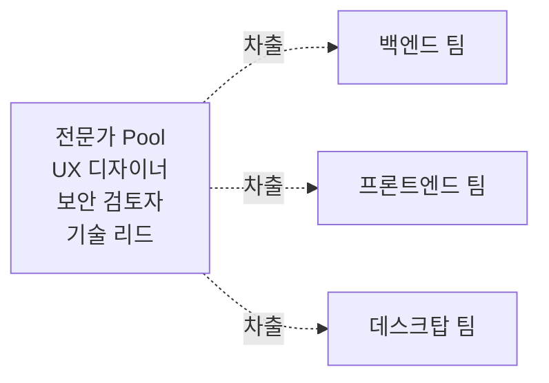

## 개요

블로그 시스템 개발을 위한 AI 에이전트 팀을 구성하면서, 계층형 구조와 브릿지 리더십을 도입한 경험을 공유합니다. **14명의 전문가, 4개 팀**으로 구성된 팀 구조를 통해 비용 최적화와 성능 극대화를 동시에 달성한 과정을 정리했습니다.

## 배경

블로그 시스템은 **백엔드(FastAPI)**, **프론트엔드(Next.js)**, **데스크탑(Tauri)** 세 영역으로 나뉘어 개발됩니다. 각 영역은 전문 기술 세트를 요구하며, 통합된 아키텍처 설계와 보안 검토가 필요합니다.

## 팀 구조 설계 원칙

### 1. 비용 최적화

Claude Opus와 같은 고성능 모델은 비용이 높습니다. 팀 전체가 고성능 모델을 사용하면 비용이 기하급상으로 늘어납니다. 이를 해결하기 위해:

- **리더/설계**: 고성능 모델 (Claude Opus)
- **팀원**: 저렴한 모델 (GLM-5.1, 60-70% 비용 절감)
- **특수 목적**: 전용 모델 (Gemini 설계, o3-mini 보안)

### 2. 전문가 분리

한 명이 모든 것을 하는 것보다 전문가가 분야별로 책임지는 것이 효율적입니다:

- **설계자**: 시스템 아키텍처, API 설계
- **보안 검토자**: OWASP, 취약점 분석
- **기술 리드**: 팀 관리 + 코드 리뷰
- **개발자**: 구현 작업

### 3. 브릿지 리더십

상위팀과 하위팀 간의 소통 병목을 해결하기 위해 기술 리드가 **이중 소속**되는 구조를 도입했습니다.

## 최종 팀 구조



## 조정 팀 (상위팀, 6명)

| 역할 | 모델 | 책임 |
|------|------|------|
| 오케스트레이터 | Claude Opus | 전체 조율, 최종 결정 |
| 설계자 | Gemini 2.0 Flash | 빠른 설계, 프로토타이핑 |
| 보안 검토자 | o3-mini | 보안 검토, 취약점 분석 |
| 백엔드 기술 리드 | GLM-5.1 | 백엔드팀 브릿지 |
| 프론트엔드 기술 리드 | GLM-5.1 | 프론트엔드팀 브릿지 |
| 데스크탑 기술 리드 | GLM-5.1 | 데스크탑팀 브릿지 |

**합의제(Consensus)**를 채택했습니다. 조정 팀의 모든 결정은 합의를 통해 이루어지며, 각 전문가가 자신의 전문 분야에서 발언권을 가집니다.

## 하위팀 (3개 팀)

### 백엔드 팀 (4명)

- **백엔드 기술 리드** (리더, 브릿지): FastAPI, SQLAlchemy, PostgreSQL
- **백엔드 개발자**: API 엔드포인트 구현
- **데이터베이스 아키텍트**: 스키마 설계, 쿼리 최적화
- **서버 관리자**: Docker, Ubuntu, 모니터링

### 프론트엔드 팀 (3명)

- **프론트엔드 기술 리드** (리더, 브릿지): Next.js 15, React Server Components
- **프론트엔드 개발자**: UI 컴포넌트, ISR
- **UX 디자이너**: 와이어프레임, 컴포넌트 설계

### 데스크탑 팀 (3명)

- **데스크탑 기술 리드** (리더, 브릿지): Tauri, Rust
- **데스크탑 개발자**: 로컬 애플리케이션 구현
- **UX 디자이너**: 공유 전문가 (프론트엔드팀과 공유)

## 브릿지 리더십: 핵심 설계

기술 리드가 상위팀과 하위팀에 **이중 소속**되는 구조가 핵심입니다.

**조정 팀에서:**
- 아키텍처 설계 참여
- 백엔드/프론트엔드/데스크탑 관련 의사결정
- 타 팀과의 기술 조율

**하위팀에서:**
- 팀원 작업 배분
- 코드 리뷰
- 기술 코칭
- 일정 관리

브릿지 효과:
- **상향**: 팀원의 기술적 문제를 조정 팀에 에스컬레이션
- **하향**: 조정 팀의 설계 결정을 팀원에게 전달하고 해석

## 모델 배분 전략

| 모델 | 인원 | 용도 | 비용 |
|------|------|------|------|
| Claude Opus | 1명 | 오케스트레이터 | 매우 높음 |
| Gemini 2.0 Flash | 1명 | 설계 | 무료/저렴 |
| o3-mini | 1명 | 보안 검토 | 높음 |
| **GLM-5.1** | **11명** | **기술 리드 + 팀원** | **낮음** |

팀원 11명을 GLM-5.1로 구성하여 **60-70% 비용 절감**을 달성했습니다.

## 공유 전문가 구조

UX 디자이너가 프론트엔드 팀과 데스크탑 팀에 **동시 소속**되는 구조입니다.

**장점:** 디자인 일관성, 리소스 효율, 커뮤니케이션 집중

**단점:** 작업량 많을 경우 병목, 두 팀 동시 요청 시 대기 시간

**해결 방안:** 우선순위 기반 작업 배분, 필요시 외부 디자이너 에이전트 추가

## 팀 구조 논의: 다양한 대안

### 대안 1: Pool 구조

전문가를 팀에 소속시키지 않고 **Pool**로 관리하는 방식입니다.



**장점:** 유연성, 리소스 효율 / **단점:** Relay 플러그인 Pool 구조 지원 필요, 복잡성 증가

### 대안 2: 조정 팀 경량화

조정 팀을 3명으로 줄이고, 기술 리드는 필요시에만 참여.

**장점:** 의사결정 빨라짐 / **단점:** 기술 리더가 핵심 의사결정에서 배제

### 채택한 안: 현재 구조 유지

이유는 **"실무 시작을 최우선"**입니다. 완벽한 구조를 찾기보다, 실행 가능한 구조로 빨리 시작하고 운영하며 개선하는 방향을 택했습니다.

## 실행 방법

### Zai 모드 (기본)

```bash
env CLAUDE_CODE_EXPERIMENTAL_AGENT_TEAMS=1 \
  /Users/yarang/.local/bin/claude \
  --settings .agent_forge_for_zai.json \
  --teammate-mode tmux \
  --plugin-dir /Users/yarang/working/agent_teams/relay-plugin
```

### Gemini 모드 (설계 빠른 프로토타이핑)

```bash
export GEMINI_API_KEY="your_key"
python3 claude-gemini-wrapper.py
```

### OpenAI 모드 (보안 검토)

```bash
export OPENAI_API_KEY="your_key"
python3 claude-codex-wrapper.py
```

## Wrapper 설계

Gemini와 OpenAI는 Anthropic API와 호환되지 않습니다. **Python HTTP Wrapper**로 변환:

```
Claude Code → Anthropic API 형식 요청
                ↓
          Wrapper 서버
                ↓
    (Anthropic → Gemini/OpenAI 변환)
                ↓
          Gemini/OpenAI API
                ↓
    (Gemini/OpenAI → Anthropic 변환)
                ↓
           Claude Code
```

## 결론

1. **비용 최적화**: 고성능 모델을 리더/설계에만 집중 사용
2. **전문가 분리**: 설계, 보안 등 전문 분야에 특화된 모델 배정
3. **브릿지 리더십**: 상위팀과 하위팀 간 소통 병목 해결
4. **실무 우선**: 완벽한 구조보다 실행 가능한 구조로 빨리 시작

다음 포스트에서는 실제 팀 운영 경험과 겪은 문제점, 그리고 해결 과정을 공유하겠습니다.
