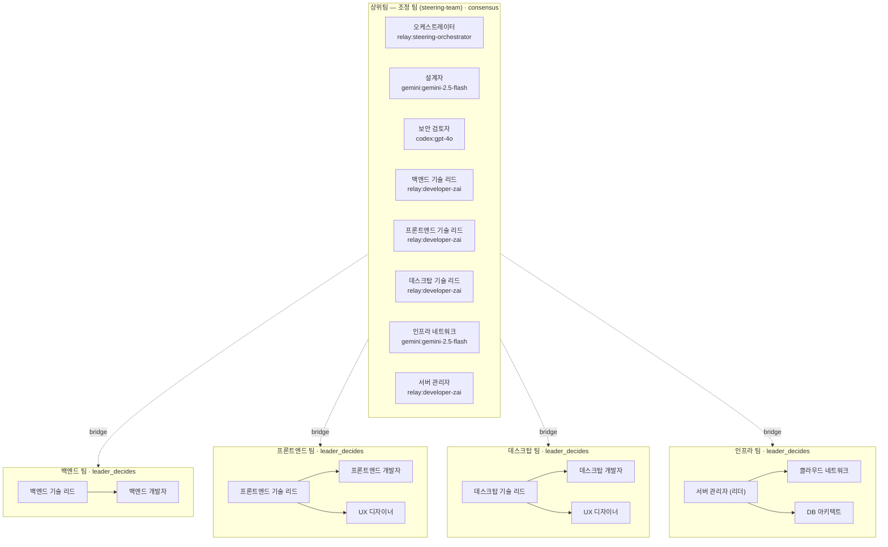
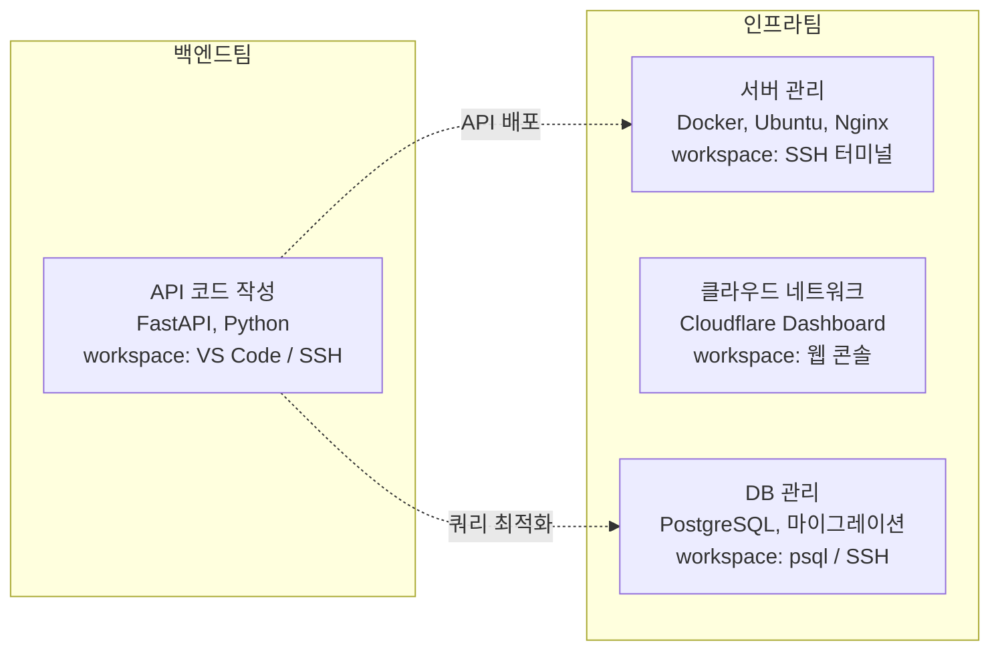
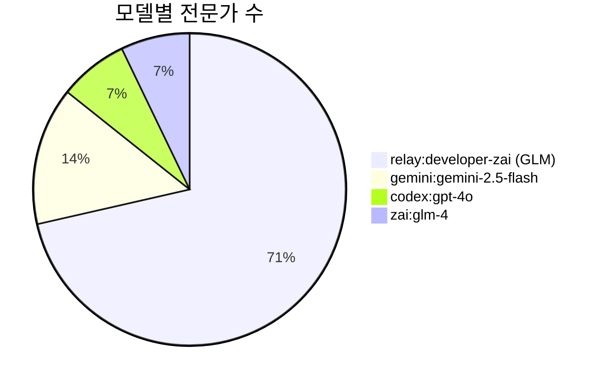
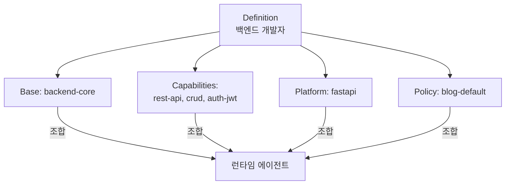
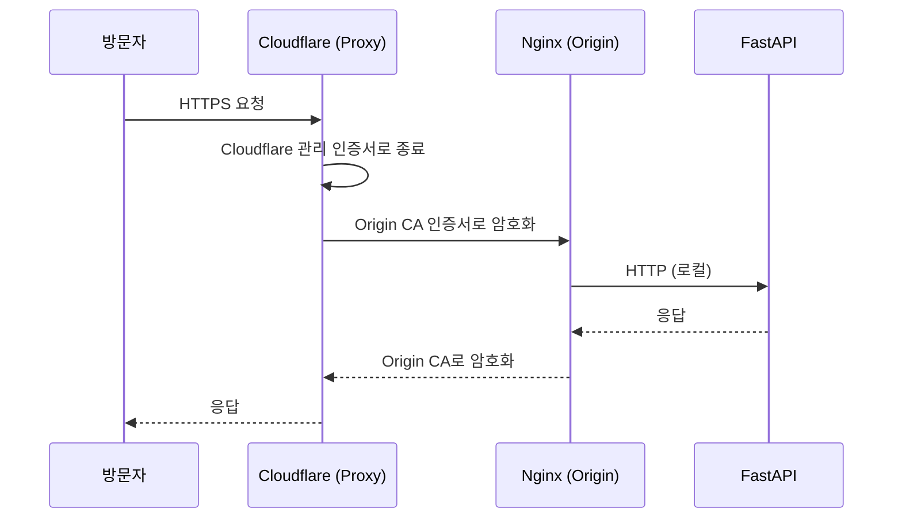
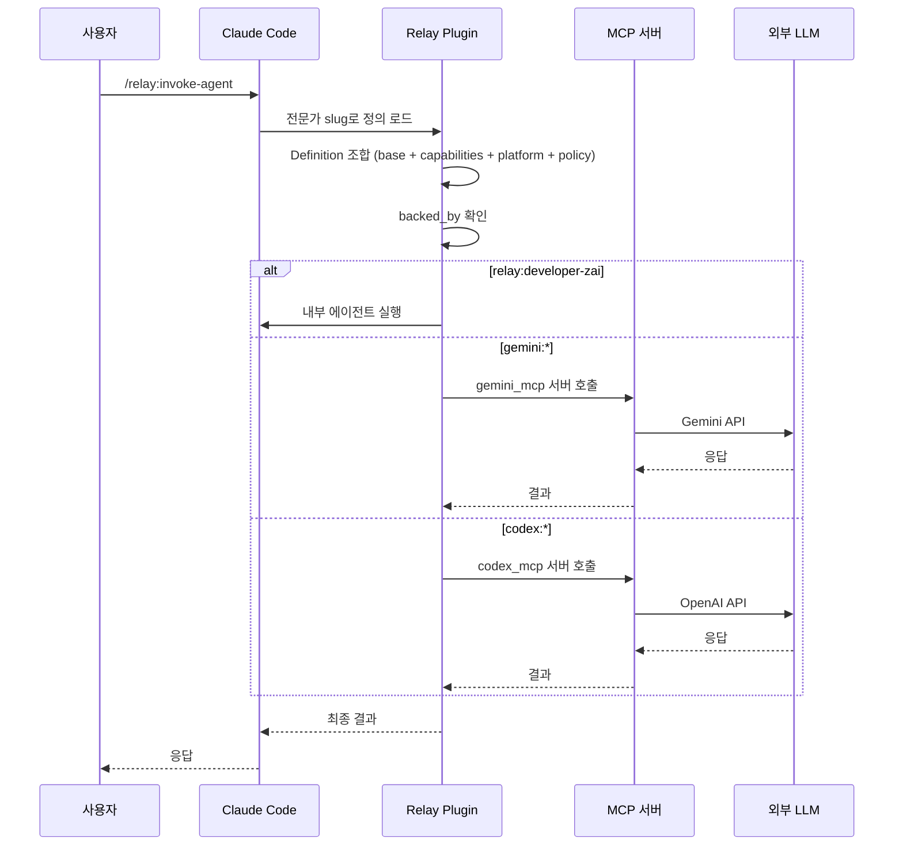

+++
title = "멀티모델 AI 에이전트 팀 설계: 조합형 아키텍처와 5팀 계층 구조"
date = 2026-03-30T00:31:36+09:00
draft = false
tags = ["ai", "agent", "multi-model", "claude", "gemini", "gpt", "llm", "team-architecture", "composed-agent"]
categories = ["Development", "AI", "Architecture"]
ShowToc = true
TocOpen = true
+++

## 개요

블로그 시스템 구축을 위해 **14명의 AI 전문가, 5개 팀, 4개 LLM 모델**로 구성된 멀티모델 에이전트 팀을 설계했습니다. 핵심은 두 가지입니다.

1. **조합형 에이전트(Composed Agent)**: 역할 정의와 실행 프로필을 분리해 재사용성 극대화
2. **계층형 브릿지 리더십**: 상위팀-하위팀 간 기술 리드의 이중 소속으로 소통 병목 해결

이 글에서는 최종 구조, 모델 배분 전략, 조합형 아키텍처 설계 과정을 공유합니다.

---

## 배경: 왜 멀티모델인가

하나의 LLM으로 모든 작업을 처리하면 두 가지 문제가 발생합니다.

- **비용**: Claude Opus 수준의 모델로 14명 전문가를 실행하면 비용이 통제 불가능
- **적합성**: 설계에는 빠른 추론이, 보안 분석에는 깊은 논리가, 구현에는 안정적인 코딩이 필요

그래서 작업 성격에 맞춰 모델을 분배했습니다.

---

## 최종 팀 구조

5개 팀, 14명 전문가, 4개 모델로 구성됩니다.



### 팀별 상세

| 팀 | 유형 | 의사결정 | 리더 | 팀원 수 |
|---|---|---|---|---|
| 조정 팀 | upper | consensus | 오케스트레이터 | 8명 (브릿지 포함) |
| 백엔드 팀 | lower | leader_decides | 백엔드 기술 리드 | 2명 |
| 프론트엔드 팀 | lower | leader_decides | 프론트엔드 기술 리드 | 3명 |
| 데스크탑 팀 | lower | leader_decides | 데스크탑 기술 리드 | 3명 |
| 인프라 팀 | lower | leader_decides | 서버 관리자 | 3명 |

---

## 인프라 팀 분리 결정

초기 설계에서는 DB 아키텍트와 서버 관리자가 백엔드 팀에 포함되어 있었습니다. 하지만 **작업 공간(Workspace) 기준**으로 분리했습니다.



**분리 이유:** 작업 공간이 다르면 같은 팀에 두는 것보다 분리하는 것이 자연스럽습니다.

---

## 모델 배분 전략



| 모델 | 전문가 수 | 용도 | 선택 이유 |
|---|---|---|---|
| relay:developer-zai | 10명 | 구현, 운영, 리드 | 비용 효율적, 안정적 코딩 |
| gemini:gemini-2.5-flash | 2명 | 설계, 인프라 네트워크 | 빠른 응답, 외부 API 호출 용이 |
| codex:gpt-4o | 1명 | 보안 검토 | 높은 추론 능력, OWASP 지식 |
| zai:glm-4 | 1명 | 컨텍스트 압축 | 무료 티어, 텍스트 요약 특화 |

10명의 구현 전문가를 GLM(저비용 모델)에 배정하여 전체 비용의 **60-70%를 절감**했습니다.

---

## 조합형 에이전트 아키텍처 (Composed Agent Pattern)

이번 설계의 핵심 혁신은 **역할 정의(Expert)와 실행 프로필(Definition)의 분리**입니다.

### 기존 방식의 문제

기존에는 역할과 실행 로직이 결합되어 변경 시 전체 재작성이 필요하고 재사용이 불가능했습니다.

### 조합형 방식



### 모듈 구조

```
agent-library/
├── definitions/        ← 14개 에이전트 정의
├── modules/
│   ├── base/           ← 6개 기본 모듈
│   ├── capabilities/   ← 15개 역량 모듈
│   ├── platforms/      ← 5개 플랫폼 모듈
│   └── policies/       ← 1개 정책
└── runs/               ← 실행 이력
```

### 장점

1. **재사용성**: `rest-api` 역량 모듈은 백엔드 개발자와 기술 리드가 공유
2. **플랫폼 교체**: `platform: fastapi`를 `platform: django`로 변경하면 즉시 전환
3. **역량 확장**: 새 역량 모듈을 추가하고 Definition에 연결만 하면 됨
4. **정책 통일**: 모든 에이전트가 동일한 `blog-default` 정책을 따름

### 전문가-Definition 매핑

| 전문가 | Definition | Base | Capabilities | Platform |
|---|---|---|---|---|
| 백엔드 개발자 | backend-developer | backend-core | rest-api, crud, auth-jwt | fastapi |
| 백엔드 기술 리드 | backend-tech-lead | backend-core | rest-api, crud, code-review | fastapi |
| 프론트엔드 개발자 | frontend-developer | frontend-core | markdown-renderer, list-filter-sort | nextjs |
| 서버 관리자 | server-administrator | server-core | docker-management, nginx-config, postgres-admin | ubuntu |
| 인프라 네트워크 | infra-network-admin | infra-core | dns-management, ssl-certificates, rate-limiting | cloudflare |
| 보안 검토자 | security-auditor | specialist-core | security-audit | fastapi |
| 컨텍스트 압축 | context-compressor | specialist-core | context-compression | markdown |

---

## TLS 인증서 전략: Cloudflare Origin CA

프로덕션 환경의 TLS 인증서로 Let's Encrypt 대신 **Cloudflare Origin CA**를 선택했습니다.



| 항목 | Let's Encrypt | Cloudflare Origin CA |
|---|---|---|
| 유효 기간 | 90일 (갱신 필요) | 15년 (갱신 불필요) |
| 발급 방식 | ACME 자동화 필요 | Dashboard에서 수동 발급 |
| 복잡도 | certbot 설정 | 인증서 파일 복사만 |

프로덕션 아키텍처:

```
Oracle Cloud ARM (4 OCPU, 24GB)
├── PostgreSQL (호스트 직접 설치)
├── Docker Compose
│   ├── blog-api (FastAPI)
│   ├── blog-frontend (Next.js standalone)
│   ├── MinIO (S3 호환 스토리지)
│   └── Nginx (Cloudflare Origin CA)
└── Cloudflare Proxy (Full Strict SSL)
```

---

## Relay 플러그인: 에이전트 호출 메커니즘

팀 구조는 **Relay 플러그인**을 통해 Claude Code에서 실행됩니다.



### backed_by 네임스페이스

| 네임스페이스 | MCP 서버 | 용도 |
|---|---|---|
| `relay:developer-zai` | 내부 에이전트 | 구현, 운영 (저비용) |
| `relay:steering-orchestrator` | 내부 에이전트 | 조율, 최종 결정 |
| `gemini:gemini-2.5-flash` | gemini_mcp | 설계, 외부 API |
| `codex:gpt-4o` | codex_mcp | 보안 분석 |
| `zai:glm-4` | zai_mcp | 컨텍스트 압축 |

---

## 설계 결정 이력

| 결정 | 대안 | 선택 이유 |
|---|---|---|
| 인프라 팀 분리 | 백엔드 팀에 포함 | 작업 공간이 다름 (SSH vs IDE) |
| Cloudflare Origin CA | Let's Encrypt | 15년 유효, 갱신 불필요 |
| PostgreSQL 호스트 설치 | Docker 컨테이너 | 단일 서버에서 메모리 효율 우선 |
| 조합형 에이전트 | 단일 정의 에이전트 | 모듈 재사용성, 플랫폼 교체 용이 |
| GLM 다수 배정 | Claude 다수 배정 | 60-70% 비용 절감 |

---

## 회고: 설계하며 배운 것

### 1. "완벽한 구조"보다 "실행 가능한 구조"

팀 구조, 모델 배정, 인프라 설정을 완벽하게 설계하려다 보면 시작조차 못 합니다.

### 2. 작업 공간이 곧 팀 경계

코드를 작성하는 사람과 서버를 관리하는 사람은 물리적 작업 환경이 다르고, 그것이 자연스러운 팀 경계가 됩니다.

### 3. 조합형 아키텍처의 가치

14명의 전문가, 5개 팀, 4개 모델이 얽히는 환경에서는 모듈 분리가 필수적입니다.

### 4. 비용은 설계 단계에서 결정된다

"이 작업에 꼭 고비용 모델이 필요한가?"를 매번 물어보면 자연스럽게 비용이 최적화됩니다.

---

## 다음 단계

- Phase 1 구현 착수: DB, Auth, Post/Category CRUD, Docker
- 팀 운영 경험 공유: 실제 실행 중 겪은 문제와 해결 과정
- 성능 모니터링: 모델별 응답 시간, 비용 대비 품질 분석

---

> 이 글은 Claude Code + Relay 플러그인을 활용한 AI 에이전트 팀 구성 경험을 정리한 것입니다.
