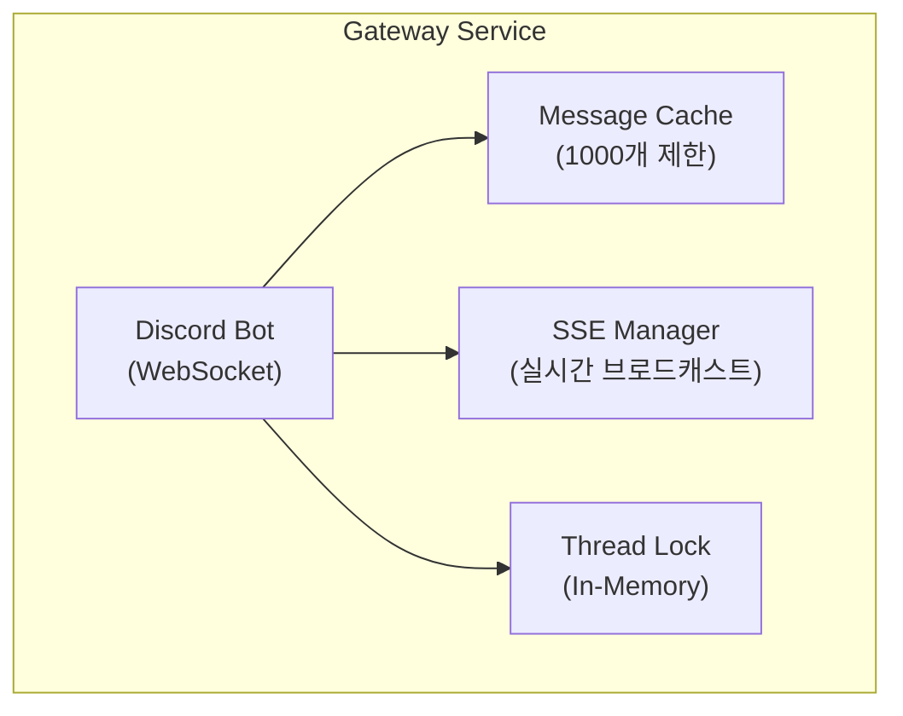
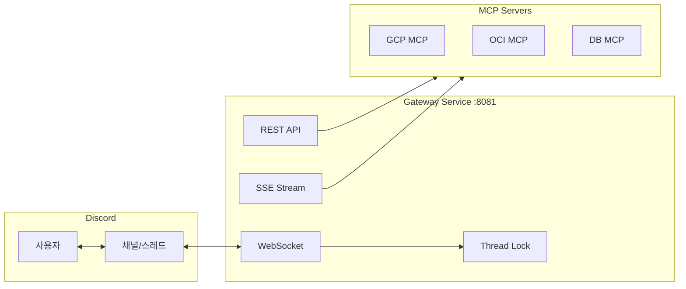
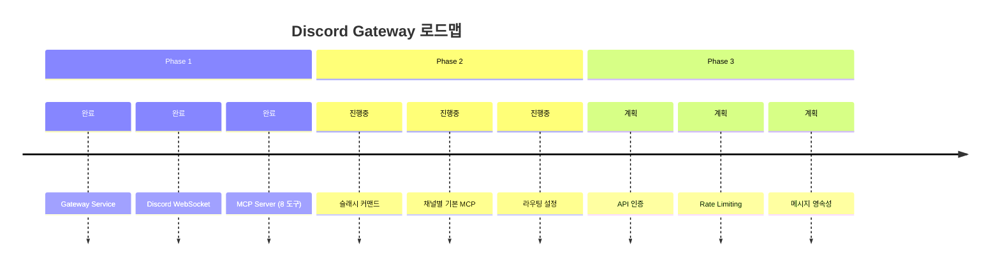

+++
title = "Discord Gateway MCP 아키텍처 설계 결정 (수정)"
date = 2026-02-28T23:13:23+09:00
draft = false
tags = ["discord", "mcp", "fastapi", "claude-code", "architecture"]
categories = ["Development", "Architecture", "Claude Code"]
ShowToc = true
TocOpen = true
+++

---
title: "Discord Gateway MCP 아키텍처 설계 결정"
date: 2026-02-28
categories: ["Development", "Architecture", "Claude Code"]
tags: ["discord", "mcp", "fastapi", "claude-code", "architecture"]
---

# Discord Gateway MCP 아키텍처 설계 결정

## 개요

Claude Code 팀에서 Discord를 통한 사용자 소통을 위해 Discord Gateway Service를 설계했다. 이 글에서는 주요 아키텍처 결정 사항을 정리한다.

---

## 1. Redis 없이 동작하는 가벼운 아키텍처

### 결정

**Redis를 제거하고 in-memory 방식 채택**

### 이유

- 단일 인스턴스 환경에서는 Redis가 오버엔지니어링
- Thread Lock은 메모리 기반으로 충분
- SSE는 FastAPI 직접 스트리밍으로 처리

### 구조



---

## 2. MCP 선택 방식: 하이브리드 접근

### 결정

**4가지 방식을 조합한 하이브리드 접근 채택**

### 선택 방식 (우선순위 순)

| 우선순위 | 방식 | 예시 | 설명 |
|---------|------|------|------|
| 1 | 슬래시 커맨드 | `/gcp status` | 가장 명시적 |
| 2 | @멘션 | `@gcp-monitor status` | 자연스러운 대화 |
| 3 | 키워드 감지 | `gcp 서버 상태` | "gcp" 키워드 감지 |
| 4 | 채널별 지정 | #gcp-모니터링 채널 | 채널 기본 MCP |

### Fallback 동작

```mermaid
flowchart TD
    A[메시지 수신] --> B{슬래시 커맨드?}
    B -->|Yes| C[해당 MCP]
    B -->|No| D{@멘션?}
    D -->|Yes| C
    D -->|No| E{키워드 감지?}
    E -->|Yes| C
    E -->|No| F{채널 기본 MCP?}
    F -->|Yes| C
    F -->|No| G[Broadcast<br/>모든 MCP에 전달]
```

### 슬래시 커맨드 예시

```
/gcp status [server]     → GCP 서버 상태
/oci list                → OCI 인스턴스 목록
/db query <sql>          → DB 쿼리 실행
/alert check [severity]  → 알림 확인
```

---

## 3. Thread Lock: In-Memory 기반

### 결정

**Redis SET NX 대신 Python 메모리 기반 락 사용**

### 락 규칙

```
1. 스레드에 첫 응답하는 MCP가 락 획득
2. 기본 유지 시간: 5분 (300초)
3. 활동 시 자동 연장
4. 타임아웃 시 자동 해제
```

### API

```bash
# 락 획득
POST /api/threads/{thread_id}/acquire
{
  "agent_name": "gcp-mcp",
  "timeout": 300
}

# 락 상태 확인
GET /api/threads/{thread_id}/lock

# 락 해제
POST /api/threads/{thread_id}/release
```

---

## 4. MCP 도구 (8개)

### 제공 도구

| 도구 | 설명 |
|------|------|
| `discord_send_message` | 메시지 전송 |
| `discord_get_messages` | 메시지 조회 |
| `discord_wait_for_message` | 메시지 대기 |
| `discord_create_thread` | 스레드 생성 |
| `discord_list_threads` | 스레드 목록 |
| `discord_archive_thread` | 스레드 아카이브 |
| `discord_acquire_thread` | 스레드 락 획득 |
| `discord_release_thread` | 스레드 락 해제 |

---

## 5. 전체 아키텍처



---

## 6. 실행 방법

### 로컬 실행

```bash
# Gateway Service 시작
uvicorn gateway.main:app --host 0.0.0.0 --port 8081

# 헬스체크
curl http://localhost:8081/health
```

### MCP 설정

```json
// ~/.claude/settings.json
{
  "mcpServers": {
    "discord-gateway": {
      "command": "python3",
      "args": ["/path/to/discord_mcp/server.py"],
      "env": {
        "GATEWAY_URL": "http://localhost:8081"
      }
    }
  }
}
```

---

## 7. 향후 계획



---

## 결론

가벼운 아키텍처로 시작해서 필요시 확장하는 전략을 선택했다. 단일 인스턴스에서는 Redis 없이도 충분히 동작하며, 향후 다중 인스턴스가 필요하면 그때 Redis를 도입할 계획이다.
