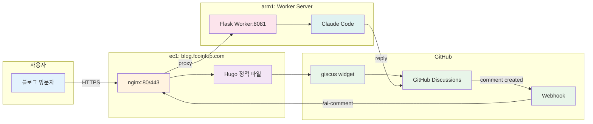

# AI 자동 응답 시스템 아키텍처

## 시스템 다이어그램

## 데이터 흐름

### 1. 댓글 작성 흐름
1. **방문자** -> 블로그 포스트 읽기
2. **giscus widget** -> GitHub Discussions에 댓글 게시
3. **GitHub Webhook** -> comment created 이벤트 발생

### 2. 자동 응답 흐름
1. **GitHub** -> `/ai-comment` webhook으로 이벤트 전송
2. **nginx (ec1)** -> `/ai-comment`를 arm1:8081로 프록시
3. **Flask Worker (arm1)** -> 댓글 분석 및 응답 생성 요청
4. **Claude Code** -> AI 응답 생성
5. **GitHub API** -> Discussions에 응답 댓글 게시

## 서버 구성

### ec1 (blog.fcoinfup.com)
- **역할**: 웹 서버 + 프록시
- **서비스**: nginx, Hugo
- **포트**: 80 (HTTP), 443 (HTTPS)
- **경로**: `/var/www/blog-repo`

### arm1 (Worker Server)
- **역할**: AI 워커 서버
- **서비스**: Flask Worker, Claude Code
- **포트**: 8081 (Flask)
- **경로**: `/var/www/auto-comment-worker`
